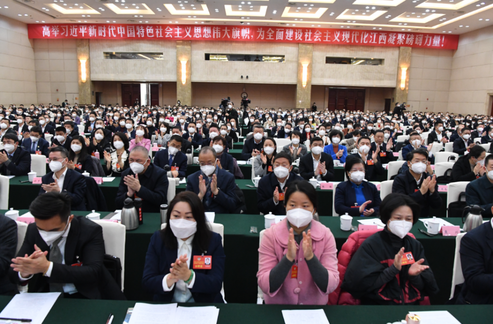
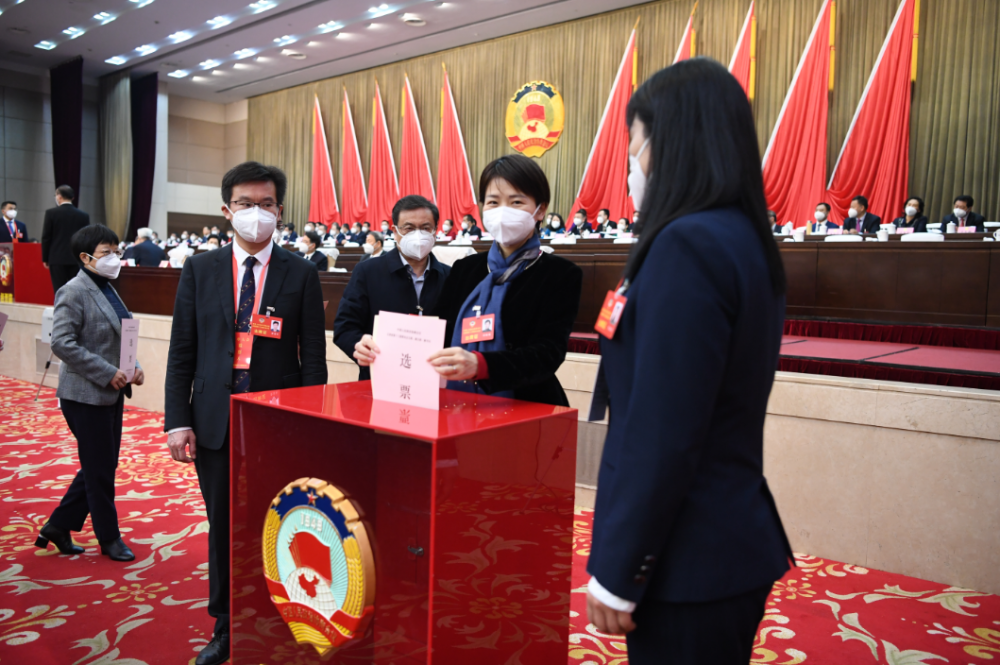

# 唐一军当选江西省政协主席

1月14日，省政协十三届一次会议举行选举大会，选举产生了政协江西省第十三届委员会主席、副主席、秘书长、常务委员。

政协江西省第十三届委员会共有委员595名，出席会议的有572名，符合政协章程规定。

唐一军、姚增科、陈俊卿、谢茹、尹建业、孙菊生、陈兴超、胡强、张勇、刘卫平在选举大会主席台前排就座。陈俊卿主持会议。

大会以举手表决的方式，通过了省政协十三届一次会议选举办法和省政协十三届一次会议选举大会总监票人、监票人名单。

大会以无记名投票方式，选举唐一军为政协江西省第十三届委员会主席；选举陈俊卿、谢茹、尹建业、孙菊生、陈兴超、卢天锡、于秀明、辜清为政协江西省第十三届委员会副主席；选举彭世东为政协江西省第十三届委员会秘书长；选举产生了102名常务委员。

来源 江西政协

编辑 高珊珊

流程编辑 刘伟利

