# 山东舰编队最新训练画面：数十架战机摆兵布阵，歼-15攻击“敌”机

隆冬时节，南海某海域，白浪如练，暗流涌动。由多艘不同型号舰艇、数十架各型战机组成的山东舰编队在此摆兵布阵，一场实战化对抗演练一触即发。

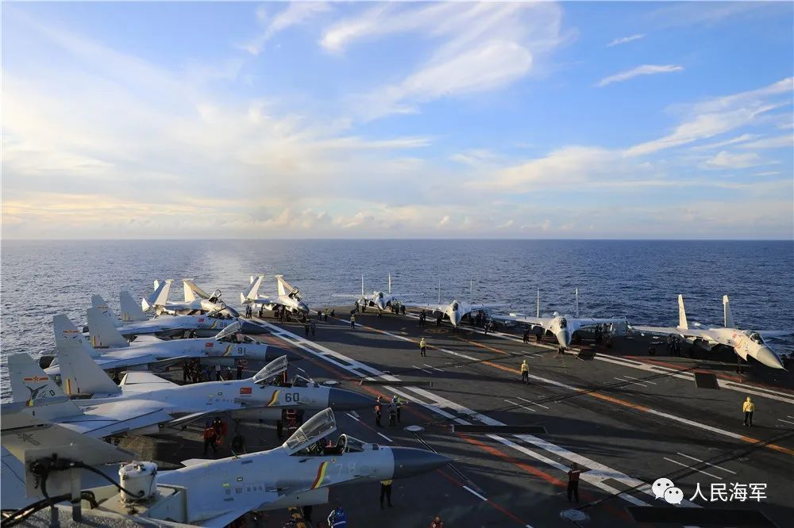

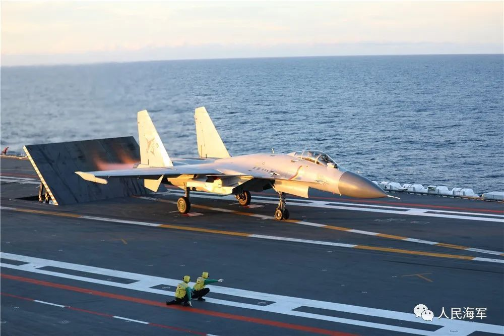

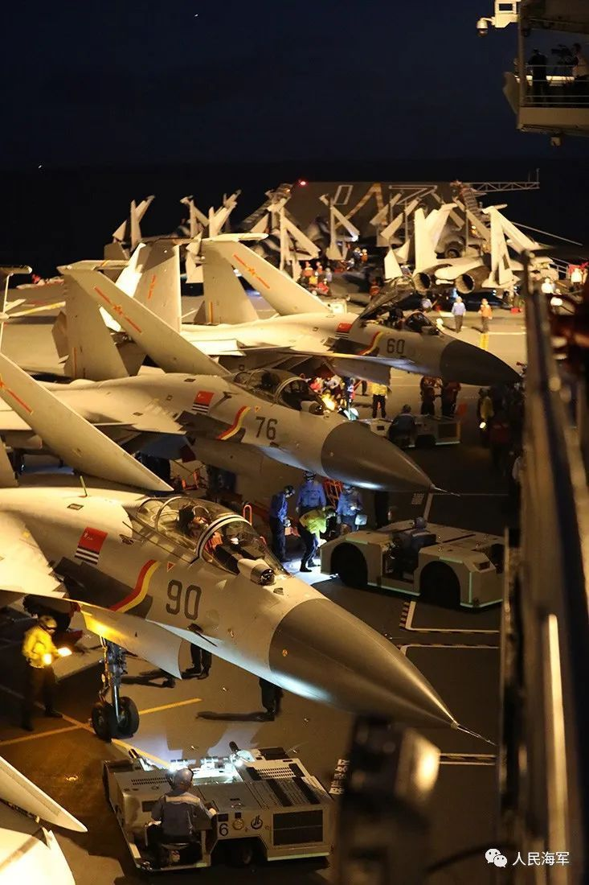

“‘敌’机向我编队近飞！”战斗警报骤然响彻海空。
“编队加强对空防御警戒。”指令一出，编队迅速构建起严密的预警探测体系，一张海空立体式“猎鹰大网”闻令展开，各舰快速变换战斗队形、严阵以待。

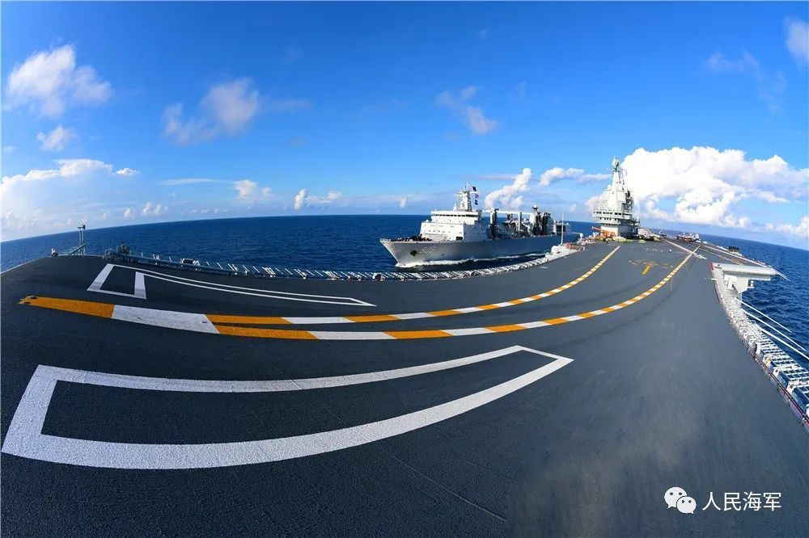

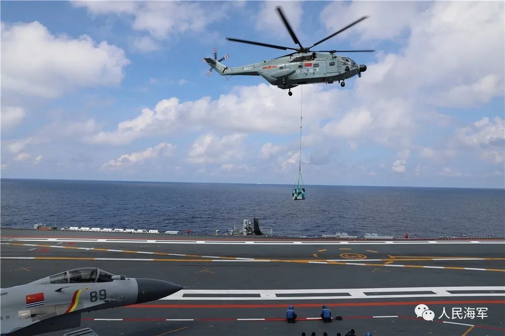

“起飞！”数批歼-15飞机分波次依令起飞、前出拦截。“发现目标请示攻击！”“攻击！”在攻防鏖战中，飞行员充分发挥战术优势，准确判断“敌”机意图，向“蜂拥而来”的“敌”目标发起“攻击”。在一连串大载荷、高难度的战术机动中捕捉到有利时机，抢先一步锁定敌机，快速完成模拟攻击。

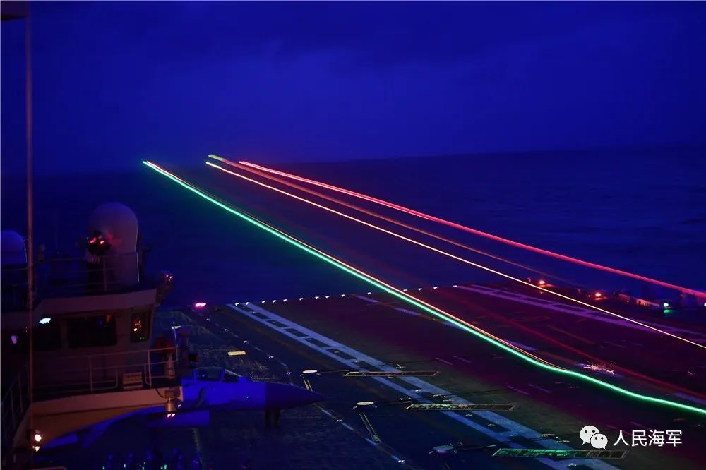

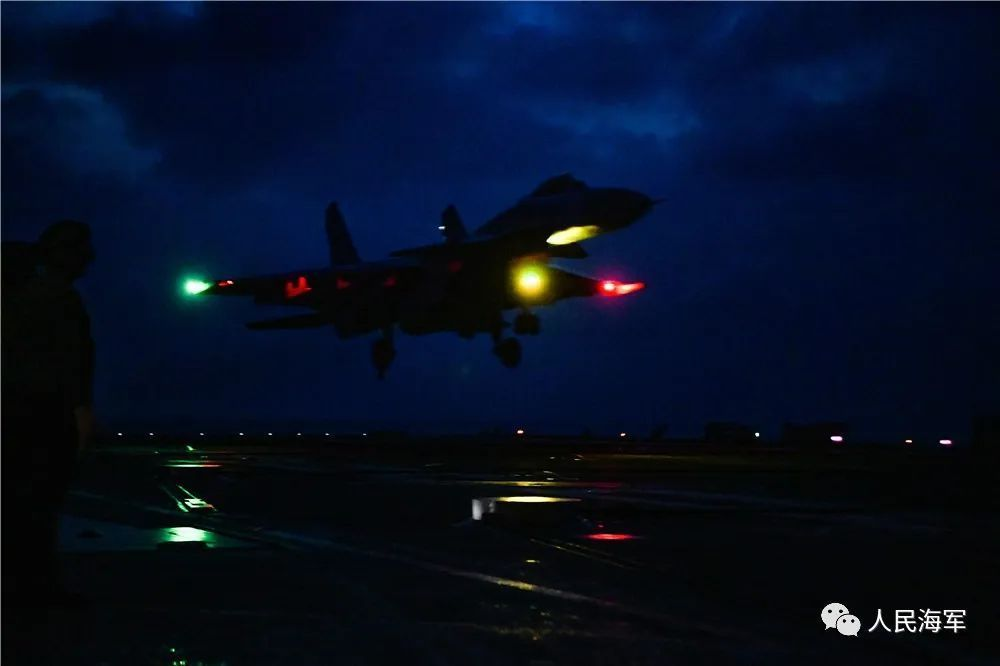

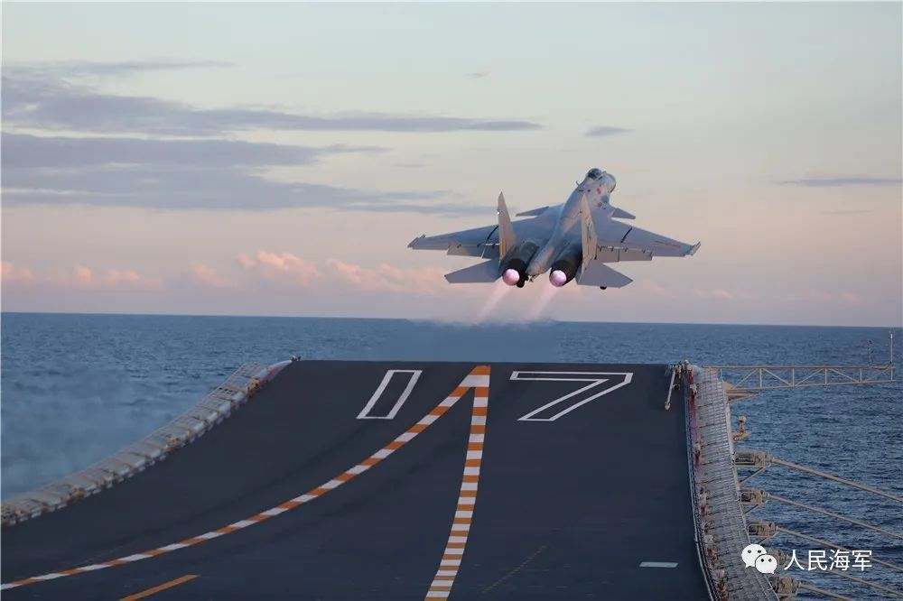

实兵“背靠背”对抗演练结束后，战鹰伴着夕阳陆续返航。加油挂弹、通电检查、惯导对准……山东舰飞行甲板上，舰载机再次出动工作有序进行。星河夜幕下，又一批歼-15战机喷着耀眼的尾焰、伴着巨大的轰鸣呼啸升空……

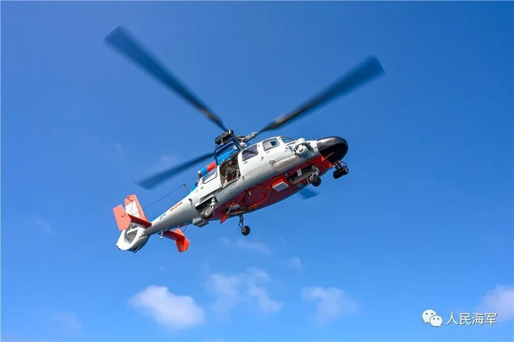

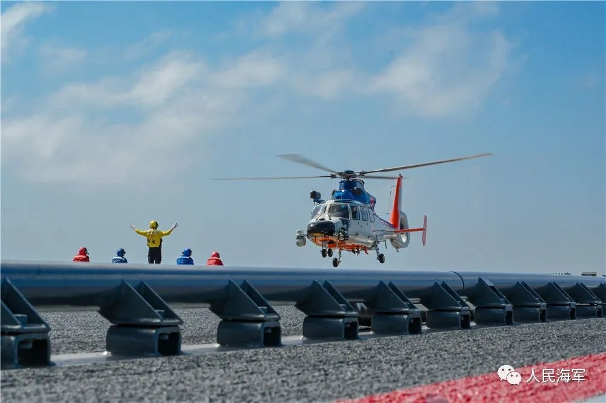

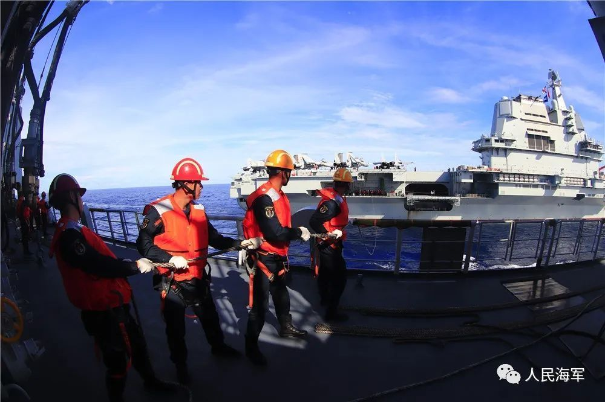

紧贴实战，砥砺硬功。此次训练，山东舰编队紧盯练兵备战重难点问题，从难从严组训施训，深入开展海面、空中、水下等多兵种、跨领域、高难度立体攻防作战科目专攻精练。训练中，又有一批歼-15飞行员取得夜间航母资质认证，标志着航母编队体系作战能力进一步跃升。

