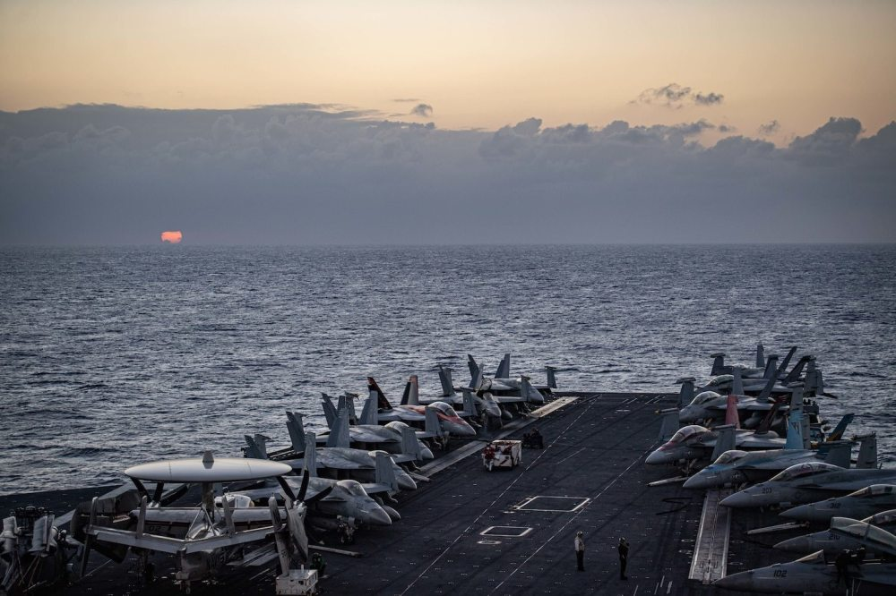
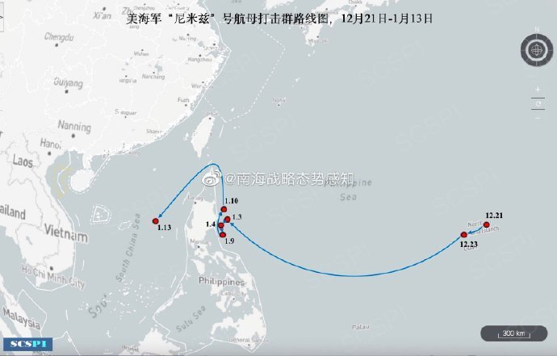
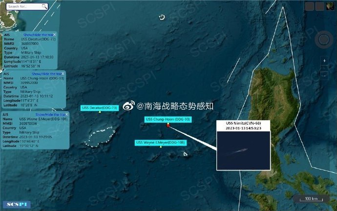

# 美尼米兹航母战斗群进入南海，“两艘中国军舰跟监”

美国海军1月13日发布新闻稿称，“尼米兹”号航母打击群12日部署进入南海开展行动，该打击群包括一艘航母、四艘军舰，正开展海上打击训练等多种演练。

据“南海战略态势感知”智库13日透露，根据卫星影像显示，“尼米兹”号航母打击群当天下午在黄岩岛西北约200公里的南海海域活动。美国有线电视新闻网（CNN）同日援引国防部官员称，中方已派出两艘军舰跟踪监视该打击群。

_美海军“尼米兹”号航母，图源：美国海军网站_

据美国海军网站介绍，这是“尼米兹”号航母打击群2022-2023年部署期间首次在南海开展行动，该打击群正在开展海上打击训练、反潜作战、多域一体化、地空联合训练等多种演练。新闻稿还宣称“尼米兹”号航母在南海行动是所谓“美国海军在印太地区常规行动的一部分”。

该打击群为美海军第11号航母打击群，指挥官是克里斯托弗·斯威尼（Christopher
Sweeney）少将，此次行动除了“尼米兹”号核动力航母外，还出动了一艘提康德罗加级导弹巡洋舰、三艘伯克级导弹驱逐舰、第17舰载机航空联队，以及部分参谋人员。

“南海战略态势感知”智库1月13日表示，当天下午，据AIS信息和欧空局哨兵卫星影像，美海军“尼米兹”号航母打击群在黄岩岛西北约200公里的南海海域活动。

“尼米兹”航母自2022年12月以来部署西太平洋地区，2023年1月3日至10日在菲律宾东部海域进行训练活动，并于1月12日穿越巴士海峡进入南海。

在13日早些时候，“南海战略态势感知”智库曾称，美海军钟云号、迪卡特号与韦恩·迈耶号导弹驱逐舰在南海活动。三艘伯克级导弹驱逐舰隶属于尼米兹号航母打击群，均于1月12日经巴士海峡进入南海，推测尼米兹号航母当天已经进入南海。

据美国有线电视新闻网（CNN）13日报道，一名美国国防部官员透露，美海军“尼米兹”号航母打击群12日开始在南海活动，中方派出两艘军舰进行跟踪监视。

报道还提到，美国和日本于1月11日宣布加强军事联系、提出一系列举措，包括日本批准美军能够在冲绳基地部署新的海军部队。这些措施被认为是“针对中国”。

1月12日，外交部发言人汪文斌在答记者问时对此做出回应。他强调，美日开展双边军事合作，应确保不损害第三方利益，不损害地区和平稳定。

早前2022年7月13日，美国海军“里根”号航母打击群进入南海执行所谓例行任务，开展海上打击操演以及水面与空中部队的协同战术训练等多种训练。

时任外交部发言人赵立坚对此回应，美方再次派航母到南海“大秀肌肉”。大家可以清楚地看到，到底谁是南海以及亚太地区和平稳定的最大威胁。

**本文系观察者网独家稿件，未经授权，不得转载。**

