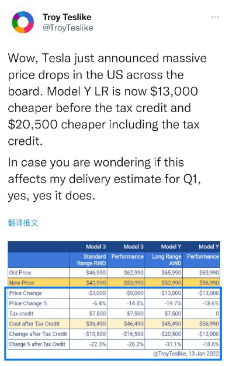
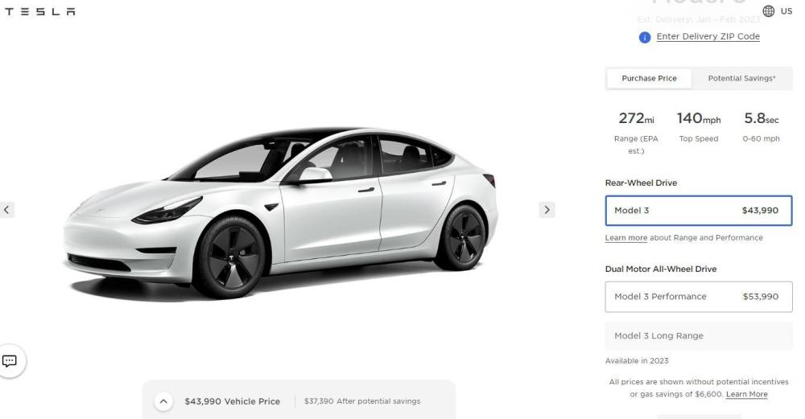
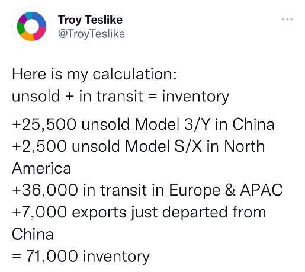

# 自己卷自己？特斯拉宣布在美国降价

今日，专注追踪特斯拉交付等数据分析的知名分析师Troy Teslike发布推文称，特斯拉刚刚宣布在美国全面大规模降价。

金融界在特斯拉官网查询，相关售价已出现调整。

此前，近日，特斯拉中国在官网上宣布，在售 Model 3 及 Model Y 全系国产车型将调整售价，Model 3 起售价直降 3.6 万元，Model
Y 起售价直降 2.9 万元，两款车型其余版本的降价幅度从 2 万到 4.8 万元不等，创下特斯拉中国售价历史新低。

值得关注的是，日前，上述分析师Troy Teslike推算了特斯拉的库存情况：

中国区有25,500辆 3/Y 未售出。

北美区有2,500辆 S/X 未售出。

3.6万辆在欧洲和亚太地区运输中。

7,000辆刚从中国区出口。

总计：7.1万辆库存。

