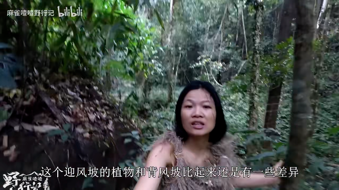

# 赤身进丛林生活100天，“国内荒野求生第一人”非她莫属

妹子有段时间特别沉迷野外生存类节目。

看人类在极端环境中遭遇困境又绝处逢生，简直比刷了几百部爽剧还刺激。

不过很遗憾，这种节目几乎被国外的探险家们包圆了，比如贝爷、德爷。

那时候我就在感叹，国内什么时候才能出个这样的“复合型”人才。

直到最近发现，咱不仅有，还是个牛皮plus的人物，给她打上“国内荒野求生第一人”的tag，毫不为过。

此人的节目叫麻雀喳喳野行记，粉丝们叫她喳姐。

她的出现，足以让一个彪形大汉卖弄着夹子音，喊一句“姐姐好飒”。

因为在她之前，没人敢想象一个“赤身裸体”的女子徒步荒野，还要在这生活100天。

“脱光衣服”这种hard模式并不是她的本意。

只不过之前有人留言说，穿衣服不算真正的野外挑战。

于是，一身反骨的喳姐开启了“赤裸裸”计划。

不但脱光自己，除了必要的拍摄、充电、应急设备，她连把刀和打火石都没带。

而她所到之处，是位于东南亚的一个原始丛林，毒虫、野兽、甚至毒贩，都可能出没。

一不小心就归西了，但喳姐表示，这是野外生存训练的天堂。

荒野求生，食物和水源最重要。

但对光着的喳姐来说，还是得先搞件衣服。

她最早瞄准柔软的芦花，不过第一次做得比较粗糙，不仅重得影响行动，尖锐的枝干还容易让她当场毙命。

于是她丢掉枝干，只用芦花的绒毛编织了一条草裙。

虽然费时费力，但结果是好的，直接从脖子骨折患者进化成了草裙小精灵。

体会到快乐后，她玩的花样也多了起来。

女人的衣柜里怎么可能只有一件衣服。

后面她用棕榈树皮外层的网状纤维做的衣服，还美美地加了个迪士尼公主垫肩。

把树枝打磨成棒针，用芭蕉纤维纺织出了一条内裤。

甚至还给自己弄了件吉利服，玩吃鸡的粉丝们直呼双厨狂喜。

通常我们认为，荒野求生时，女性天生就会比男生弱势一些，因为除了体力的考验，还有生理期的折磨。

但妹子属实没想到啊，这卫生棉，喳姐居然也会做。

她本以为丛林环境恶劣，只能用草木灰解决，结果被她发现了木棉树。

于是，棉絮+苔藓+树皮，卫生棉就这样诞生了。

想要在这里生存100天，只会些手工活当然不行。

慢慢往后看，越看喳姐越宝藏。

上悬崖、下峡谷，编鱼笼、布陷阱。

捉得了老鼠，捕得了鱼。

木薯盐酸果当主食，偶尔也吃点虫子炒饭。

新闻哥一大老爷们儿，见到蛇也只会吓得一激灵。

但是咱喳姐，逮着条小绿蛇就开始科普。

钻木取火没啥稀奇，可她还能做一个随取随用的火折子。

动手能力贼强的背后，是胆大心细的底气。

看到地上蕨菜翻过来了，她就推断出有大型动物从这里路过。

所以晚上地面不安全，要到树上去睡觉。

找到野柿子不好拿，直接扒了树皮开始搓绳子。

噢，在原始社会，纺锤代表着人类智慧和文明的进步。

所以后面喳姐也利用芭蕉树，做了个纺锤来编织绳子。

——妹子合理怀疑她是想实现衣服自由。

越往后看，越惊叹于她的全能。

制作肥皂、驱蚊水、甚至陶罐。

捡到被丢弃的废铁不要扔，哐哧哐哧就制作出了刀具。

她赤条条地来到丛林，然后就地取材，在这里安了一个家。

这不就是现实版的种田文。

而且她知识面超广，简直就是一本行走的百科全书。

挖到茅草根时，张口就来了一段：“《本草纲目》上有记载，茅根处处有之。春生芽，布地如针，俗谓之茅针，亦可啖……”

周杰伦的《本草纲目》妹子都记不全歌词，更别说李时珍的了。

木棉、小野竹、葛藤、茅草、苦楝树、水木耳......

喳姐不仅都认识，还知道它们的各种用途。

找个木棉花，还顺带科普一下迎风坡和背风坡植被的差异。

穿梭在丛林里，看着缠在大树上的藤蔓，有感而发背了整篇《致橡树》。

不过，最打动妹子的，还是喳姐的乐观与豁达。

为了解决以后的口粮问题，她花大力气做了个鱼陷阱。

结果没两天河水就涨了，陷阱说没就没，馅饼也说没就没。

不过很快，她就收拾好了心情，又一口气做了十个落石陷阱来捕食。

喳姐身上还有一种悲悯情怀。

取蜂蜜时，她没有选择用火熏，而是直接用手取。

虽然这样会被蜇伤，但是却可以最大程度保护蜜蜂不被伤害。

这样时刻挑战观众感官的节目，在网上自然会吸引很多质疑。

毕竟强大如贝爷，都离不开一个扛着20斤摄影机的好基友。

但几乎没有人找到证据，实锤喳姐背后有团队，或是视频不真实。

据说这100天的荒野求生视频是她2017年就拍摄完成的，从20年开始慢慢剪辑上传，至今连载了三年还没完结。

因为她有全职工作，只能用空余时间剪视频，更新时间极不稳定。

不过只要认真看过她的视频，你会坚信她是真的没有团队。

为了这100天的挑战，她把自己的体重增加到了62公斤才敢行动。

出发前也做了一系列的体能训练，甚至还学会了开飞机。

办好目的国的签证，买好保险。

准备了一台go pro、一台无人机，4部手机、15个充电宝、3个太阳能充电板，用于拍摄。

还有一台卫星电话，用于应急。

在第35天，喳姐因为误食了榼藤子，导致她腹泻、呕吐，体内电解质失衡。

为了继续挑战，她不得已使用卫星电话，让附近的村民在指定地点放了一些盐。

做野外求生类节目，贝爷、德爷珠玉在前，喳姐免不了被比较。

只能说各有各的可看性和欣赏角度。

在妹子看来，如果世界末日真的来临，贝爷德爷或许能活得很久。

但喳姐估计能带起一个部落，并且很快就发展出又一个人类文明……

