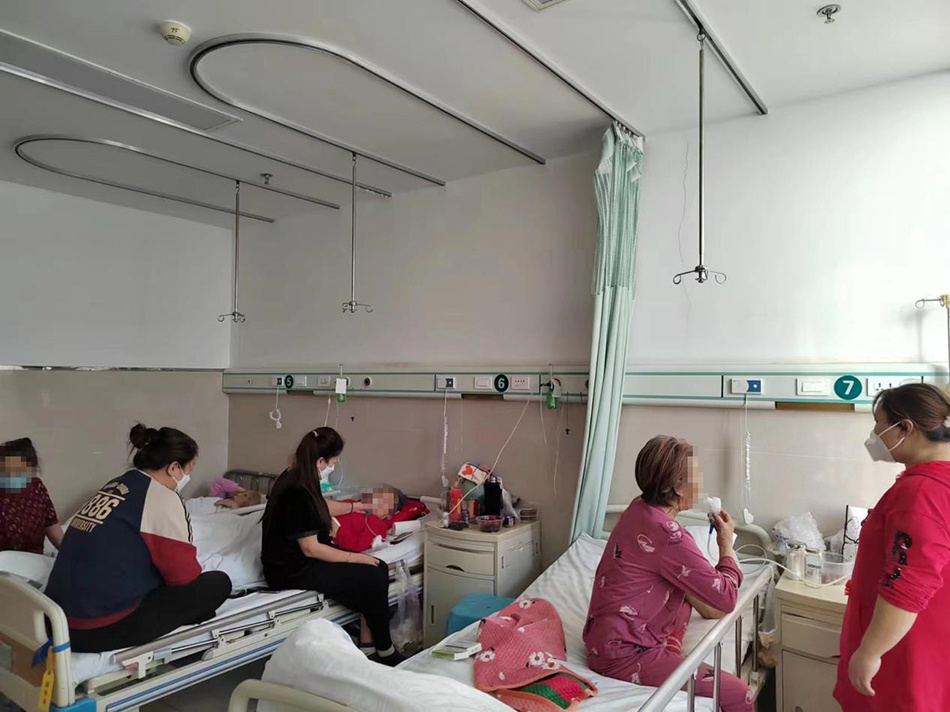
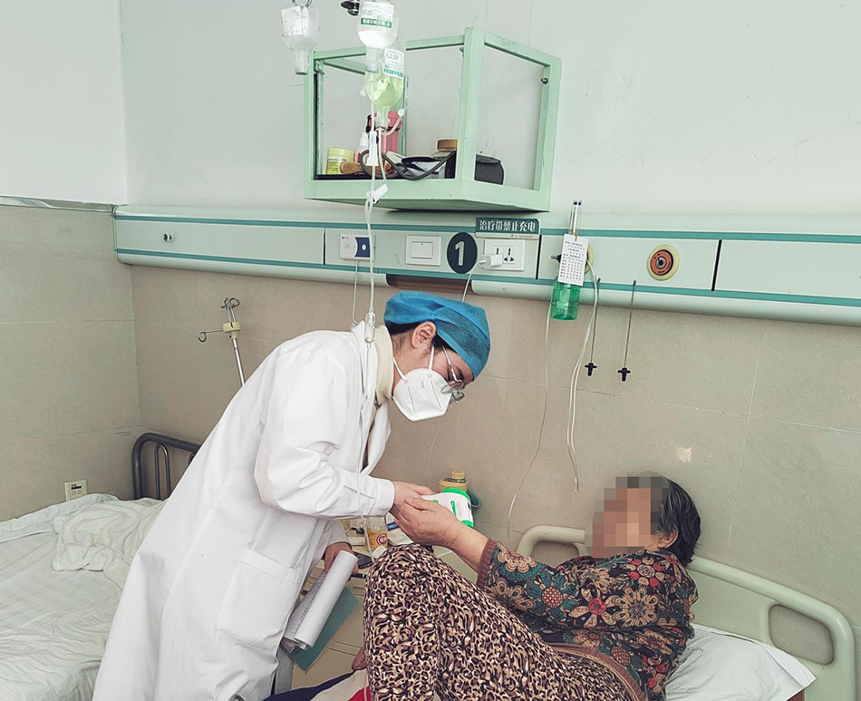
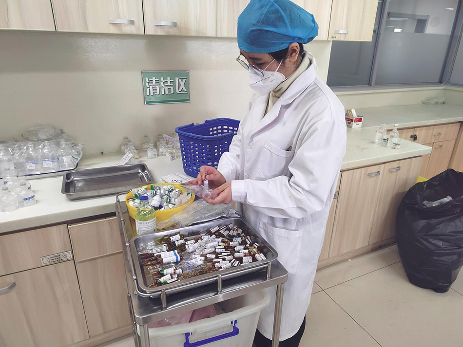
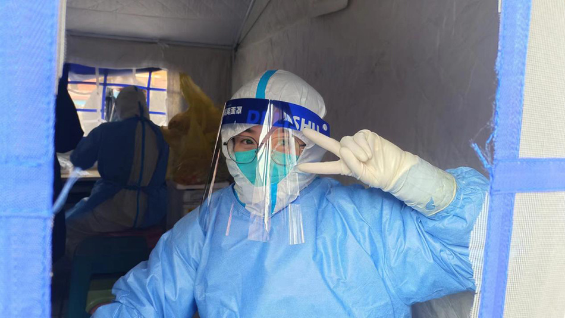

# 返乡抗疫的00后医护志愿者：第一次直面生死，不怕吃苦只怕辜负信任

这个寒假，19岁的医学生刘玉洁第一次在医院近距离直面生死。

“谢谢大家，让一让，让一让。”从二层CT室出来后，刘玉洁和病人家属焦急地推着病床前往重症监护室。床上躺着一位80多岁、新冠病毒感染和肺部基础病叠加的老人，戴着吸氧机，近乎失去意识。就在前一天，刘玉洁还给老人做了“四测”，老人病情稳定。

老人被送进重症监护室后，门外的家属们沉默不语，刘玉洁的大脑也一片空白。她看得出，家属们已经在做最坏的准备了，而自己安慰的话也哽在了心里，“我还没办法接受，说不出话，就跟哑了似的。”

没时间多想，刘玉洁需要立刻再赶到十层普通病房，还有三位住院患者需要她陪同做检查。刘玉洁是内蒙古呼伦贝尔扎兰屯市人民医院的一名医护志愿者，当天是她上岗的第10天。

_扎兰屯市卫健委招募公告部分内容_

去年底，各地相继迎来感染高峰，医疗救治压力愈加严峻。12月中下旬，多地卫健委、医院向社会发出医护志愿者招募令，刘玉洁的家乡扎兰屯市卫健委也在其中。

报名通过后，19岁的刘玉洁于2022年12月31日正式开启了医护志愿服务。她服务的住院病人9成都是新冠病毒感染者，整个科室患者激增，病床持续添加，10余名医护人员全员高位运转。

刘玉洁觉得，能回家乡支援抗疫，是自己的荣幸，她不怕苦，生怕辜负了信任。“我一直都不担心自己的身体，只害怕自己知识储备不够，又没有临床经验，做不好。”

而早在12月初，与刘玉洁同时就读于内蒙古河套学院2021级护理1班，住在同一个寝室的希里、赵丹也报名支援了各自家乡的抗疫工作。

**没有犹豫**

2022年的寒假，比以往来得更早一些。

11月24日晚上，刘玉洁和同学正在上晚自习，突然接到放寒假的通知。她经过查询发现，自己回家的飞机已经停飞、火车停运，在老乡的帮助之下，刘玉洁最终拼到了26日凌晨5点发车的回乡大巴。

历经2000多公里，将近40个小时的路程到家后，刘玉洁根据当地防疫政策，进行了7天的集中隔离和3天的居家隔离。而随着姐姐从外地到家，刘玉洁的隔离时间也被延长。

紧接着，随着防控政策的调整，各地新冠病毒感染人数骤增，结束隔离的刘玉洁也“阳”了。“困”在家中的她，每天都关注着家乡的防疫情况，看到医护人员在感染后仍坚守在岗的新闻，刘玉洁的心也被揪了起来，“我当时就想赶紧去帮他们一把”。

12月24日晚，刘玉洁正要准备睡觉，从姐姐那里得知扎兰屯市卫健委正在招募医护志愿者，她想都没想便在报名表中写下了自己的名字。家里人知道后，都非常支持她，觉得这是一件善事，“我爸爸当时就说，只要能被选上，每天开车接送我。”

等通知的时候，刘玉洁也很忐忑，她害怕自己没有竞争力，才读大二，没有临床经验，没有扎实的专业基础。12月30日早上，刘玉洁接到了电话，要求次日就来医院报到，“我当时还有点震惊，但是更多的是激动。”放下手机后，刘玉洁赶紧拿出了自己的专业书，重温可能会用到的专业知识。

上岗第一天，刘玉洁就发现形势的严峻程度远超于她的预期。

被分配于神经内科的她，服务的患者9成都是新冠病毒感染的住院病人，整个科室患者激增，病床持续添加，10余名医护人员全员高位运转。“能腾出空间的都腾给了呼吸科，多个科室接收新冠患者，我们科室病区原本只有40个床位，目前加床收治了50余名患者。护士姐姐感染了照样在工作，每个人都疾走如飞，我从进医院大门开始就提着一口气，不敢松懈。”

_病房里患者雾化治疗
本文图片均为受访者提供_

“扎兰屯发布”微信公众号1月3日也发文称，扎兰屯市人民医院现在每天急诊白天大约有患者250余人，夜间60余人，是平日工作量的5—6倍，急诊科负责人一直带病上岗，坚持在一线工作。

**不断学习**

扎兰屯早上气温只有零下20摄氏度，父亲兑现了当时的承诺，每天准时开车送刘玉洁去医院。到了医院，换上护士服、戴上帽子口罩、穿戴整齐后，刘玉洁开始了一天的工作。

7点30分，刘玉洁先是跟随护士进行查房工作，为患者换上洁净的床单被罩，再把需要送去检测的尿标本、痰标本、血标本送往检验科进行检测。

刘玉洁还和另一位志愿者共同负责十层患者的“四测”（体温、脉搏、呼吸和血压）工作。十层共有17间普通病房，每个病房住着四位病人，病人需要每天上下午固定两次“四测”。忙碌起来时，她一个人要承担这些工作，短时间内需要来回在楼道里穿梭多趟，“脚像上了发条，根本停不下来”。

_刘玉洁为患者测量体温_

在做“四测”方面，刘玉洁也有了自己的经验。面对年龄偏长的患者，她都格外小心谨慎，生怕碰疼他们。对不太配合的老人，她会蹲下身，耐下地告诉老人“四测”的重要性，一遍遍细心劝说。“住院的病患大多数是老年人，有的还有基础病，气温下降导致疾病加重，又遇到新冠，叠加症状严重，有些比较害怕。对待他们一定要特别有耐心，才能安抚他们的情绪，使他们更好地配合治疗。”

刘玉洁还会陪着轻症和病情稳定的住院患者辅助检测，帮助护士配药，收拾病床。

陪检也是她固定工作中的一项。每个住院病人会定期进行彩超、CT、磁核共振等相关检测，刘玉洁则需要在病人检测前提醒和照顾。“一般就是听着护士姐姐叫我们，等快到他们的时候帮病人拔了针，再推进检测室。”平日里，刘玉洁每天至少会陪1-2位病人进行检测。

由于志愿者的身份，刘玉洁的工作量和真正的医护相比较为简单，“医护人员都特别辛苦，声音沙哑、止不住的咳嗽对他们来说根本不算什么，我们还能休息，他们忙起来甚至没办法回家。”

但刘玉洁也坦言工作比想象中的累，“每天到家就想躺着不想动，心也累，因为要时刻紧绷着。”

_刘玉洁进行配药准备_

刘玉洁在临床实操方面一直不太自信，每次遇到实操的工作，她就会紧张，生怕某个步骤做错。“书上的护理知识在实操时用不上，真正的操作技能还没有掌握。”她知道自己只能在实践中锻炼，把握每一次机会，“护士姐姐们不忙的时候，会教我一些操作，像做心电图、雾化，这些都是这段时间学会的。”

1月6日上午，一位60多岁的患者需要做心电图。在护士的鼓励下，刘玉洁独立完成了操作，她小心翼翼把老人的袖子、裤腿挽起来，把仪器放在身体的对应部位，心里默默回忆着课上老师教的口诀，将不同颜色的夹子分别夹在手腕、脚腕以及胸前相应位置。做完心电图，刘玉洁还给这位奶奶进行了一系列的检查，“当我做完以后，特别有成就感”。

在医院里，刘玉洁也提前感受到未来从医需要面对的生死瞬间。

“玉洁，快过来帮忙。”1月11日下午，刘玉洁正在病房进行“四测”工作，便听到了护士在叫她。刘玉洁赶忙将手头的工作转交给其他人，顺着呼叫声奔向病房。

只见一位80多岁的老人被众人包围着，老人已经失去了意识，并戴上了吸氧机。刘玉洁没办法理解，就在前一日体征还正常的老人怎么就突然加重了病情，她强忍着难过，与老人的四位家属一同推着病床进行检查。

他们将病床从十层挪进电梯，坐到一层再换乘前往二层彩超室。电梯里的空间狭小，一旁的人都示意他们先走，“大家看到病床上的患者都会理解，当时还是挺感动的。”

彩超室外，刘玉洁和老人的女儿、外孙们一同等待，“我当时隐约听到，他们已经在做最差的准备了。”

做完检查，大家推着老人前往重病监护室，一路都沉默不语，刘玉洁的大脑也一片空白。看着家属难过的表情，她知道说什么都是多余的，安慰的话哽在了心里，“这是我第一次直面生死”。

**一起进步**

刘玉洁每天在医院里的所见所闻都会和自己的大学室友希里、赵丹分享，也会探讨一些实操业务。事实上，早在12月初她还在隔离期间，两人就已报名参加过各自家乡的核酸志愿服务。

假期回家隔离期间，希里了解到小区紧缺志愿者后，主动联系了楼栋的网格员。在解除隔离后的第二天，希里一早便来到居委会，分派给她的任务是核酸采样工作。

12月2日早上7点，居民们陆陆续续来到广场排队进行核酸检测，“我看到很多人排着队，就开始慌了。”尽管在学校时，希里曾陪好友参加过系里组织的核酸采样培训会，对采样的方式流程有过了解，但真正操作时，还是难免慌张。

刚开始，希里没能把握好节奏，在她还在数10支采样棉签时，下一个居民已经摘了口罩等待检测了。“他们等着我的时候，我就更紧张了，怕他们多等，因为这存在感染风险”，希里说道。

志愿者中只有希里一人有过医学背景，在接班时，大家会围观她的采样流程。“他们发现我的动作和他们的不一样，就会问我这个采样到底应该怎么采。”希里发现，有些人的采样方式并不正规，“有人就是把采样棉签放在嘴里随便划一下就出来，这样检测出来的结果并不准确。”她边为居民做核酸，边讲解采样方法。希里将棉签伸进扁桃体的两侧，左右分别划三次，再伸进喉咙，“这才是采样的完整做法。”

_希里进行核酸采样_

当晚，小区里出现了新冠感染者，希里接到居委会通知，以后要到单元门口进行核酸检测。她和其他两位志愿者组成一队，负责小区一期广场以南二十栋楼的核酸检测。“一栋楼有三个单元，但是负责核酸检测的只有我们三个。”希里回忆。

次日凌晨5点半，她睁眼看着手机里的室外温度——零下15度。窗外还是漆黑一片，路面上已经结了冰，里三层外三层的包裹后，希里艰难跨出楼道门，“这一步是最困难的，出到室外，风吹来是刺骨的寒冷。”

希里需要先到居委会进行“二次装扮”。防护服的穿戴步骤琐碎，先是戴上头套和口罩，然后穿上一层防护服，再套上鞋套、戴上第一幅手套，这只是第一层。志愿者们还需要在防护服外面再穿上一层围裙式的蓝色外套，看到希里够不到后面的带子，志愿者姐姐会主动帮她系好。看着她的头套太大，也细心帮她捆上胶带，“虽然这是一件很小很小的事，但是我当时还是感到很温暖。”

志愿者们的工作方式变成流动式核酸检测后，希里的身上也多了几个塑料袋。站在单元门口进行核酸检测时，希里在腰上绑上了一个垃圾袋，方便把包装袋子扔进去。同时，腰上也多了一个充电暖宝来御寒，但长时间在室外，她还是全身发冷。

防护面具上的水珠结成了冰碴儿，希里的眼镜上也起了一层雾，但她顾不得这些。

一连几个小时站室外，希里的手脚都麻了，“手没有知觉了，甚至都握不住采样棉签。”回到家后，希里发现手背起了皮，有些地方开始皲裂，“开始的时候没有太在意”。一连几天，希里都觉得手背生疼，等她再次查看后，才发现是起了冻疮。希里没有告诉家人，涂了药膏就睡下了，她笑道，“一忙起来也就顾不上疼了。”

家住呼和浩特市和林格尔县的赵丹，也从12月3日开始支援社区的核酸检测录入工作，当天早上6点半便开始了自己的工作。

“早晨太冷，做核酸的人并不多，真正多起来是从上午10点开始的。”和希里一样，随着人多起来，赵丹也开始紧张。她全神贯注地录入居民信息，提醒居民手机屏幕调亮些，也时刻关注着录入数字。

上午的核酸检测完成后，志愿者们封箱清点。“我们发现扫码成功的人数和做完核酸的人数对不上”，发现错误后，所有志愿者逐个排查。为了防止出现纰漏，居委会设置了名册登记制度，扫码前，居民要先在名字后面打勾，“我们当时就对着名册挨个地找，虽然小区里只有8栋楼，但我们也花了一个小时才找出来。”

赵丹心中很是愧疚，“我当时很害怕，但是大家没有责怪我一句。”天气很冷，但是赵丹心里却很暖，之后的工作也很顺利。

随着防疫新政策的发布，核酸检测逐步取消，希里和赵丹也结束了自己的志愿活动。看到刘玉洁如今能在医院做志愿服务，她们感到很羡慕，也都在自己的家乡继续找志愿服务。如今，希里也已经向当地申请前往医院帮忙，准备前往下一个“战场”。

她们约定，今年春暖花开返回学校之时，继续寻找机会做医护志愿者。

（为保护受访者隐私，文中刘玉洁、希里、赵丹均为化名。）

