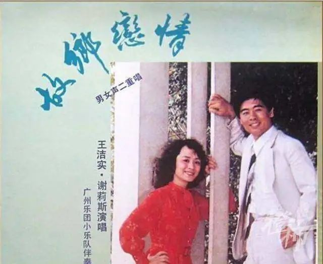

# 75岁歌唱家谢莉斯去世，她演唱的《外婆的澎湖湾》家喻户晓

1月13日下午， **著名歌唱家谢莉斯于在北京去世，享年75岁。**

谢莉斯中国音乐家协会会员，中国电影家协会会员，中国电影乐团国家一级演员。她1972年分配到中国电影乐团任歌唱演员，上世纪七八十年代，她和王洁实的二重唱曾经是大陆最为人熟知的声音。

谢莉斯和王洁实用校园歌曲的方式首先向中国歌坛介绍并展示了“通俗”唱法，
**并演唱了《校园的早晨》《踏浪》《草原牧歌》《九九艳阳天》《龙船调》《花儿为什么这样红》** 等优秀的创作歌曲、电影歌曲、中国民歌，很多人耳熟能详的
**《外婆的澎湖湾》**
，就是由他们传唱开来的。当时的谢莉斯与王洁实比现在的凤凰传奇更火，曾有人用“旧时王谢堂前燕，飞入寻常百姓家”形容这对演唱组合的风靡程度。

**谢莉斯1947年出生于重庆，受歌唱家郭兰英影响，从小喜欢演唱民歌** ，
**她17岁考上了中央音乐学院，25岁进入了中国电影乐团，担任独唱、重唱演员。**

谢莉斯与王洁实合作于1978年。当时电影乐团要推出一对二重唱的歌手，于是谢莉斯和同样喜欢并擅长演唱的王洁实成了一对组合。

王洁实和谢莉斯第一次登台表演， **合唱了《油田的夜晚》《花儿为什么这样红》等歌曲。** 随后持续合作，两人越来越默契，名声也越来越大。

上世纪80年代初，谢莉斯无意间在电台里听到了台湾校园歌曲，尤其喜欢其中一首《赤足走在田埂上》。谢莉斯从一位当音乐编辑的同学那打听到有那张唱盘，她和王洁实就骑自行车跑到同学那里，把歌转录回来再继续听。随后，两个演唱开始演唱台湾校园歌曲，《外婆的澎湖湾》《踏浪》《走在乡间的小路上》这些歌很快传遍大江南北，他们也成为大家熟知的歌星。

1980年以来，谢莉斯先后为《莫让年华付水流》《一个女经理的星期天》等十几部电影、电视剧演唱主题歌、插曲。独唱、重唱歌曲录入磁带、CD十多盒畅销国内外，其中《何日再相会》盒带发行量达300万盒。连续4年获得太平洋音像出版公司颁发的“云雀奖”。

虽然事业上很成功，但谢莉斯却过早的遭遇了病痛的打击。1997年10月份，50岁的开始感觉不能很好控制自己的面部表情，相伴而来的是头晕眼花。经过医院的诊断，
**她得了多发性的腔隙性脑梗塞，这是一种脑损伤疾病，由于堵塞的面积大，堵塞的血管众多，难以疏通，很难恢复。**

经过两个多月的治疗后，谢莉斯终于脱离了最危险的阶段，但一波未平一波又起，她又面临着如何能独立行动的问题，开始了同病魔战斗的漫漫长路。

为了恢复健康，能走路，能再度登台演唱。谢莉斯坚持每天进行康复训练，终于在2000年得到好转，再度开始表演，回到了自己最喜欢的舞台。

战胜病魔的谢莉斯， **又在2010年再次遭遇打击，她的独生女患上了癌症，几年后去世。** 但谢莉斯依然热爱生活，她曾在采访中说，“
**生活中不幸的事情随处发生，但我们必须抱有希望。”**

这几年的谢莉斯，已经不再登台演唱，和家人过着低调的生活。没想到在2023年伊始，就传来了不行的消息。

希望为很多人带来美妙歌声的歌唱家谢莉斯一路走好。

橙柿互动·都市快报 记者 邢鹤涛

