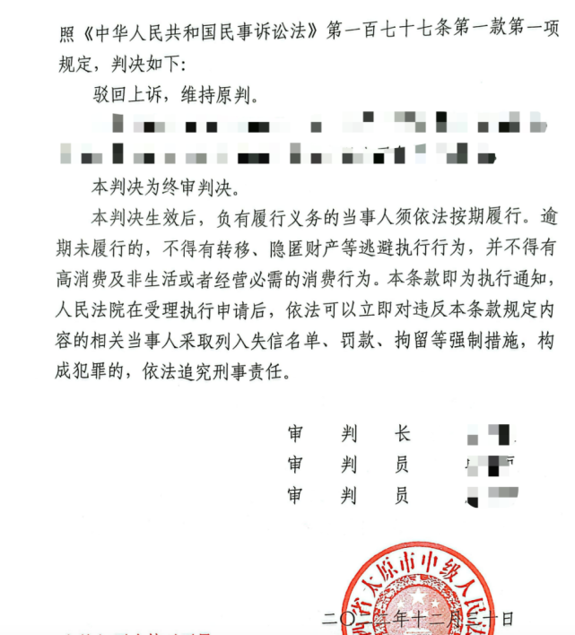

# “1200万被银行职员转走”储户称将申请再审，此前被判担责八成

山西太原清徐农村商业银行（下称清徐农商行）日前发布的关于“1200万元被转走事件”声明视频，引发社会关注。

视频中，清徐县农商行表示，客户丁女士的资金损失，是王某伟实施诈骗犯罪行为所致，王某伟也因此受到法律制裁，应承担赔偿责任。而丁女士的儿子王先生则认为，该声明自始至终未提及王某伟系清徐农商行职工的身份，也未提违规办理业务的情况，试图撇银行的责任。

丁女士称，她被丈夫的外甥女婿王某伟诈骗共计1200万元，王某伟则是清徐县农商行个人金融事业部客户经理。

判决书显示，王某伟利用其在清徐农商行工作的便利和丁女士对其的信任，通过虚构事实、隐瞒真相的方式，多次骗取丁女士钱款。这1200万元均被王某伟非法占有，案发后全部款项未追回。

丁女士称，她为了帮王某伟完成存款任务，将1200万元先后分4笔存进了清徐农商行。但王某伟以帮她代领礼品为借口，拿着丁女士的身份证和存单，偷偷划走了她在银行的存款。

_二审判决书。受访者 供图_

王某伟案二审判决书显示，法院判决王某伟犯诈骗罪，判处无期徒刑，并继续追缴王某伟的犯罪所得，发还给被害人。

2020年4月，丁女士委托律师对先期2笔存款共计500万提起诉讼，请求清徐农商行承担责任并赔偿损失。

经过清徐县法院和太原市中级法院两级法院审理，法院认定丁女士在本次存款造成的损失中存在重大过错，应承担八成责任；清徐农商行只承担两成责任。

2023年1月16日，丁女士的儿子王先生告诉澎湃新闻（www.thepaper.cn），清徐农商行对员工管理混乱、柜员未尽到审慎的注意义务，存在失职行为，银行不能将管理不善的风险转嫁给储户。他们将于近期向山西省高级法院申请再审。

**银行职员诈骗亲戚1200万元被判无期徒刑**

丁女士介绍，王某伟是她丈夫的外甥女婿，今年34岁，原是清徐农商行的一名客户经理。有亲戚在银行工作，丁女士一家自然会对其信任和照顾，“我们家有什么与银行的交往及办理银行的现金转账等业务，都是通过王某伟给办的。之前也帮他完成过单位下的存款和理财任务，都没啥问题。”

丁女士回忆，2017年1月，王某伟到家中找她，当时她和丈夫都在家。“王某伟想让我再帮忙完成理财任务，但是他说这次的理财任务是他个人名义的理财。我们出于对王某伟的信任，就答应了。”

丁女士说，2017年1月，她给王某伟账户转账400万元让其帮忙买理财。同年11月，王某伟又来找她，她又转了100万元给王某伟。到了2019年3月，王某伟说500万的理财已经取出来了，但银行内部有政策，如果能存2000万进去就有机会让他升为主任。丁女士称，她共计在清徐农商行存了1200万元。

但丁女士不知道的是，王某伟已将1200万元非法占有。王某伟案二审判决书显示，法院经审理查明，2017年1月和11月，王某伟谎称需要丁女士帮助其完成理财任务，先后骗取丁女士给其转账500万元。2018年2月，王某伟以帮助丁女士办理定期转存业务为借口，骗取丁女士的存折、银行卡和身份证，将其500万元存款取出据为己有。2019年3月，王某伟隐瞒前述500万元理财产品被其占有的事实，谎称该理财产品本金及利息543万元已到账，以让丁女士帮助其完成银行存款任务为借口，又骗取丁女士存款200万元。上述共计1200万元均被王某伟非法占有，案发后全部款项未追回。

判决书显示，王某伟证言称：“我因为倒贷欠下巨额债务，这些钱（注：指1200万）我全部用来周转和还款付息了。”

2020年12月，太原市中级法院判决王某伟犯诈骗罪，判处无期徒刑，继续追缴王某伟的犯罪所得，发还给被害人。王某伟不服提出上诉，2021年6月，山西省高院裁定驳回王某伟上诉，维持原判。

**一审法院：银行未尽到足够的管理职责**

丁女士说，自己存进银行的钱，怎么会被王某伟非法占有？她认为清徐农商行存在重大责任，应承担相应责任，遂于2020年先期起诉1200万元中的500万元，要求清徐农商行支付存款本金并支付利息。

2021年9月2日，清徐县法院作出一审判决，判定丁女士自己承担八成责任，清徐农商行承担两成责任。

判决书显示，清徐县法院认为，作为储户，丁女士应当对资金安全负有注意义务。本案中，丁女士将存单及身份证交给王某伟，虽丁女士及王某伟均认可是领取礼品，但均未提供相关的证据予以证实，且丁女士也未在存单上注明让王某伟持存单仅限于领取礼品的字样。丁女士作为成年人，应当预判到存单和身份证交给别人可能会造成存单被支取的风险，但其放任该风险的发生，故丁女士在本次存款造成的损失中存在重大过错，理应承担相应的责任；作为专业金融机构，清徐农商行清源支行负有保障储户存款安全的义务。就本案而言，丁女士的存单上午存、下午取，当天上下午银行的柜员和授权员也没有变化，王某伟在填写个人业务凭证时存取汇款人姓名栏应填“丁某某”，却误填为王某伟的父亲“王某某”，清源支行工作人员也未电话或短信通知丁女士本人就对涉案存单支取后转账到王某伟父亲的账户，且涉案存单未设密码，银行对未设密码的存单支取更应尽到谨慎的义务，故清徐农商行在本案存款损失中未尽到足够的管理职责，未尽到严格的注意资金安全的义务，对丁女士存款被王某伟支取所造成的损失也应承担相应的责任。综合考量双方的责任，丁女士承担八成责任，清徐农商行承担两成责任。

**二审法院：储户应对自身的财产损失承担主要过错责任**

判决后，丁女士及清徐农商行均不服，分别提出上诉。

太原市中级法院认为，本案案由应调整为储蓄存款合同纠纷，本案的争议焦点为：清徐农商行在给丁女士办理案涉业务时，是否严格按照法律、行政法规、有权机关的规定及答复执行；丁女士对自身财产是否尽到安全保管的注意义务，应否承担过错责任；清徐农商行对储户存款是否尽到审慎注意义务，应否承担过错责任。

该院认为，清徐农商行在验证了存款人丁女士的身份证、存单、声明代丁女士支取的王某伟的身份证真实无误后，办理支取案涉定期储蓄存款未到期业务，符合《储蓄管理条例》等条例、规定对该业务办理的要求及人行的答复意见。

对于第二个争议焦点，太原市中院认为，丁女士作为存款人，基于与王某伟的亲戚关系和对王某伟的信任，长期将身份证、存折/卡、密码(部分)、定期储蓄存单(部分)交给王某伟，对应当预见可能发生的不法侵害，未采取任何防范措施，未对自身财产尽到安全保管的基本注意义务，应对自身的财产损失承担主要过错责任，一审判决其对存款损失承担80%的责任，并无不当。

对于清徐农商行的责任，太原市中院认为，作为专业金融机构，保障存款人的合法权益，是商业银行应承担的法律责任和社会责任。清徐农商行对案涉的大额款项当天或次日存、取，未尽到保障存款人资金安全的审慎注意义务，故对丁女士的案涉存款损失应承担一定的过错责任，原审判决清徐农商行承担20%的责任，也并无不当。

2022年12月底，太原市中院作出判决，驳回上诉，维持原判。

**涉事银行发视频声明，储户称将申请再审**

丁女士和清徐农商行的纠纷并未随着二审判决的送达而停息。

2023年1月11日，清徐农商行发布关于“1200万元被转走事件”的声明视频。视频中，清徐县农商行新闻发言人张晓婷表示，丁女士的资金损失，是王某伟实施诈骗犯罪行为所致，王某伟也因此受到法律制裁，应承担赔偿责任。丁女士与王某伟不仅仅是普通亲戚间的信任关系，有证据显示，王某伟与丁家多人长期存在大额频繁经济往来。

张晓婷称，王某伟在办理涉案支取业务时，“身份是我行的正常客户”，该行为其办理业务符合《储蓄管理条例》等有关规定。该行将充分尊重司法权威、尊重太原市中院二审判决，对不应由该行承担的责任和损失，该行仍将继续通过法律途径坚决维护自身权益，保留对王某伟的追偿权。

张晓婷还称， “1200万存款”的说法与实际不符，该案件中，丁女士起诉该行赔偿金额为500万元，另700万元属王某伟诈骗资金，并未在该行发生真实业务。

对于上述声明视频，丁女士的儿子王先生认为，该声明自始至终未提及王某伟系清徐农商行职工的身份，仅一再强调是“亲戚关系”。也未提违规办理业务的情况，试图极力撇清清徐农商行在事件中的责任。

对于太原市中院二审判决，王先生说，法院认为“储户不能以违反金融机构内部管理规定，要求银行承担违约责任”。而在现实中，银行内部规定不只约束银行员工，也同时约束广大储户。任何银行不填业务受理单肯定不会受理业务，哪怕填错一个字都不行，不电话核实清楚业务真实性银行也不会随意放款，可本案业务受理单“存/取/汇款人”姓名填写错误，电话不是预留电话，付款人、收款人账户未填写，更没按规定核实通知储户，王某伟就是利用了银行员工身份、工作便利、柜员没尽到责任义务，违规办理，使存款被盗取。银行不能将管理不善的风险转嫁给储户。王先生说，他们将于近期向山西省高院申请再审。

