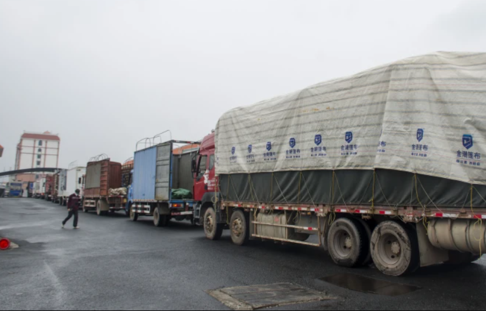

# “如果今天无罪，明天就出车”：涉疫获刑四年，货车司机申请再审

_2023年1月8日，广西东兴，边民互市贸易区内大量货车正在通关。图文无关。（视觉中国/图）_

41岁的韩东在看到新闻后难得地睡了个整觉。

作为长年全国各地跑的货车司机，他通常只在过年时才回到家乡——辽宁省葫芦岛市绥中县。但在过去大半年中，韩东待在老家县城寸步未离。他与妹夫贺宏国因涉嫌妨害传染病防治罪，于2022年4月24日被绥中县公安局监视居住，在半年后的10月31日，绥中县法院对该案进行公开开庭审理，两人被判处有期徒刑四年。

韩东不断关注涉疫获刑的相关报道，他觉得自己的四年刑期太长。

这一次，他看到的新闻是：最高人民法院、最高人民检察院、公安部、司法部、海关总署于2023年1月7日联合出台《关于适应新阶段疫情防控政策调整依法妥善办理相关刑事案件的通知》：自2023年1月8日对新型冠状病毒感染实施“乙类乙管”、不再纳入检疫传染病管理之日起，对违反新型冠状病毒感染疫情预防、控制措施和国境卫生检疫规定的行为，不再以妨害传染病防治罪、妨害国境卫生检疫罪定罪处罚。

通知表示，目前正在办理的相关案件，依照中国刑法、刑事诉讼法相关规定，及时妥善处理。犯罪嫌疑人、被告人处于被羁押状态的，各办案机关应当依法及时解除羁押强制措施；涉案财物被查封、扣押、冻结的，应当依法及时解除。

上述新规主要针对未审结案件。韩东、贺宏国一审宣判后未上诉，判决已生效。

“既然一审判决已经生效，通知的出罪规定就和他们没有关系，他们依然要在监狱服刑。命运给他们开了一个巨大的玩笑。”中国政法大学教授罗翔撰文表示，中国刑法采取的立场是认为既判力的效力高于溯及力，对行为人有利的法律不能溯及已经生效的裁决。

不过，两人也没有被送往监狱服刑，一直处于监视居住状态。2023年1月9日，韩东告诉南方周末记者，他已向绥中县法院提交再审申请书，希望事情有转圜余地。“如果今天判我无罪，明天我就出车，我得挣钱去。因为我家里的压力太大了，这一年我的家里头落了好几万块钱外债，孩子得读书，房贷得还。”

1月13日，绥中县法院工作人员向南方周末记者表示，该再审申请已提交至葫芦岛市中级法院。

最后一趟车

韩东的妹夫贺宏国现年45岁，两人是同乡，疫情暴发之后开始一起跑车。

这辆半挂牵引车是贺宏国贷款与人合伙购买，韩东拿“每月一万”固定工资，平时主要是运蔬菜水果，出车范围遍布全国各地。“它是有季节性的。”韩东说，到四川拉芒果，跑云南拉菜，上新疆拉哈密瓜，“哪里有货源就上哪里去”。

运送生鲜较为辛苦，两人通常是交替开车，马不停蹄地赶路。“我们装上货之后，24小时就不停了。”韩东举例，“比如说我在云南保山拉豆角，到哈尔滨就给70个小时，两个人在车上吃饭，上厕所时间都得紧出来，黑（夜）白（天）车不闲着，不停地走，才能在这个时间进入市场，晚了就扣运费。”

他初中没读完就出来工作，做货运司机已有十年，就图这份工作常年有活，能干的时间长一点。

两名司机平日很少回家。“一年365天，连春节算上，在家能待一个月。”韩东说，新冠疫情三年，自己偶尔路过绥中，到家拿两套换洗衣服，跟家人吃顿饭就走了。“我们都不敢回家，一个是到家就隔离，挣不着钱了，另外一个也害怕把家里人给传染上。”

2022年1月，两名司机接了一个运送包心菜的任务，从湖北武汉送到黑龙江牡丹江。

这是贺宏国年前最后一趟车，但他没料到是最后一次。

整个行程密集紧凑。韩东回忆，1月23日，他们先到牡丹江卸下半车包心菜，又配了半车胡萝卜，当晚开到牡丹江市代管的县级市绥芬河，将车内货物卸下。1月24日凌晨3点左右，到另一牡丹江市代管县级市东宁装玉米，1月25日凌晨3点多到辽宁省锦州市卸货，在锦州港卸完货物后，他们就一路往绥中县赶，于1月25日中午到达。

贺宏国说，由于路线太长，途经地区有不同的报备流程，“咱们也不知道怎么报，合着就从哪回来就在哪报”。1月24日，他通过妻子向屯里的微信群报备从锦州返回的行程。

到了家，在听闻绥芬河当时暴发疫情的消息后，他没太在意，觉得与自己关系不大，就照常过年，走亲串门。

跟贺宏国想法类似，韩东在老家微信群里报备后，也看到了绥芬河疫情的消息。“我们也就没报（去过绥芬河），原因是当时就报的锦州，已经报完了。”

但他也坦言，货车司机行业特殊，所涉地点众多，难以报齐行程。“拉蔬菜水果有时间限制，如果你说你从疫区走过，肯定得给你隔离，这一车菜一车水果怎么办？就又得扔了。”

从两人返回绥中县，到该县疫情暴发，其间经过了17天时间。韩东告诉南方周末记者，自己在2月2日、2月8日、2月9日做过核酸，检测结果均为阴性。其间，他到小舅子家吃饭，一行十余人，随后绥中县疫情暴发，韩东的小舅子成为全县首位新冠感染者。2月10日晚上，韩东检测为阳性，次日被医院拉走隔离，很快被认定为引发疫情的责任人。

根据绥中县纪检委官方微信“清风绥中”2月15日消息，“0208”绥中疫情存在公民个人妨害传染病防治、属地乡镇风险排查及落实包保责任不严不实、行业监管部门履职不力等问题，引发此次疫情的大货车司机被立案侦查，绥中县多人被处分。

是否故意瞒报行程

2022年9月29日，绥中县检察院向绥中县法院提起公诉。

10月31日，绥中县法院一审判决。贺宏国的妻子、父亲也到了法院，但家属不允许进入，他们便在门外等着。等了三个多小时，贺宏国、韩东终于从法院走出来，此时他们已经被认定犯妨害传染病防治罪，分别获刑四年。

判决书显示，2022年1月22日，两被告从绥中县前往牡丹江市送货，1月25日返回绥中县。二人得知牡丹江绥芬河市暴发疫情后，未履行疫情防控相关规定，未对去过绥芬河市的行程进行报备，后均被确诊，造成绥中县183人被感染，7865人被隔离，全县陆续划定34个封控区、管控区和重点防范区，启用隔离场所61家，绥中县财政共支出各项疫情应急处置费用约1.55亿元。

瞒报疫区行程是案件关键之一。“我们以为说从哪里回来就报哪里。”韩东自辩，在22日至25日期间，两人送货卸货行程涉及多地，“我们工作特殊，一天就走很多地方，有时候也不能全部报备”。

韩东的辩护律师也当庭表示，韩东虽然实施了瞒报疫区行程的行为，但其瞒报是出于对绥中县防控措施不了解，主观故意不强。他还指出，韩东于1月25日返回绥中，在2月10日核酸结果才显示阳性，“即韩东从绥芬河市疫区返回后，经过
17 日才被确诊新冠肺炎，并不能合理排除韩东从疫区返回绥中县时并未感染新冠肺炎，不排除其返回绥中县后感染的可能。”

因果关系难以判定亦是案件争议所在。北京市隆安律师事务所律师何志伟向南方周末记者解释，妨害传染病防治罪的判定需要有“违反防疫规定行为”本身以及“该行为产生了一定负面影响”两个条件，但在法律实践中，行为与结果之间的因果关系很难界定，而在大多数案件中法院往往是采用推定的方式来确定两者之间的因果关系，“这样的方式在法律上可以说是非常牵强的，刑法上讲究的一定是A原因导致B结果这样明确的因果关系”。

此外他指出，两名被告人的具体行程轨迹不清，判决书仅以市行政区域为依据，没有具体到县（区）、街道、路（号牌）等详细的坐标点位。两人去过的具体地点是否在该时段有疫情不详，接触的人、物不明，是否有涉疫风险不清楚，是否涉及接触确诊病例、密接人员和疫区，没有证据证实。

但在审判过程中，两名司机认罪认罚，宣判后并未上诉。据财新报道，贺宏国称，他们以为“上诉会再往多了判”，不知道“上诉不加刑”是刑事诉讼基本原则。

提交再审申请书

该案件的判决生效后，韩东和贺宏国并没有被送往监狱服刑，而是被监视居住。

两人被告知是“疫情原因”，“看守所不收人”，让他们等通知。何志伟则认为，这或许是“留有余地的一种处理方式”。而国家防疫政策目前已发生重大变化，监视居住的原因也已不太成立。

对于当事人来说，被监视居住意味着工作停滞。“也就是说不让我出绥中县城，随叫随到，电话24小时保持畅通。”韩东说，跑车无从谈起，自己失去了经济来源，日子过得辛苦。

他的压力在于一家老小所需的生活费，和每月两千多元的房贷。父母在农村种地，儿子上高三，女儿上初一，妻子在县城打零工，“一个月两千多块钱，就能挣个房贷钱，不够的就借”。

从2022年4月24日至今，和韩东一样，在手机定位和监控器之下，贺宏国只能在家里待着。在出事之前，贺宏国是六口之家唯一的经济来源。由于是农民出身，他们所在的山头有两块小田地，种一些苞米，也能打个一千多斤，但妻子韩梅（化名）说这根本不足以养活一家子，还是得出去打工。

贺宏国的母亲在这一年中摔伤了腿，住院治疗花去四万元，只好找亲戚借钱维持生活。韩梅一直在家照顾两位老人，无暇外出打工，只能在家里接一些小活儿。“家离不了人，没人会做饭。”

儿子在与绥中县相邻的兴城市读大专，女儿在当地上初二。韩梅说，孩子只要一提到贺宏国的事就哭，女儿有时说不想再升学了，干脆出去打工给家里挣些生活开销。这也是韩东的苦恼之处，临近高考，儿子无法安心读书，总想着出去打工，减轻家里压力，被他劝住。

2023年元旦后，两名司机又向绥中县法院提交了再审申请书。“我写材料的时候是12月份，当时国家没出台这个政策（1月7日五部门通知）的。”韩东给出自己的申请理由，“我就是感觉判得重。因为我在家没事，我就看（相关案例），在全国来说，没有比我们两个再重的了。”

“咱还是希望不要有罪。判四年挺不甘的。”韩梅还担心丈夫的犯罪记录影响孩子往后就业。“我们不是读书人，最起码孩子是读书人，还是希望他们能好一点儿。”

何志伟表示，新通知的发布原则上不能推翻已经判决的案件，但对于一些明显存在证据不足等问题的案件法院应当予以处理。

南方周末记者 高伊琛 南方周末实习生 邹露 卜小展

