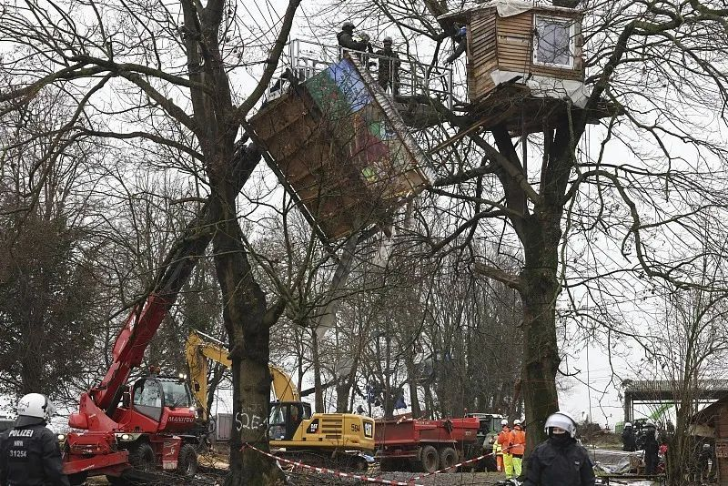
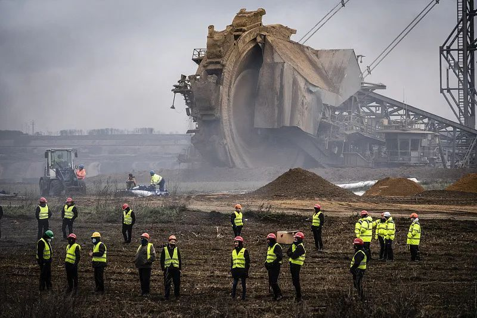

# 一个小村庄如何成为德国气候之争的“引爆点”？

近日，大批头戴钢盔、手持盾牌的警察涌入德国一个名为吕策拉特（Lützerath）的小村庄，这不是电影中突袭制毒窝点的场景，而是驱赶居住在此的数百名气候活动人士。

德国能源巨头莱茵集团（RWE）拥有吕策拉特的产权，计划拆除村庄以开采地下的褐煤。德国气候活动人士“占领”吕策拉特以阻止煤炭开采。《德国之声》称，吕策拉特已经成为了德国气候之争的一个“引爆点”。这个村庄象征着德国气候活动组织与能源巨头之间的冲突。

一个村庄和它地下的煤炭

吕策拉特位于德国北莱茵-
威斯特法伦州（北威州）的埃尔克伦茨镇，紧挨着占地面积达35平方公里的加兹韦勒露天褐煤矿。从空中俯视，这片露天褐煤矿宛如地面巨大的裂口。

加兹韦勒露天褐煤矿隶属于莱茵集团，该集团多年来一直推动扩大加兹韦勒煤矿的开采区，代价则是周边许多村庄的百年建筑被毁，另有一片风力发电场被拆除。

位于褐煤矿之上的吕策拉特村是莱茵集团的最新目标。莱茵集团于2017年通过购买吕策拉特村的产权让当地村民搬离这个村庄。

据美国有线电视新闻网（CNN）报道，德国的气候活动人士认为，褐煤是污染最严重的化石燃料，继续开采不符合德国的气候行动目标。从2020年开始，气候活动人士陆续进入吕策拉特，他们搬进了空置的住宅或者搭建木屋和树屋，数百人在此定居以阻止该村被拆除。这些活动人士短则住了几个月，长则住了两年多。

_当地时间2023年1月15日，德国吕策拉特，房屋被拆除。图/视觉中国_

“有研究表明，（德国）并不需要这里的煤炭”，气候活动人士对《德国之声》表示，“希望政府至少能重新评估一下情况。”气候活动人士援引国际研究机构“煤炭转型”(Coal
Transitions)去年8月发布一份报告称，即便德国的燃煤发电厂以2020年以前的产能运行，德国现有的煤炭供应量也足以满足这些发电厂的需求。

莱茵集团则以俄乌冲突引发德国能源危机为由，坚称有必要扩大煤炭开采。该公司1月11日的一份声明称，加兹韦勒煤矿的相关开采手续已经通过了第三方独立审查。

当地一家法院1月9日裁定，允许警方对吕策拉特的气候活动人士采取驱逐行动。随后，警方告知气候活动人士，驱逐行动最早将于1月11日开始。同时，气候活动人士向法院紧急申请禁止驱逐行动，遭法院驳回。这意味着法院为后续的警方强制驱离开了绿灯。

气候活动人士与警方的冲突升级

当地时间1月11日，吕策拉特风雨交加，全副武装的德国警察开始包围这座村庄。

当天，德国警方通过社交媒体和现场扩音器对气候活动人士喊话：“驱离行动已经开始，吕策拉特周围已经拉了警戒线，位于警戒线以内区域的人们可以自行离开，否则警方将采取进一步措施。”

“吕策拉特已经被包围了。”德国警察工会(GdP)副主席迈克尔·马滕斯表示。

德国警方称，在驱离过程中，气候活动人士向警察发射烟花、投掷石块和燃烧瓶。警方对气候活动人士喊话：“立即停止投掷莫洛托夫鸡尾酒（燃烧瓶）。”

北威州内政部长赫伯特·鲁尔态度强硬，他称：“我们保护气候，但不保护暴力破坏者。”他把吕策拉特的气候活动人士称为非法滞留者和暴力破坏者。

《德国之声》记者哈默斯坦在现场表示，气候活动人士躲在自己搭建的路障后面和树屋中。“有人把自己和树屋拴在一起，现场的气氛十分紧张。”

气候活动人士罗尼·齐柏林表示：“我们反对这种破坏行为，我们要用身体挡住挖掘机。”

_当地时间2023年1月12日，德国吕策拉特，警察和工人正在拆除一座临时树屋。图/视觉中国_

据德国警方消息，至当地时间1月13日，吕策拉特大部分建筑内的气候活动人士已经被驱离，仍有少数人坚守在树屋或地洞中。

当地时间1月14日，吕策拉特局势升级，警察动用高压水枪和警棍对付坚守村内的气候活动人士。

一个气候活动组织的发言人英迪格·德拉乌指责警方行动是“彻头彻尾的暴力”，她指责警察“肆无忌惮地”殴打气候活动人士。另有一名气候活动组织的医务人员表示，1月14日约有20名气候活动人士受伤被送往医院。

德国警方发言人否认警察对活动人士使用暴力的指控。他表示，自1月11日的驱离行动开始以来，已有大约70名警察受伤，其中许多警察是在1月14日的冲突中受伤的。

德国警方还表示，已经启动了约150起刑事诉讼程序，包括与妨碍公务和破坏财产等有关的指控。警方已经拆除了吕策拉特35个树木结构（树屋）和近30个木制建筑物。警方表示，截至1月15日，“吕策拉特村庄内已经没有气候活动人士了。”

扩大开采是绿党的“背叛”，还是权宜之计？

当德国总理朔尔茨领导的联合政府于2021年12月开始执政时，德国的气候活动人士曾期盼着加兹韦勒煤矿的扩建计划会被取消。支持气候运动的德国绿党在执政联盟中占有重要席位，在大选中，绿党得到了气候活动组织的支持。

然而，2022年10月，德国政府与莱茵集团达成一项协议，允许莱茵集团拆除吕策拉特并扩建加兹韦勒煤矿；作为交换，莱茵集团同意保存其他5个村庄和3个农场，并将该集团的煤炭淘汰计划从2038年提前至2030年。

绿党将上述协议视为一场胜利。北威州绿党发言人马丁·莱科塔普对CNN表示：“我们挽救了5个村庄和3个农场，使500人免于被迫重新安置，并将（莱茵集团）煤炭淘汰计划提前了八年。”

气候组织则强烈反对上述协议。他们称，继续燃烧煤炭将无法实现《巴黎气候协定》设定的将全球升温控制在比工业化前水平高出1.5℃的目标。

据法新社报道，许多曾经给绿党投票的气候活动人士感觉遭到了“背叛”。

“欧洲超越煤炭”(Europe Beyond coal)的能源和煤炭活动家费边•休伯纳表示:“绿党在面临艰难决定时选错了方向，降低了气候政策的优先级。”

_当地时间2023年1月2日，德国吕策拉特附近，一台斗轮挖掘机正在作业。图/视觉中国_

对此，德国政府方面认为，为了应对俄乌冲突可能带来的能源供应短缺，该国不得不增加煤炭使用量。德国政府已经重启了此前关闭的燃煤发电厂，以确保电力供应。来自绿党的经济与气候保护部部长罗伯特·哈贝克此前表示，增加煤炭供应是一个“痛苦的”选择，但对于降低对俄罗斯天然气的依赖来说是“必要的”。

莱茵集团称，德国若要安全度过冬季，就需要加兹韦勒煤矿的煤炭。莱茵集团发言人圭多·史蒂芬表示:“扩大开采并不意味全面恢复煤炭能源，而是帮助德国应对能源危机的一个权宜之计。”

当地时间1月14日，据警方称，共有1.5万人参与了声援吕策拉特的抗议活动，抗议活动组织方则称有3.5万人参加了活动。有气候活动人士表示，保卫吕策拉特的行动没有结束，他们将继续采取行动。

莱茵集团则在吕策拉特周围建立1.5公里长的围栏，同时封闭该村庄所有建筑、街道甚至下水道，以阻止环保活动人士返回该村庄，直至该村庄被完全拆除。

记者 | 陈奕凯

编辑 | 张磊

