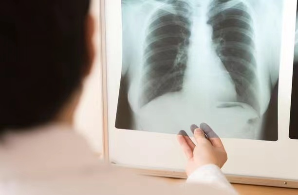
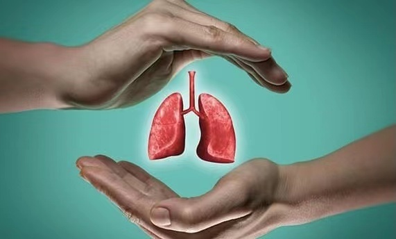

# 为什么日本近一个月新冠死亡人数飙升？

日本最近的一个热门话题是：为什么近一个多月来新冠死亡人数飙升，已经超过新冠总死亡人数的1/6？从日本厚生劳动省统计数据看，2022年10月日本全国死于新冠的人数为1864人，11月为2985人，12月为7622人，死亡人数急速递增。而截至2023年1月14日，1月份累计死亡已达4998人，增速超过上个月。自去年12月以来的大约1个半月时间里，死亡人数达1万2620人。

那么，是什么原因导致最近日本新冠死亡人数飙升的呢？有各种不同的解读。引人注入的是一位日本国立医院权威的呼吸科专门医生仓原优也发表文章解读原因，他说日本疫情的第8波还在持续中，感染人数也是一高再高，全国病床使用率也在增加。患者需要住院，很大程度上是发展成了新冠肺炎。现在第8波的肺炎与新冠初期的肺炎完全不同。何以不同呢？

_日本电视台也在讨论这个话题_

这位医生在文章中说，在阿尔法和德尔塔毒株流行的时候，尽管有许多严重的住院患者需要吸氧，但病人主要是年轻人和中年人，所以他们中的大多数能够在病房完成基本的个人行为，如上厕所和吃饭等。
**但这回第8波的新冠住院者，老年人的比例居高不下，如东京都超半数都是80岁以上者。**
照料有高度护理需求的老人需要相当多的人手，如喂食、换尿布、体位翻身等。于是出现了这样一种现象：原本可容纳30人的医院床位，只收20人就陷入了机能停滞状态。根据调查，日本12月7日至1月10日的死亡人数中，有97%的死者年龄为65岁以上。

更为重要的是，新冠初期的肺炎，病毒是在肺部肆虐。所谓的“病毒性肺炎”是指肺部同时多处发炎，整个肺部蔓延着一层薄薄的、白色的、刷状的阴影。这就是所谓的
"白肺"。不过自奥密克戎毒株流行以来，这种“白肺”类型的病毒性肺炎在日本已经减少。相反，由于老人住院数量的增加，导致了患者细菌性肺炎和吸入性肺炎的增加。这种肺炎可能发生在肺的背面某个部位或下侧的某个部位而不是整体，这是由于吸入的细菌和食物造成的。

那么，是否可以认为病毒性肺炎重，而细菌性肺炎轻呢？这位呼吸科医生做出了明确的否定回答。他认为，老人的细菌性肺炎和吸入性肺炎，更不是一个可以在短期内解决的问题。不能轻易地宣告他们的治疗期已经结束，可以返回原来的养老院等设施。在这位医生看来，治疗老年肺炎患者时，有必要讨论患者本人及其家人的愿望，即他们想要什么样的医疗和护理，特别是在生命的最后阶段，在紧急情况下，应该如何治疗和护理为好等。这些都必须在新冠病房里从头做起，无形中增加了不少工作量。在医疗压力大的时候，可能没有时间与患者和家族协商一个最终的治疗计划。
因此有必要定期举行 "病患阶段性会议"。

_日本第8波疫情多见细菌性肺炎_

仓原优医生在文章最后说，与新冠初期阶段的病毒性肺炎相比，细菌性肺炎和吸入性肺炎等被称为“难以治愈的肺炎”，在第8波中变得更加常见从而形成特点。这些被称为“医学弱者”的老人肺炎患者，他们的住院和治疗时间更长，这间接地给其他病人的医治带来了压力。这位医生还强调说，即便新冠级别在今年有可能被政府下调成第五类传染病，但这也是我们医务工作者长期必须面对的一个问题：即新冠导致的细菌性肺炎和吸入性肺炎。

**为了避免发展成重症肺炎，前提条件就必须预防新冠感染。那么如何才能有效防止感染呢？**
这位呼吸科医生在另一篇文章中说，根据121个国家和地区的气象数据和新冠死亡者数据比较来看，室内相对湿度维持在40-60%的话，新冠的感染数和死亡数就会降低。因此室内湿度至关重要。冬天干燥季节如何加湿是关键。其次，人体气道的水分保有也非常重要，气管和支气管如果水分量不足，作为扫帚的防御机制，即所谓的纤维毛就会出现故障，导致病毒和细菌停滞在呼吸道中，感染症就会发生。所以多喝水非常重要。

_新冠与肺炎，降低死亡率的关键_

与日本呼吸科医生所言不同的状况是，我们国内疫情放开后第一波的感染大潮，中招后发展成重症的老人，呈病毒性肺炎的“白肺”居多。这里的疑问是，同样是奥密克戎病毒的感染，为什么呈现出完全不同的表现形式？这又是什么原因造成的？问题的关键点在哪里？这需要专家们持续的关注与研究。

不过，另有日本专家还指出，除细菌性肺炎和吸入性肺炎导致患者不治身亡之外，奥密克戎毒株导致心血管等循环系统并发症的发生，也增加了死亡人数。去年12月，日本厚生劳动省专家组织会议的参会者有意见指出“新冠可能已成为循环系统的疾病”，如心力衰竭、心律不齐、血栓等的发病。熟悉循环系统疾病的日本佐贺大学教授野出孝一发表研究结果称，因新冠住院的31名患者出院三个月后的检查中发现，42%的人出现心肌病、26%的人出现心肌炎征兆。毫无疑问，这些说法与研究结果也应该引起我们的高度重视才是。

