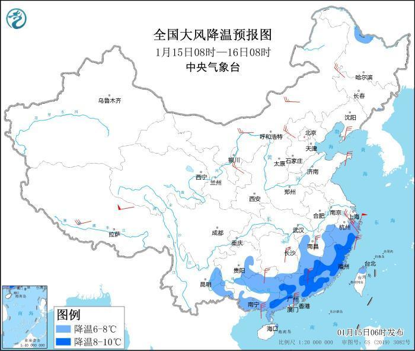
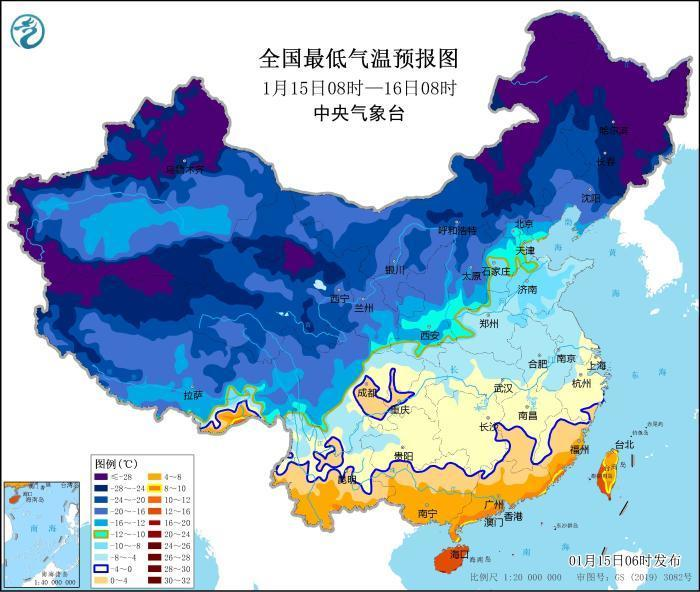
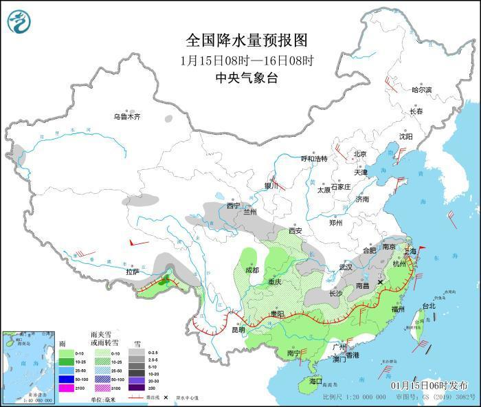
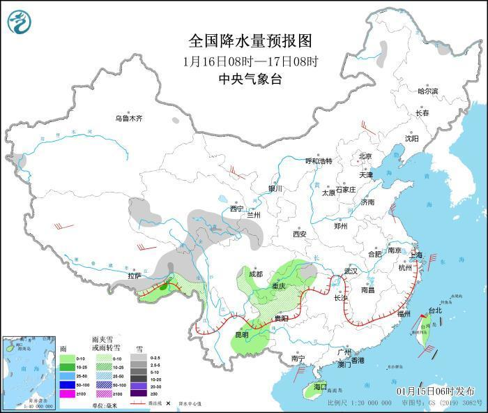
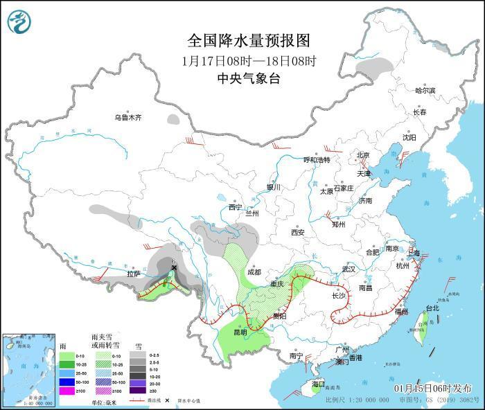

# 冷空气继续发威，局地降温8℃以上！江汉江南华南等地仍有雨雪天气

中新网1月15日电
据中央气象台网站消息，受冷空气影响，1月15日8时至1月16日8时，西南地区东南部、江南中东部和南部、华南大部等地将先后降温6～8℃。预计1月15日，安徽南部、江苏南部、湖北西部和东南部、湖南西部和东部、江西中北部等地的部分地区有小到中雪或雨夹雪。

**冷空气继续影响华南等地**

受冷空气影响，预计，1月15日8时至1月16日8时，西南地区东南部、江南中东部和南部、华南大部等地将先后降温6～8℃，其中，江西南部、浙江南部、福建中北部、广东西北部和东北部等地的部分地区将降温8℃以上。16日至17日早晨，最低气温0℃线将位于云南东部至贵州南部、湖南南部、江西中部、福建北部一线。辽东半岛、山东半岛、广西东南部沿海、广东西南部等地有5～6级偏北风。我国近海大部海域有6～8级风，其中台湾海峡部分海域有9级风，阵风可达10级。中央气象台1月15日06时发布寒潮蓝色预警。

19-20日，还将有一次冷空气影响我国北方地区，华北、东北地区、黄淮等地将有4～8℃降温。华北北部、内蒙古东部、东北地区南部等地部分地区有小雪，局地中雪。

_全国大风降温预报图(1月15日8时-16日8时)_

_全国最低气温预报图(1月15日8时-16日8时)_

**江汉江南华南等地仍有雨雪天气**

预计1月15日，安徽南部、江苏南部、湖北西部和东南部、湖南西部和东部、江西中北部等地的部分地区有小到中雪或雨夹雪。江南中东部和南部、华南大部等地的部分地区有小雨，局地中雨。

此外，未来三天，西藏东南部有小到中雪，17日局地有大雪。

**未来三天具体预报**

1月15日8时至16日8时，新疆南疆西部山区、西藏东南部、青海东部和西部、甘肃中南部、陕西南部、安徽南部、江苏南部、湖北西部和东南部、湖南西部和东部、江西中北部等地的部分地区有小到中雪或雨夹雪。四川盆地中东部、江南中东部和南部、华南大部等地的部分地区有小雨，局地有中雨。西藏北部和南部、西北地区东部、华北北部、辽东半岛、山东半岛、浙江东部等地的部分地区有4～6级风，其中，西藏北部的部分地区有7～8级风。

_全国降水量预报图(1月15日8时-16日8时)_

1月16日8时至17日8时，内蒙古东北部、黑龙江西北部、新疆南疆西部山区、西藏东部和南部、青海南部、甘肃西南部、川西高原北部、贵州西北部、湖北西南部等地部分的地区有小到中雪或雨夹雪。西藏东南部、四川东南部、云南中东部、重庆大部、海南岛、台湾岛等地的部分地区有小雨，局地中雨。内蒙古东部、西藏北部和西部等地的部分地区有4～6级风。

_图4
全国降水量预报图(1月16日8时-17日8时)_

1月17日8时至18日8时，内蒙古东北部、西藏东部和南部、青海南部、甘肃西南部、川西高原北部、湖北西南部、贵州西北部、重庆西南部等地的部分地区有小到中雪或雨夹雪，其中，西藏东南部等地的部分地区有大雪(5～6毫米)。西藏东南部、云南中东部、重庆东南部、贵州东北部、湖南西北部、台湾岛等地的部分地区有小雨，局地有中雨。西藏北部、内蒙古中部、甘肃河西、华北中北部、辽东半岛、广西东南部沿海等地的部分地区有4～6级风，局地阵风可达6～7级。

_图5
全国降水量预报图(1月17日8时-18日8时)_

