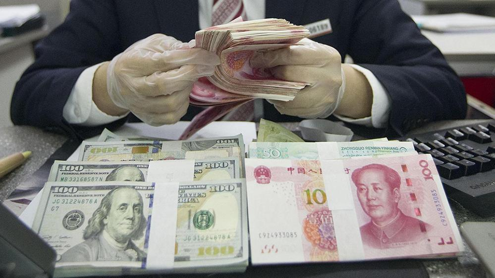

# 在岸、离岸人民币对美元汇率一度升破6.7，创半年以来新高

人民币对美元汇率强势升值至半年新高。

1月16日，人民币对美元即期汇率开盘即升破6.70关口，为半年来首次升破这一关口。

同时，更多反映国际投资者预期的离岸人民币对美元汇率也强势升破6.7关口，为去年7月以来首次。

进入2023年，人民币对美元即期汇率已经累计升值超过3.6%，离岸人民币对美元汇率也累计升值超过3%。

央行副行长宣昌能1月13日在国新办发布会上谈及人民币升值时表示，2022年11月中旬以来，随着国内稳经济政策措施的落地见效，优化疫情防控措施和金融支持房地产政策的相继出台，加之市场预期美联储将放缓加息步伐，美元指数高位回落，人民币对美元汇率逐渐转向升值态势。

对于市场关注的人民币走势，宣昌能表示，当前和今后人民币汇率走势会受到国内外经济金融形势、国际收支、市场风险偏好等多重因素影响，短期测不准是必然的。总的看，保持基本稳定有坚实的基础。近期，中国经济总体延续恢复的发展态势，疫情防控动态优化，在全球高通胀背景下中国保持了物价的基本稳定，考虑到主要经济体经济景气指数下降，我国贸易顺差增速可能有所回落。在多种力量综合作用下，我国人民币汇率将总体保持平稳运行。

