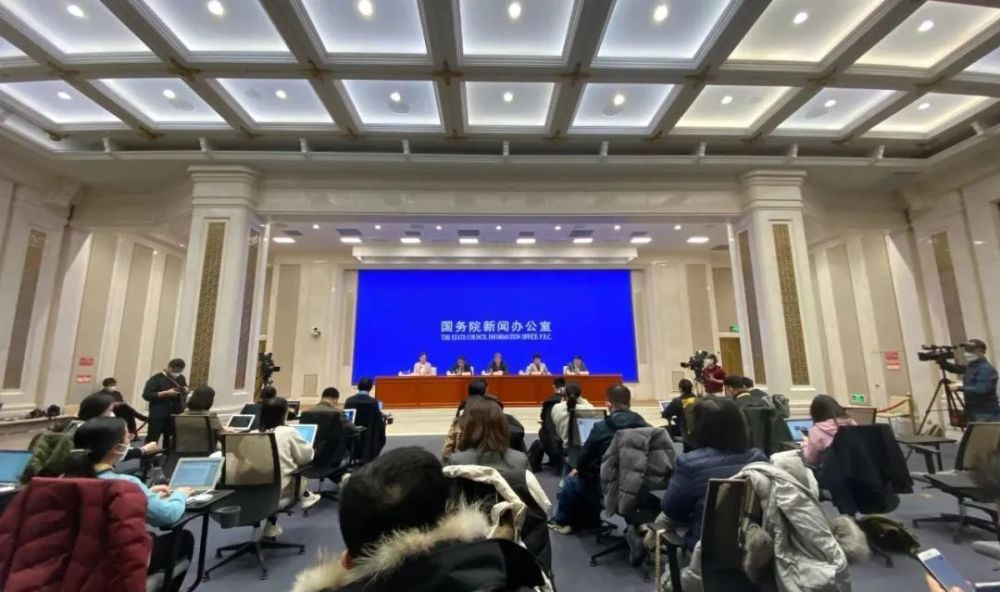

# 央行：蚂蚁集团等14家大型平台企业整改已基本完成

_13日新闻发布会现场
中新社记者 夏宾 摄_

中国央行13日在京举行的新闻发布会上，对当下的热点问题作出最新回应。

平台企业整改

**中国央行金融市场司负责人马贱阳**
表示，2020年11月以来，金融管理部门指导督促蚂蚁集团等14家大型平台企业的一些突出问题扎实开展整改，目前已基本完成整改。平台企业金融业务的常态化监管框架也已初步形成。

金融管理部门将坚持“两个毫不动摇”，发展和规范并重，将从三个方面支持平台经济健康发展，包括继续推动相关平台企业加快剩余少数问题的整改，善始善终，完成整改工作，提升常态化监管水平，研究制定促进平台经济健康发展的金融支持措施。

房地产支持政策

**中国央行货币政策司司长邹澜**
说，最近在研究推出另外几项结构性工具，主要重点支持房地产市场平稳运行，包括保交楼贷款支持计划、住房租赁贷款支持计划、民企债券融资支持工具等，届时出台后我们会另外再作一些详细披露和发布。

数字人民币纳入M0

从2022年12月起，金融统计数据将数字人民币数据首次纳入M0（流通中的货币）统计口径。

**中国央行副行长宣昌能**
表示，数字人民币是人民银行发行的数字形式的法定货币，它与实物人民币一样，本质上都是货币组成部分。从统计和管理角度看，有必要对二者进行一并统计、合并分析、统筹管理。

他表示，近年来，随着数字人民币试点的逐步深入，数字人民币的应用场景稳步扩大，交易金额、存量也不断增加，相关管理和统计制度不断完善。将数字人民币纳入流通中货币即M0统计，能更准确反映流通中货币总体规模。到2022年底，流通中数字人民币存量是136.1亿元，纳入M0以后，M0同比增速是15.3%。（作者：夏宾）

