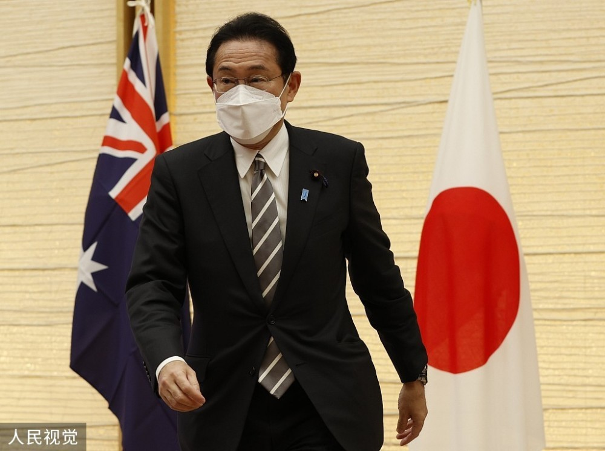

# 岸田文雄“引乱入亚”遭多方警告，或为国民带来“战争梦魇”

【环球时报综合报道】日本首相岸田文雄15日结束对西方七国集团（G7）中的五国——法国、意大利、英国、加拿大和美国的访问。在美国和西方盟友的怂恿下，岸田的口气也越来越大。在结束对最后一站华盛顿的访问前夕，岸田在多个场合大放厥词，他声称“乌克兰的情势可能是东亚地区明日要面对的局面”，而日本“将肩负主导国际社会的重任”，他还呼吁美、欧、日“团结起来共同应对与中国的关系”。岸田从此次出访五国的第一站起，就将矛头对准中国，他大谈所谓中方“在东海和南海单方面武力改变现状的企图愈演愈烈”，与英国签署允许双方相互部署军事力量的《互惠准入协定》等。“日本正扮演把冷战遗物——北约引进亚太地区的带路人角色”，多名中国学者15日接受《环球时报》记者采访时认为，种种迹象显示，日本为实现自己军事大国化的野心，已决心充当美国遏制中国的“战略和军事之矛”，同时企图将“新冷战”思维以及北约引入亚太，严重威胁亚太和平稳定。日本这种行径，值得亚太国家高度警惕。

**东亚会出现“乌克兰情势”？**

据法新社报道，岸田14日在华盛顿的记者会上总结此次G7五国之行。岸田称，他在访问中对G7其他国家领导人表达了“对东亚地区安全环境的强烈危机感”。他称：“乌克兰的情势可能是东亚地区明日要面对的局面。”“日本外围情势日益严峻，因为有人意图单方面改变东海和南海的现状，而且朝鲜核导弹危机也有激化之势。”法新社称，虽然岸田未点名，但这番话明显就是针对中国。

岸田文雄显然对此次访问结果“很兴奋”。日本NHK电视台称，岸田在记者会上谈起前一天他与美国总统拜登的会谈：“我就日本安保政策方针向拜登总统进行了说明，他表达了全面的支持。”他还称，“G7的团结和协调比以往更能左右世界的动向。作为G7轮值主席国的日本，不单单是为了举办5月的广岛峰会，还肩负着在新的一年中主导国际社会的重任。”

路透社称，拜登在与岸田文雄会谈时表示，美国“全面、彻底、毫无保留地致力于日本防务”，对日本提升国家安全战略表示“赞扬”，他称美日同盟处于“非凡时刻”，两国关系“从未如此亲密”。双方还发表联合声明，宣称“将强化在经济安全方面的共同优势，包括保护半导体产业等关键和新兴技术”。

拜登的“赞扬”似乎令岸田“胆量大增”，他当天晚些时候在约翰·霍普金斯大学发表演讲时将矛头公开对准中国。路透社称，岸田在演讲中声称，中国是日本和美国“面临的关键挑战”。他说，“美国、欧洲和日本绝对有必要团结起来，以应对与中国的关系。”他称，日美同盟“永远无法接受”中国的观点。“绝不允许任何单方面以武力改变现状的企图，我们将加强威慑。”

中国社科院亚太与全球战略研究院国际问题专家杨丹志15日接受《环球时报》记者采访时表示，岸田声称东亚可能出现“乌克兰情势”，完全是渲染“中国威胁”。在俄乌冲突爆发后，西方一些国家和台湾岛内的某些势力频频将台湾和乌克兰相提并论。台湾是中国的一部分，而乌克兰是独立主权国家，两者完全不具有可比性。这样的类比不仅毫无根据，而且用心险恶。

杨丹志说，日本不久前公布的新版安保战略三文件公然将中国定位为“迄今最大的安全挑战”。岸田此次访问G7五国的一个主要目的是为日本提升军力寻求美国等西方国家的支持。他在此轮访问中频频渲染东亚局势危机和“中国的威胁”，其调门与美国保持一致，甚至比美国更激烈，更具挑衅性。

**多国严厉警告日本**

岸田此次访问引起亚太多国的警惕。朝鲜外务省国际机构局局长赵哲洙14日发表谈话称，使国际社会变成无法天地的根源正是美国及其追随势力的强权和专横。他警告，日本鼓吹对抗和分裂，企图从中实现其军事大国化野心，那么它难免遭到正义的国际社会的谴责和反对，将重演“自我毁灭的历史”。

俄联邦安全会议副主席梅德韦杰夫14日在社交媒体上发文嘲讽称：“日本政府首脑沉浸在耻辱的、忠诚（于美国）的狂喜中。他背叛了数以十万计日本人在广岛和长崎的核灾难中被烧死的记忆。岸田文雄根本不在乎美国是唯一全面使用核武器的国家，而唯一的受害者正是岸田自己的国家。”梅德韦杰夫称，岸田应该“要求美国领导人为这样的战争行为进行忏悔”，“但岸田只是美国人的服务员，他没这个胆量”。“现在只能为日本人感到遗憾。这种尴尬只有在他回国后在内阁会议上切腹自杀才能消除。不过，这一代日本人的武士道精神并不典型。”

对于邻国的警告和嘲讽，日本自民党副总裁麻生太郎15日却称，日本把防卫费提高到现有GDP占比的两倍，并有权“对敌方进行反击”，这是“亡羊补牢，犹未为晚”。对邻国批评日本“正成为军事大国”，麻生称，这无疑证明了“日本威慑力得到加强”。

日本肆无忌惮扩张军力，就连美国在东亚的另一个盟友韩国舆论也表示担忧。“美国支持日本强化军力针对中朝，但日本军事大国化令人担忧”，韩国《国民日报》15日称，美日正在以中国和朝鲜“威胁”为借口强化日本的军事能力，但作为曾经被日本军国主义殖民而夺去主权的韩国而言，没有理由支持日本强化军力。

“岸田文雄此次海外之行带给亚太地区的是安保不安。”朝中社称，岸田文雄此行目的在于获得G7其他成员对日本“新版国家安全保障战略”的支持。这一战略的核心是把现有的“专守防卫”政策改为先发制人战争政策的对抗剧本。日本正式通过拥有“对敌基地攻击能力”政策，企图彻底脱掉“和平国家”华丽外衣。朝中社称，岸田文雄访问的国家都是北约成员国这一点更具危险性。一些西方国家为日本重走军事大国化动向煽风点火，使得不安定的乌云笼罩亚太地区。

外交学院国际关系研究所教授周永生对《环球时报》记者表示，岸田此次G7五国之行是企图将祸水东引，目的是引入外部势力以维护自身利益，并制约、遏制和围剿中国，将混乱带入亚洲。

**日本民众担忧“战争梦魇”**

“日本扩军梦令民众担忧战争梦魇”，新加坡《联合早报》15日称，岸田文雄以应对包括台海局势在内的周边事态为由，敲定5年内将防卫预算翻一番的计划，也赋予自卫队有权“攻击敌方基地”。这个扩军政策彻底埋葬了日本二战后奉行和平主义的路线。报道引述日本学者冈田充的话称，岸田的政策是“一次外交败笔”。“日本若要在经济上重新站起来，摆脱‘失去的30年’，不应当与邻为敌。日本现在要做的不是渲染中国威胁，而是停止对中国的敌视”。

“岸田要做美国之矛，东亚和平现新危机”，香港《明报》15日称，二战后传统的日美军事分工中，美国是“矛”，日本是“盾”，现在日本也成为“矛”的一部分。而且，日本担心美军力量不够，还企图引入北约等域外军力。在这次欧美之行中，岸田处处剑指中国，日本已成为美国之外反华最激进的国家。出于地缘战略需要，日本甚至比美国更迫切地遏制中国，企图利用并扩大中美战略竞争来谋取自身利益。这意味台海乃至东北亚和平都将出现新危机。

杨丹志表示，在强化日美同盟的同时，日本有意将北约的力量引入亚太，这可能会导致朝鲜半岛、东海、台海，甚至南海的安全态势发生变化，地区局势将更加复杂和紧张。由于美国的战略调整和怂恿，日本谋求地区主导权和成为军事大国的野心昭昭，这将使亚太，特别是东亚和平稳定前景变得黯淡。

日本共同社14日刊发评论质疑，从历史的教训来看，这是战后艰难地走上和平主义道路日本的应有状态吗？

【环球时报驻日本、美国特派特约记者 岳林炜 萧达 环球时报记者 丁雅栀 刘海生 柳玉鹏 陈康】

