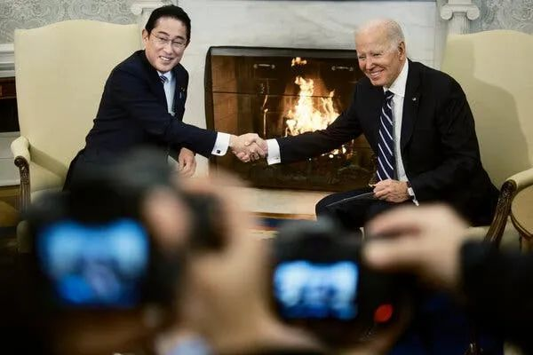

# 岸田登门拜见拜登，日美强化安保合作搅动亚太！

【环球时报综合报道】在结束对欧洲三国和加拿大的访问后，日本首相岸田文雄12日下午抵达华盛顿，将于当地时间13日上午与美国总统拜登举行首脑会谈。美国是岸田此次外访的最后一站，也是他本人最为重视的一站。自2021年10月就任首相以来，这是岸田首次访问美国。在他到访之前，日本政府已派出外务大臣林芳正和防卫大臣浜田靖一到华盛顿“打前站”。日本和美国媒体认为，两国首脑将在外长、防长“2+2”会谈的基础上，进一步讨论共同安全和全球经济问题。几周前，日本借口“地区威胁”，进行了包括提升军费开支、发展“反击能力”在内的大规模军事改革，令亚洲国家感到担忧。而岸田此次外访，在强化日美同盟的同时，还让人看到他有意引入北约的力量参与亚太事务，更让外界担心未来亚太可能面临一些不稳定因素。中国外交部发言人汪文斌13日在例行记者会上表示，亚太是和平发展的高地，不是地缘政治的角斗场。我们敦促美日摒弃冷战思维和意识形态偏见，停止制造“假想敌”，停止将“新冷战”思维引入亚太地区，不要做搅乱亚太稳定的逆流祸水。

**“日美峰会将为地区安全环境火上浇油”**

根据日本外务省网站发布的消息，岸田此次访美为期两天。他将在13日参加日美首脑会谈等活动，并于14日离开华盛顿。日本NHK网站称，岸田与拜登的会谈预计为30分钟，会谈后，除了发表联合声明外，两人还将共进“工作午餐”。

在岸田与拜登会面前，日本媒体就已迫不及待放风两人会谈的内容。NHK网站13日称，预计日美首脑将确认加强七国集团（G7）的合作，并推进实现G7广岛峰会成功举办。由于日本政府于2022年12月修改了《国家安全保障战略》等3份文件，并明确写入拥有“反击能力”和大幅提升防卫费，所以在会谈期间，预计岸田将向拜登就日本安保政策的重大转变进行解释说明。

日美双方还将强化在经济安保领域的合作，其中包括半导体、量子等最先进技术的研发等。日媒称，出于应对中国的目的，日美将确认两国安保战略方向的一致性，并希望展示不断强化的日美同盟的“威慑力”和应对能力。此外，预计两国将就应对朝鲜问题、加强供应链和产业链合作等议题展开沟通。日本时事通讯社13日报道称，拜登将在会谈期间直接要求日本在尖端半导体方面限制对华出口。两人还将谈及台湾问题。

据日本《每日新闻》13日报道，日本内阁官房长官松野博一当天在记者会上称，日美首脑会谈将成为“双方再次确认进一步加强作为日本外交安保基石的日美同盟，以及携手实现‘自由开放的印太’”的场合。

俄罗斯卫星通讯社12日引述莫斯科国立国际关系学院研究员帕拉蒙诺夫的观点报道称，与之前的日美外长、防长“2+2”会谈主要集中在军事事务上相比，即将举行的日美峰会涉及的内容更加广泛。他说，拜登与岸田的会晤旨在讨论具体措施，巩固美日同盟在美国围绕北京建立的联盟网中的关键作用。帕拉蒙诺夫还提到，东京方面尤其希望美国重返“跨太平洋伙伴关系协定”。这位俄罗斯学者认为，即将举行的日美峰会将为本已脆弱的地区安全环境“火上浇油”。

**“岸田政权正把自己绑在美国的战车上”**

“反对日美首脑会谈”“决不允许军费翻倍”，与部分日媒大肆渲染日美首脑会谈的重要性不同，一些日本民众对岸田政权推出的军事和外交政策持疑问态度。《环球时报》记者13日傍晚在东京新宿的闹市区看到，多个劳工和学生团体手举上述字样的横幅和标语，高喊“反对拥有‘对敌基地攻击能力’”“阻止破坏民众生活的大扩军”等口号进行抗议。

据《环球时报》记者了解，此次抗议活动的主办方认为，基于新的安保三文件，针对中国的日美共同作战计划正在进一步实战化和具体化，日美首脑会谈形同一次“战争会议”。在日美首脑会谈基础上，日本政府还将在国会通过高达6.8万亿日元的扩充军备的预算开支。“岸田政权正把自己绑在美国的战车上，朝着战争的方向一路狂奔，这样下去，日本终将在不久的将来成为战争的当事方。”在普通人苦于物价高涨、为生计奔命的当下，岸田政权不惜以增税的手段来增加防卫费。日本普通劳动民众对此决不答应。

长期以来，日本在对外战略上与美国进行着全方位捆绑，尤其是在对华战略上，形成了唯美国“马首是瞻”的整体态势。13日接受《环球时报》记者采访的多名专家认为，岸田政权最新推出的激进军事改革，不仅使日本愈发失去战略自主性，而且更进一步地让自己成为美国的“棋子”和实现其利益的工具。岸田政权或许能在短期内捞到一定政治红利，但从长远来看，日本的国家利益、日本民众的切身利益必将因此受损。今后日本有限的财政收入，将被大量用于军备开支，而不是用于解决少子老龄化等日本民众广泛关注的诸多社会现实问题。这与岸田“通过对外展现相对强势的形象和大国地位来提振国内士气凝聚民意”的想法背道而驰。

**只会给亚太地区带来不安**

日本时事通讯社13日称，岸田此次的五国外访有两大特点：一是为担任G7轮值主席国做准备，二是为对抗中国和俄罗斯，展示G7在安保领域的团结。而第二点也被舆论质疑为有意将北约力量引入亚太，不利于亚太地区的和平稳定。

《环球时报》记者注意到，岸田在巴黎期间，与法国总统马克龙商定今年上半年举行日法“2+2”会谈；在罗马，他与意大利总理梅洛尼决定将两国关系升级为“战略伙伴关系”，并一致决定建立两国外交和防务部门之间的磋商机制，进一步深化两国安保防务合作；在伦敦，岸田与英国首相苏纳克签署包括允许英国在日本部署军队的《互惠准入协定》（RAA），并决定在合适时候举行日英“2+2”；在渥太华，岸田与加拿大总理特鲁多同意深化两国合作，共同推进实现“自由开放的印太”。

韩联社13日评论称，日本在为扩大被“和平宪法”束缚的军事力量外延方面下了很大功夫，尤其是最近接连与美欧国家举行首脑会谈，让这种倾向逐渐明显。报道进一步指出，岸田文雄与拜登13日进行的会谈，将更加凸显军力外延扩张的意图。《东京新闻》13日在题为《“深化”军事合作，担忧日美安保变质》的社论中称，“日本自卫队与美军加速一体化，以及日本防卫费剧增将使地区军备竞赛白热化，这不会破坏地区稳定吗？”同一天，朝中社发表朝鲜国际政治研究学会研究员金东明撰写的文章称，一些西方国家为日本重走军事大国化道路煽风点火，使得不安定的乌云笼罩亚太地区。岸田文雄的海外之行只会给亚太地区带来不安。

中国现代国际关系研究院副院长胡继平13日对《环球时报》记者表示，日本加强军事能力、提高军费，强化与美欧国家的安保合作，事实上就是把包括中国在内的一些邻国当成“假想敌”，这无疑会给东亚地区安全局势带来巨大的紧张和不确定性。

“日美首脑会谈中除涉及军事，还将所谓安保范围扩展至经济领域。”胡继平同时提到，日美试图联手通过供应链“脱钩”等手段阻碍其他国家的科技、经济发展，为自身谋求竞争优势，这样做的结果必将导致全球“阵营化”加剧。而“阵营化”会使被卷入其中的国家都受到影响，这个过程中没有赢家。

【环球时报驻日本特派记者 岳林炜 环球时报报道 记者邢晓婧 孙鹏 王逸 韩雯 柳直 青木】

