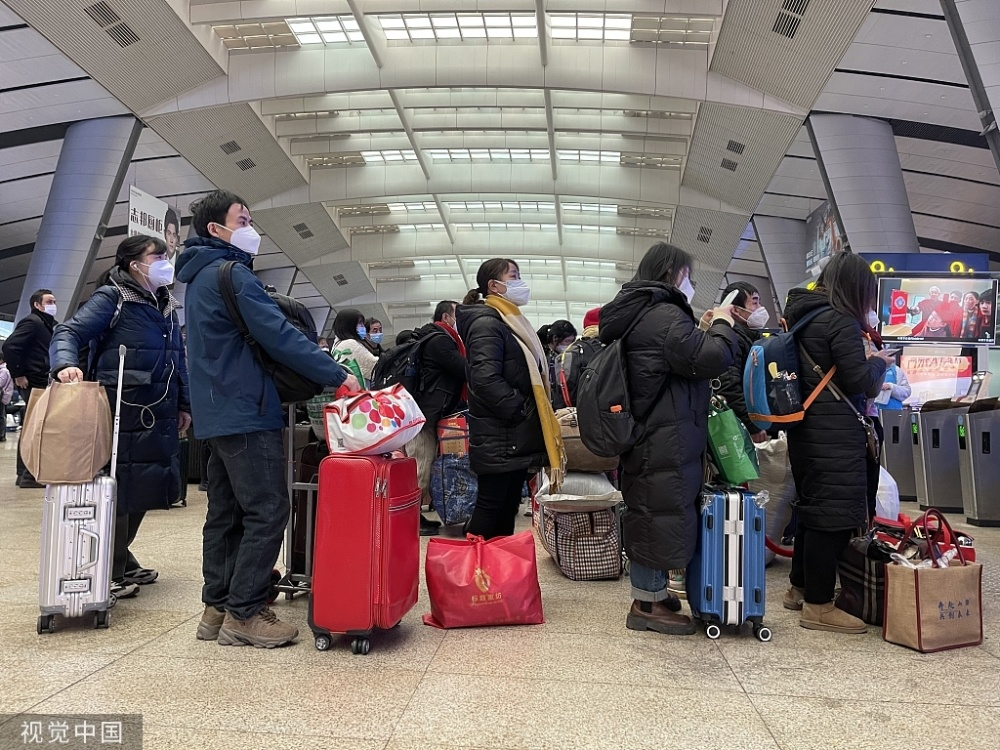
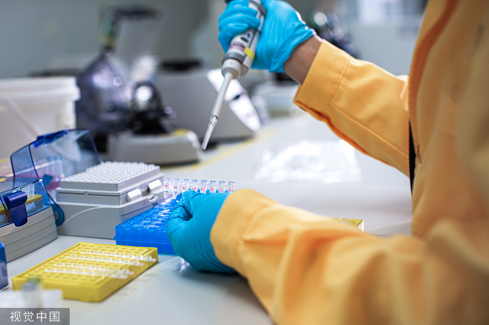

# 新毒株会带来重症死亡高峰吗？病毒学家：仅用实验室数据预测现实发展非常危险

2022年年末至今，中国多地先后经历感染高峰，关于新冠病毒毒株的讨论不断。我们能否通过症状判断自己感染的毒株类型？正在经历的这波疫情何时能结束？是否有一个大致的节点？

以下内容整理自德国华裔病毒学家、埃森大学医学院病毒研究所教授陆蒙吉于1月6日的回答：

问：有不少网友根据腹泻等症状来判断自己可能感染了XBB毒株。通过症状和抗原检测判断感染毒株类型靠谱吗？如何确定感染毒株的类型？

**陆蒙吉：** 大家从症状和个人感受来推断感染毒株类型和毒素侵入性致病性是很主观的。症状不是我们评估所感染毒株的标准。

病毒的基因测序目前是抽检，需要医生将样本送到测序中心，测序中心将我们的核糖核酸提取出来进行处理，通过测序的化学反应测定碱基序列，根据样本中核糖核酸碱基序列与已知毒株序列进行比较，就能确定毒株是哪一类的。

问：近期有两篇顶刊论文引发讨论。其中一研究显示灭活疫苗接种者发生突破性感染后中和XBB毒株效果较弱，另一研究则显示mRNA疫苗接种者发生突破性感染后依然可以中和XBB毒株。你如何看待两组实验的差异？

（编者注：研究一为美国哥伦比亚大学何大一团队等在 Cell 期刊发表的题为Alarming antibody evasion properties of
rising SARS-CoV-2 BQ and XBB subvariants
的研究论文；研究二为北京大学曹云龙团队在Nature期刊发表的题为Imprinted SARS-CoV-2 humoral immunity induces
convergent Omicron RBD evolution的研究论文。）

**陆蒙吉：实验室结果很难对我们判断对真实世界病毒传播提供指导。**
因为实验室用的是一部分血清来测定综合条件下观察病毒复制情况，这是很有局限性的。实际生活中毒株流行受到很多因素的影响，一个是病毒本身的生物学特征起到决定性作用，另一个就是我们社会采取的管制措施，比如社交距离、戴口罩、不上街等避让行为。

**实验室数据可以用于真实世界的现象解释，但用实验室数据来预测现实疫情发展状况是非常危险的。**
假如我们人群的免疫力很高，那么实验室里逃逸能力再强的毒株可能也逃不过免疫屏障；若我们的免疫能力很弱，即便毒株的毒性弱或在欧美不流行，在国内还是可能会流行。

所以病毒的流行情况取决于地区差异和各地人群免疫屏障的不同，大家也知道国内的免疫屏障整体相对较弱。
**所以不要过于在意实验室的数据情况，这不能为我们提供作决策的信息。**

_2023年春运返乡潮（图源：视觉中国）_

问：关于德尔塔毒株的传播，此前已有一些辟谣信息，但很多人似乎还是很担心原始毒株卷土重来，从病毒监控层面来讲，您有什么看法？

**陆蒙吉：** 我们对全球各毒株流行观察程度是有限的，以德国为例，最多能对5%的阳性样本测序为例，所以无法做到对毒株完全监控。
**不能做到100%监控，我们就无法100%肯定一定不存在德尔塔毒株。**

**不同毒株在不同国家地区流行的局部性多样性很大，若一地已流行过某种毒株，此地居民就产生了一定的免疫，那么该毒株在该地区再次流行程度就会降低，新的突变株则会带来新的流行波峰。**

**不同时间、不同地区人群免疫力和免疫特征、对某些毒株的易感性，都会影响到毒株流行。在检测能力不够时，深层隐匿低水平流行的毒株我们是发现不了的。**
中国人由于没有大量感染过德尔塔毒株，对它没有产生群体免疫，相应会有易感性，所以要提防它卷土重来。从全球监控的情况来看中，德尔塔衍生的毒株还持续存在。

问：中国疾控中心病毒病所所长许文波12月20日表示，中国疾控中心病毒病所根据多个新冠病毒亚型在中国共循环的现实情况，制定了《人群新冠病毒变异株监测工作方案》，你怎么看待这种监测方法？你认为当下在中国主要流行的毒株还是奥密克戎BF.7与BA.5吗？

（编者注：《人群新冠病毒变异株监测工作方案》指出，“每个省选三个城市，每个城市选一个哨点医院，每个哨点医院每周采门诊急诊病例15例、重症10例和所有死亡病例的标本进行基因组测序和分析，并且在一周内，把测序数据上传中国疾控中心病毒病所建立的国家新冠病毒基因组数据库中”。）

**陆蒙吉：** 我认为目前应该进行更严密的测序监控，这对控制疫情本身是很有利的。
**按照现在的监测方法推算下来全国每天的测序样本也就不到400个。其实中国的检测测序能力很强，测序样本数扩大五到十倍也完全没问题。**
若样本太少带来测序精度低，不能及时发现危害性强的毒株，等新毒株造成危害后再去做检测就为时已晚，带来不可逆的后果。

德国现在尽量做到对5%的阳性样本测序，比如目前有三到四万阳性病例数，就对1500个样本进行测序。在这样的测序密度上看，分析精度提高很多，我们可以检测出BQ.1.1、BQ.1.2、BQ.1.3等毒株。

在大流行情况下并非单独一两个毒株流行，在分子水平上的流行株很多，德国这么小的范围就可以检测20余种毒株，扩大测序量的话还会见到占比更少的流行毒株，不排除这些流行毒株中突现传播力更强毒株取代已知流行株的可能性，因此不能笼统地说我们现在只有两种毒株在传播。
**从监控质量角度来说，应该多测一些样本、精度就更高一些，毒株分支就可能相应更多一些，不会只有一两个。**

_图源：视觉中国_

问：我们正在经历的这波疫情何时能结束，是否有一个大致的节点？

**陆蒙吉：** 每个人都想知道什么时候该做什么事，个人、家庭要做什么样的决策。
**目前最大的问题是我们没有准确的数据来源让大家根据自身情况和疫情发展来安排生活和工作。**
从大的时间框架来讲，疫情可能三个月后会过去，从十二月开始算，大概到二月底疫情就会进入低谷期。

但现在所有的预测都只是猜想，很有可能会被新毒株的出现打破。一旦出现强毒株，就很有可能在中国造成更大范围的传播，这也是我们为什么必须要监控中国的毒株流行情况。

我们目前对疫情的判断主要来自于身边情况，例如看住院人数、发热门诊排队人数等的人少了，就感觉感染高峰过去了。这些判断不能说错误，但准确性不高，特别是对我们的整个社会来讲。

**公开的数据是最准确的信号。对我们预测疫情走势，制定公共卫生策略、配备医疗资源、指导经济活动、恢复社会活力具有非常重要的作用。**

**事实上，疫情数据的监控与获得从科学方法上来说其实已经解决得很好了，合理的监控对于恢复社会活力的价值是非常大的，成本相对来说也比较低。**

**所以我还是建议，尽可能在质量和数量上保证我们的疫情数据提供。** 如果能根据疫情数据来做模型推算，大家就会有关于疫情发展的合理预期。

目前，这一波造成的冲击从大框架来说已经是不可逆的。我们目前也在讨论是不是2023年冬天还有一波冲击，如果人群的免疫屏障还没有达到一个高度的话，很可能还会有一波冲击。我们2023年还要往前看，结合全球经验和已经发现的科学规律，通过提供检测数据来更好地指导大家未来应该怎么做，相信会更好。特别是要能够及时发现问题，采取措施避免一些突发的事件，造成社会的不安和困扰。

**版权声明：本文系腾讯新闻《一起来唠科》独家稿件，未经授权禁止媒体转载，但欢迎转发至个人朋友圈。**

