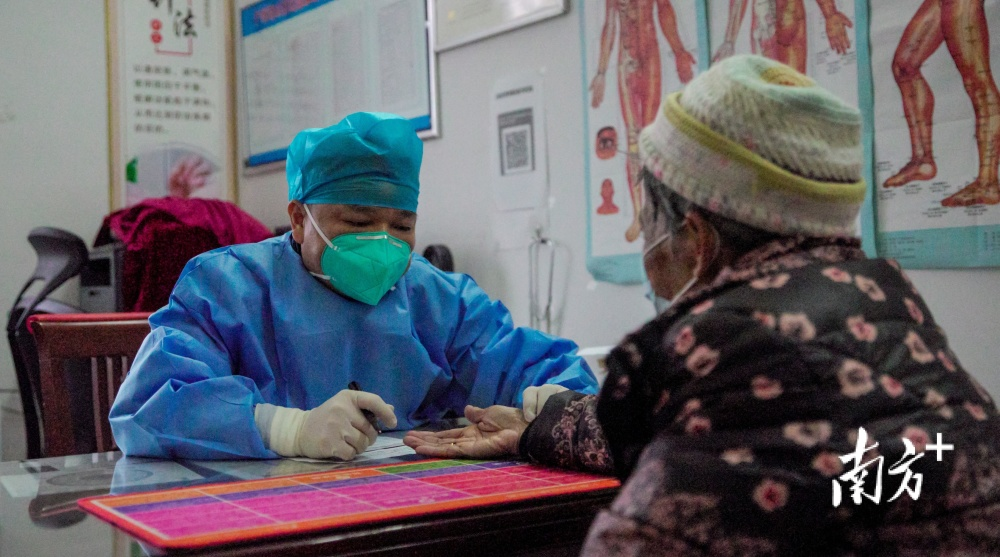
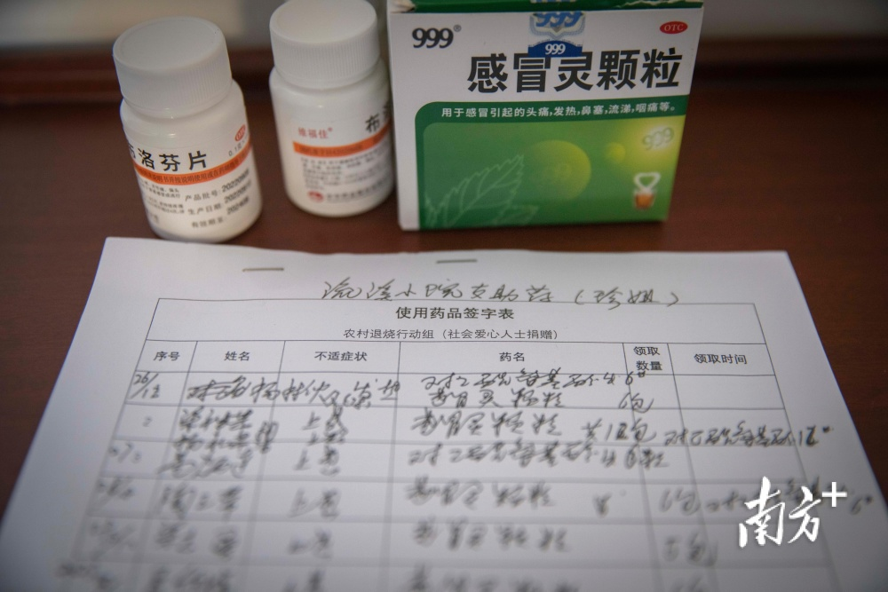
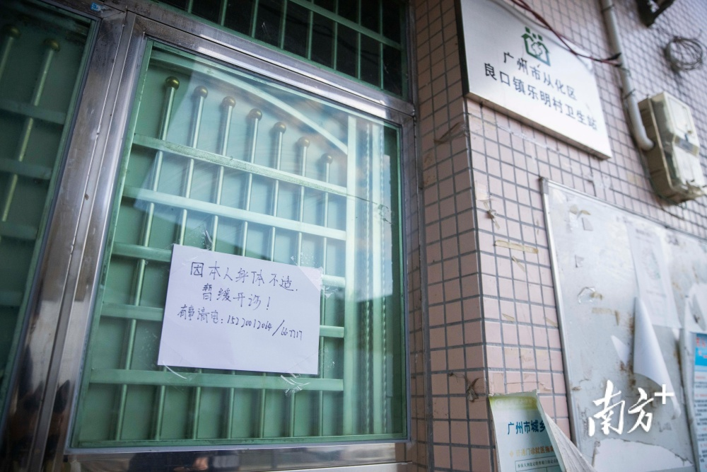

# 村医接诊量是往日十多倍：网上抢药，紧急学习如何识别重症患者

4页表格、45位村民，是广州市从化区良口镇长流村村医易林胜近半个月来的接诊记录。在表格的“拟诊”一栏，这45人都被记录为“上感（新冠？）”。

这半个月的接诊量，是易林胜平时的十多倍。

长流村位于从化北部山区，距离良口镇车程四十分钟，开车到从化市区要近一个半小时。因为村里缺少抗原检测试剂，易林胜无法给前来就诊的患者确认是否为新冠感染，所以只能在接诊记录中先打上一个问号，“看症状基本符合。”最初，长流村卫生站也没有退烧药储备，后来在社会力量和镇卫生院的帮助下补齐了相关药品。

农村地区老年人比例高、人均医疗资源有限，面对新冠感染高峰，应该怎么办？在“新十条”落地一个月之际，记者走访了广州从化区的多个村发现，村卫生室的药物已基本恢复供应，村医对新冠患者的接诊以及重症患者的转诊正变得规范和高效。

_源湖村村医张福荣在药房整理他在网络平台上抢到的药品。_

网上给村民抢药

“最多的一天接诊了十来个人，现在是每天有两三个人。”从1月1日开始，长流村卫生站的病人一天比一天少，“感觉高峰应该是过去了”，易林胜说。易林胜本人也“很可能感染了新冠”，他1月1日开始发烧，之后的两天在退烧和低烧间反复，但他那几天仍坚持带病坐诊，“症状不重，村里只有我一个医生，还是得给大家看病”。

53岁的易林胜在长流村当村医已有26个年头，在这个常住人口只有300人的村子里，他已经很久没有在短时间内接诊过这么多人了。尤其在近年，易林胜的主要工作是进行核酸检测和疫苗接种。过去三年，政策不允许村卫生室收治发热病人，而是让患者去设有发热门诊的医院就医，“以前有一些退烧药，都放过期了”。

_1月5日下午，长流村村医易林胜在线上参加新冠诊治培训。_

此轮优化防控措施之初，从化的多个村都面临着无药可用的局面，村医、村干部和镇卫生院一起为抢退烧药想办法。去年12月中旬，社会力量捐赠的一批药物送到了长流村，充实了村卫生室的药物供应。目前，卫生室的退烧药、止咳类药物差不多够半个月使用，同时也在不断补给相关药物。

在从化区温泉镇源湖村，为了充实村卫生站的药方，村医张福荣每日在网络平台上抢药，但受制于物流迟滞，张福荣抢到的第一批药直到去年12月15日才送到源湖村，之后物流通畅后，源湖村卫生站才摆满了药。张福荣抢到的这些药品，都会零差价卖给村民。

线上学习新冠诊治

_源湖村村医张福荣接诊新冠患者_

1月9日下午，源湖村一位75岁的老太赶到村卫生站看病，她距离退烧已经一个礼拜了，但仍没有食欲、心率较高，经过诊断后，张福荣给她开了感冒药和开胃药。

张福荣估算，源湖村目前感染率可能已接近80%，因源湖村距离从化市区较近，感染高峰来得较早。张福荣称，现在该村的新冠治疗已经进入了后半程，发烧的症状减少，乏力、心悸胸闷的症状增多，此外老年人的重症倾向也多发在后半程，所以还不能放松警惕。

张福荣介绍，几年前，从化区就要求村卫生室在未经审核批准的情况下禁止开展静脉输液，审核的要求较高，所以几乎全区的村卫生室都停掉了“挂吊针”的项目，只能给病人开口服药，病情严重的病人只能建议他们去医院治疗。

“一方面是要有药能够发下去，另外一方面是老年重症患者能及时转诊”，长流村村医易林胜说。在他的接诊记录里，45个疑似新冠感染者中，有4人在“处理”一栏被写上“建议到医院治疗”，4人均为超过70岁的老年人，均有基础疾病，易林胜发现他们的血氧等指标存在异常时，会建议他们去医院治疗，或联系120进行转诊。

1月5日下午，记者在长流村见到易林胜时，他正在手机上参加广州市有关部门组织的村医培训，课程中，有医生详细指导村医们如何诊断新冠患者、如何判断重症等。

_社会力量给长流村捐赠的药品。_

村医“阳了”，邻村助力

1月6日，广东省新冠感染防控指挥办哨点监测工作专班发布《关于印发广东省村卫生室人员新冠病毒感染接诊十须知的通知》，进一步指导村医为村民提供基本医疗服务，发挥首诊和兜底作用。该文件提出，地理位置偏远、交通不便的村卫生室要提前储备治疗药物和防疫物资，不得随意关停，必要时向上级部门寻求支援。

_良口镇乐明村村医何惠蜂症状较为严重，该村村民可以向周边村的村医寻求帮助。_

在长流村东北方向五公里外，良口镇乐明村的感染情况却和长流村截然不同，据该村村医何惠蜂介绍，他从去年12月至今总共仅接诊过7个疑似新冠感染者，“目前村里大部分人都还没感染”。

但何惠蜂却先感染了。他怀疑是在接诊过程中被传染的，1月3日，何惠蜂开始发烧，因患有基础病，他判断自己的感染症状较为严重，便赶去位于从化区的南方医科大学第五附属医院进行治疗。1月11日，何惠蜂说，“吸了两天氧，现在感觉好很多了。”

这段时间，乐明村的卫生站只好关门休诊，大门外贴上了一张A4纸，上面写着“因本人身体不适，暂缓开诊！”何惠蜂说，他将自己的情况向镇卫生院做了汇报，经过协调，乐明村的村民如有就诊需求，可以寻求周边村村医的帮助。

“此前，我们已经对村里的特殊人群进行了摸底，形成了名单，向他们发放过药品，我不在的这段时间，村干部也会对特殊人群的情况进行持续关注。”何惠蜂说。

【采写】张笛扬

【摄影】董天健

【统筹】张由琼 徐勉 朱红鲜 董天健

【作者】 张笛扬；董天健

南方探针

