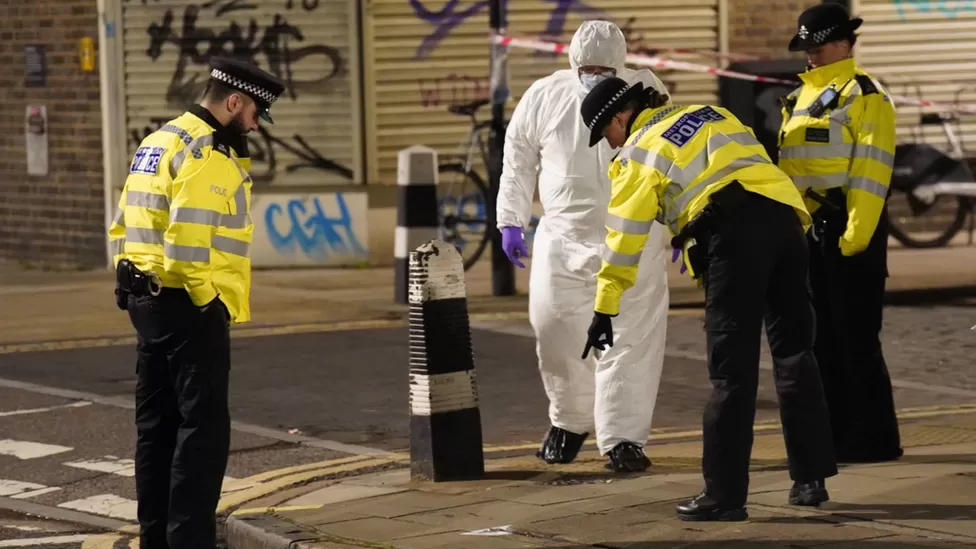
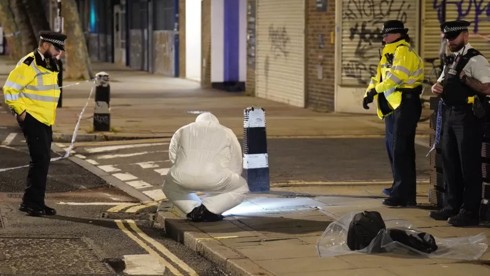
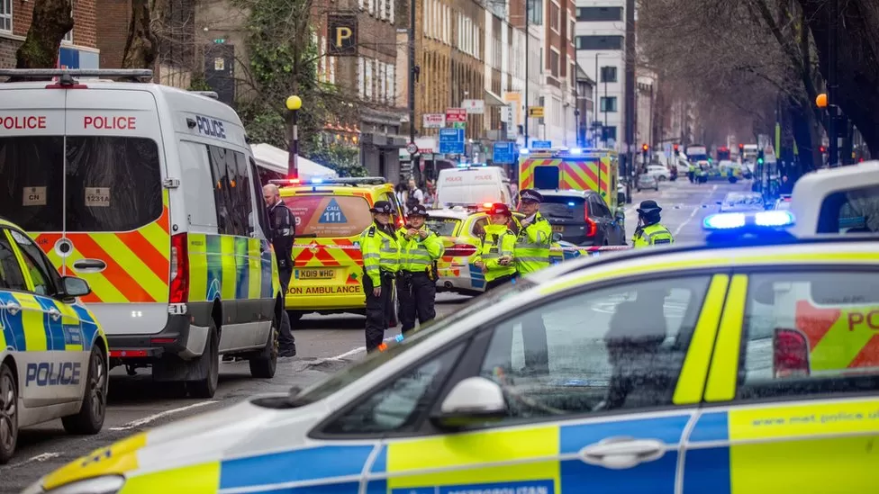
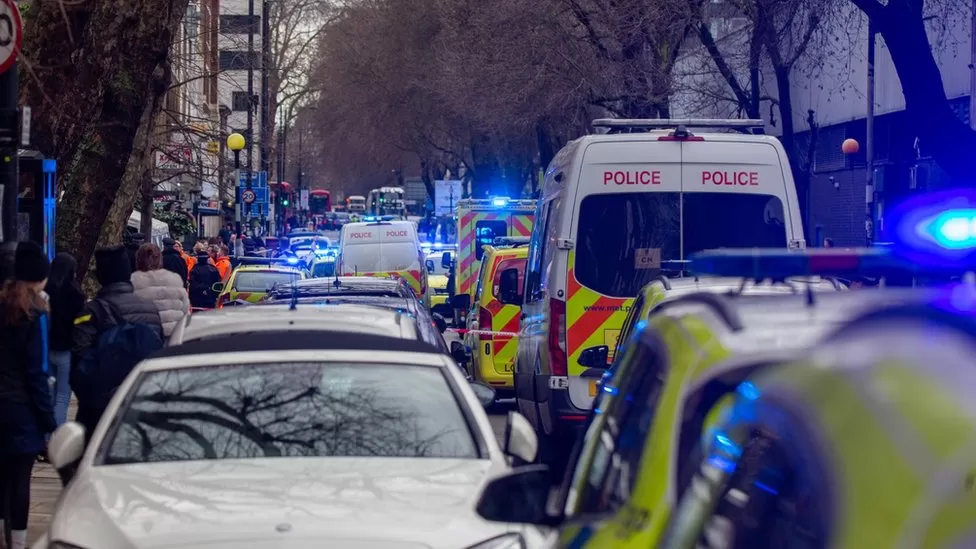

# 英国伦敦枪击事件已致6人受伤

_枪击事件发生后，法医人员在事发现场工作
图自英媒_

_枪击事件发生后，法医人员在事发现场工作
图自英媒_

_枪击发生在一座教堂附近，靠近尤斯顿车站附近一家酒吧
图自英媒_

_事发现场附近道路封闭，枪击事件调查继续进行
图自英媒_

当地时间1月14日夜间，英国伦敦警方称，当天早些时候发生在伦敦市中心的枪击事件伤者人数上升至6人，其中一名7岁女孩的情况危急。所有伤者均已被送至医院接受治疗。（文字来源：央视新闻客户端
总台记者 高瞻）

