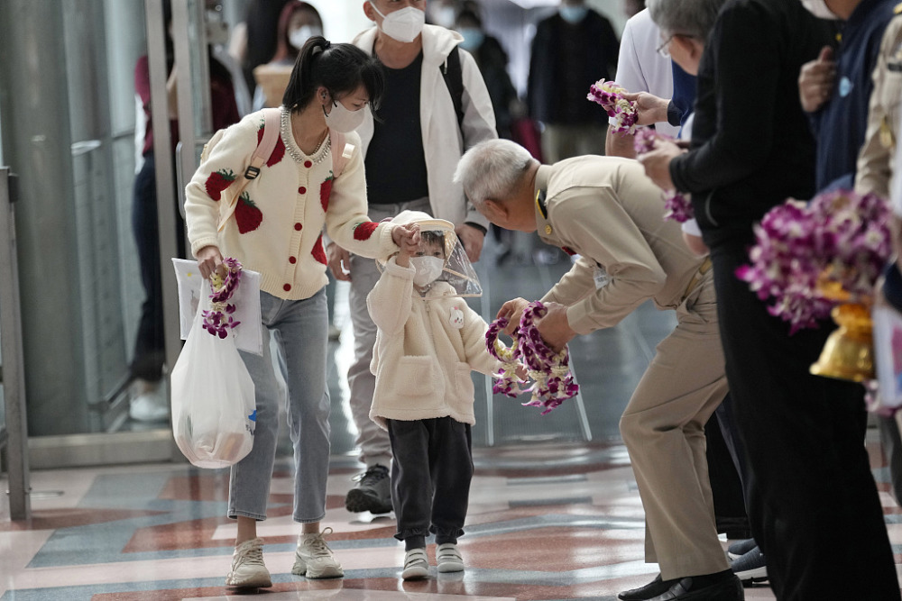
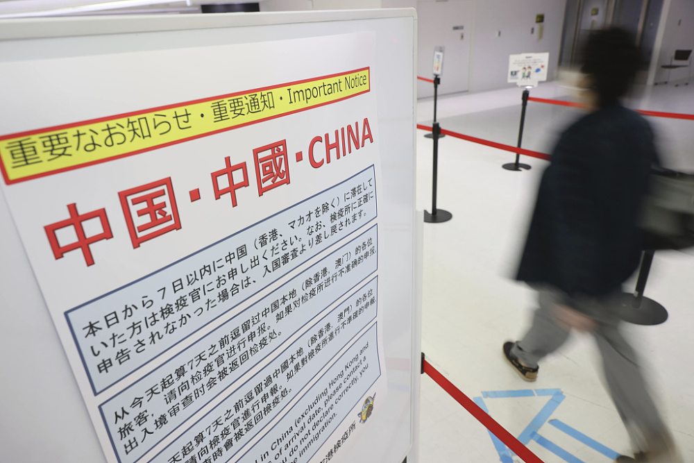

# 赴泰国与日本的中国乘客切身体验：有欢迎横幅，也有核酸检测

自2022年12月来，中国不断优化调整防疫政策，国际社会普遍积极看待，认为中国经济的强劲复苏，将对全球经济的稳定和增长起到提振作用。

伴随着防疫政策的优化，中国公民出境人数也处于有序恢复和增加的过程中。与此同时，国际社会对中国体现出一定程度上的反应差异。

在东南亚，泰国副总理兼卫生部长阿努廷在2023年1月9日亲自赴曼谷素万那普机场迎接中国游客，他还当场表示，泰国已取消之前宣布的一项入境政策，不再要求国际旅客出示新冠疫苗接种证明。阿努廷指出，如果游客在泰国境内确诊，可以到医院治疗，不需要担心。如果游客有意在泰国接种疫苗，在缴纳相关费用后即可接种。

除了“副总理迎接”之外，各个国家的入境措施给中国乘客带来了怎样的切身体验？澎湃新闻（www.thepaper.cn）近日连线了多位在恢复开放后前往泰国与日本的同胞。

_当地时间2023年1月9日，泰国曼谷，泰国官员向抵达素万那普国际机场的中国游客发放花环。
本文图片均来自视觉中国_

**泰国：热情与感动**

“下飞机就看到工作人员在门口拉着横幅欢迎我们，横幅上写着‘中泰一家亲’，工作人员说‘欢迎中国家人们’，我就很感动。”
于1月9日入境泰国的小爱告诉澎湃新闻（www.thepaper.cn），“然后又是泰国官员来给我们递花环，给我们送袋子和小礼物，很贴心。然后他们还用中文说‘你好，欢迎来到泰国。’我感觉非常开心，他们还挺重视我们中国游客的。”

“我当时落地泰国入关是非常流畅的，因为我当时拿的是学生签证，和像那些拿落地签的人不一样，他们去填表格，我是直接去取我的行李了。”小爱告诉澎湃新闻，“当时是排队入境，机场人还挺多的，排了得有20至30分钟，排到我之后，就把资料、机票和护照都给了入关的工作人员，然后他看了半天，也没有问什么问题，最后他问了一下说我是学什么专业的，又问了一下出机场之后住在哪。”

“我就用泰语回答他，说我是传媒专业的，出机场之后是去学校对面的宿舍，然后他就问了一下，我为什么会泰语？因为他可能觉得我是国际学院的学生，我说我比较喜欢学习外语，所以我就学习了泰语和英语两种外语，最后他就说给我通关盖章了，把资料递给我，说让我好好学习，然后我就出机场了。”

“我当时递给他的资料就是我的学生签证、航班行程单，还有疫苗接种证明，我没有准备什么核酸证明和保险，他也没有管我要其他的。”小爱说道，“当你有什么事情问机场工作人员的时候，他们都很热情地回答你，给你指路。”

于1月9日入境泰国的中国游客大刘在接受澎湃新闻（www.thepaper.cn）采访时表示，自己的流程也很顺利。

“我是从深圳过关到香港搭飞机的，在登机前，香港机场的海关也没有看我的保险，当天也没有卡保险不给过等等过度管理的例子。在落地泰国后，我填好入境卡，落地签的费用是2000泰铢（约合人民币405元），另外我还给了工作人员200泰铢的小费，之后泰国海关人员看了下我的机票酒店订单，几分钟就顺利进入泰国。”
大刘说道。

另一位于1月10日入境泰国的中国游客清墨则告诉澎湃新闻，自己是在昆明长水国际机场搭乘航班飞往泰国的，“不需要做核酸，海关只看了我的回程机票、酒店订单和新冠保险。”清墨表示，在落地泰国后自己感觉很好，工作人员很热情，“什么都不看，盖章直接通关。”

面对逐渐复苏的旅游业，泰国财政部长阿空·登比达亚拜西日前表示，虽然世界经济面临下行压力，但中国游客回归等利好因素有望推动泰国实现今年3.8%的经济增长目标。

_2023年1月12日，一名乘坐中国大陆直飞日本航班的旅客抵达千叶县成田机场检疫亭，通过登机口接受抗原定量检测。_

**日本：同航班的日本人下飞机也做核酸**

与此同时，也有一些国家对入境本国的中国游客采取了针对性的防疫措施。

据日本官方此前发布的消息，日本从1月8日起要求从中国入境日本的旅客，不管接种过任何疫苗，均需要在出国前72小时以内做核酸检测，并出示由医疗机构出具的核酸检测证明。进入日本前7天内有停留过中国大陆的人员以及从中国大陆直接飞往日本的人员到达日本时，需接受检测，检测结果若呈阳性则将被隔离。

于1月12日抵达东京成田机场，赴日工作的小陈向澎湃新闻表示，
72小时内的核酸阴性证明最好是英文的，是日文的最好，假使是中文的话需要配一个申告书。这些都有了才能登机。

当被问及落地日本后是否有工作人员给入境日本的中国游客发相关的牌子要求佩戴时，小陈表示，工作人员只在自己的袖子上贴了一张贴纸，上面写着跟核酸检测时护照上贴的号码一样，“因为他们要拿走我们的护照、在留卡（编者注：由日本政府向中长期居留于日本的外国人所发放的身份证明文件）以及机票，在我们回来的时候，他们对着袖子上的号码将上述证件还给我们。”

“落地后就要去做核酸检测了，检测方法是往管子里吐口水，吐到一定的量，然后等检测结果，阴性的可以入境，阳性的就要被拉走去酒店隔离。”
小陈表示，自己由于核酸检测结果呈阳性而被隔离，“假使没有症状的话，5天的隔离后会给你做核酸，结果为阴性的话，第六天早上可以离开隔离酒店。不过，工作人员态度都挺好的。我刚开始得知自己的结果是阳性的时候，情绪很低落，他们也很耐心地安抚我。”

小陈指出，从自己上巴士到隔离酒店的房间，行李都是工作人员搬的，“他们的态度没问题，我是满意的。就是希望他们处理阳性乘客的速度能快点，从下午1点半开始等核酸结果，到晚上8点踏入酒店房间，这个过程等得太累了。”

另一位于1月11日入境日本的中国游客小埋告诉澎湃新闻，自己在落地后也马上做了核酸检测，1小时之后结果出炉，“同航班上有日本人，他们下飞机也要做核酸，也一样等结果。”

中国外交部发言人汪文斌1月11日在回应相关问题时表示，我们已经多次指出，少数国家罔顾科学依据和本国疫情实际，执意对来自中国的旅客采取歧视性的入境限制措施。我们再次呼吁相关国家从事实出发，科学适度制定防疫措施，各方共同努力，为正常人员交往和交流合作创造有利条件。

**（文中小爱、大刘、清墨、小陈、小埋均为化名。）**

