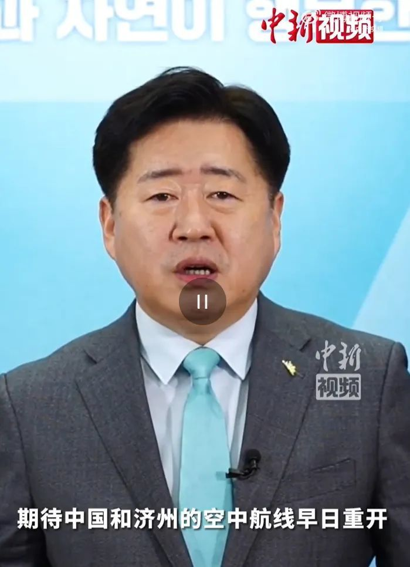

# 韩国官员：诚挚期待中国游客到访济州，期待航线早日重开

每经编辑：何小桃,张锦河

近日，韩国对中国游客入境采取“歧视性”措施，韩国旅游业复苏受到影响。

据中国驻韩国大使馆1月13日消息，韩国济州岛知事吴怜勋接受采访时表示，期待中国游客早日访问济州。同时还表示，希望韩国政府和中国政府通过友好协商，尽快解决现在的入境防疫政策问题。

据环球网1月12日消息，《韩国经济》11日以“中国游客不来，韩国商家认栽”为题报道称，位于首尔市区的大型奥特莱斯商场“W购物中心”将于今年9月关门停业。该商场近两年受疫情影响，失去了作为“消费主力”的中国游客，导致经营不善，难以为继，最终宣布倒闭。

**韩国济州道知事：诚挚欢迎中国游客早日到访**

据中国驻韩国大使馆1月13日消息，近来，中国驻韩国大使馆和总领事馆同韩国各界进行了广泛接触，了解到，随着中国防疫政策不断调整和优化，许多韩国友好人士以及旅游、酒店、零售等相关从业者纷纷对中国游客早日到访韩国表示诚挚期待与热烈欢迎。

日前，韩国济州岛知事吴怜勋接受采访时表示，期待中国游客早日访问济州。吴怜勋说，济州岛拥有美丽和平的生态环境，是中国游客最喜欢的韩国代表性旅游胜地。从历史上看，济州岛还是巩固韩中文化纽带和经济合作的伙伴。

虽然两国关系暂时出现一些波动，相信随着和平与共存的大潮，我们会再次迎来繁荣共赢的未来。希望韩国政府和中国政府通过友好协商，尽快解决现在的入境防疫政策问题。期待中国和济州的空中航线早日重开，大批中国游客在济州度过愉快的旅行时光，双方各领域各层次人文交流和经贸交流更加活跃。

_图片来源：中新视频截图_

济州岛曾是中国游客赴韩旅游的热门目的地。

根据报道，早在2012年访问济州岛的中国游客就达到108万人次，这些中国游客消费带来的生产带动效应达到2.7458万亿韩元(约合人民币158亿元)。

另外，公开资料显示，截至2016年8月末，即济州岛实行免签入境制度15年以来，共有近298万人访问济州岛，其中中国人占99%，约295万人。2016年9月8日，韩国文化观光研究院公布，中国游客2016年上半年在韩总共刷卡消费金额达到43293亿韩元（约合人民币264.3亿），占全体外国游客在韩刷卡消费金额的63%。

不过，受到“萨德”入韩影响，访问济州岛的中国游客大减。

据参考消息2017年报道，数据显示，2017年1月至4月10日，访问济州岛的中国游客为45.1827万人次，较2016年同期减少26.6%。

根据韩国观光社统计，2017年访问韩国的外国游客人数为1334万人次，同比减少22.7%，其中访韩的中国内地游客为417万人次，同比大减48.3%。

**韩国旅游业忧心忡忡，旅行社：感到非常担心**

据北京日报，此前，不断有中国网友爆料，韩国方面针对中国旅客的防疫措施带有“侮辱性”，且“只针对中国人”。

1月11日，赴韩访友的中国旅客Tina接受澎湃新闻专访，讲述了她从韩国仁川机场入境的经历。

过海关时，Tina站在外国人通道排队，有工作人员反复跟她确认“14天内有没有去过中国大陆”，在她回答“去过”之后，该工作人员要求她前往近期去过中国大陆入境的通道，并帮她单独录入信息，然后将她转交给一位军人。Tina称自己在一名军人的陪同下前往核酸检验点，并自费8万韩元(约合人民币430元)做了核酸检测。

Tina指出挂黄牌代表需要自费做核酸检测。只要在14天内到过中国的旅客，不管是中国还是外国旅客，都会被挂上黄牌以示区分。

韩国对中国游客的歧视性政策，让韩国旅游业忧心忡忡。韩国模德旅行社工作人员说，“原本准备面向中国游客销售的旅游商品，随着韩国政府对来自中国的入境者加强防疫措施，正处于停滞和观望状态”，“相关政策正在持续（给业界）泼冷水”。哈拿旅行社方面也表示，“若目前状况影响两国间的感情，将不利于重启和恢复旅游业，未来前景也不会乐观。”“从长远来看，我们感到非常担心。”

韩国旅游业界普遍认为，企业和个人能做的部分十分有限，对此感到束手无策，希望韩国政府部门尽快出面解决。

另外，韩国航空业、免税店零售行业、化妆品公司也均在密切关注相关情况。有报道称，2019年及以前，韩国免税店八成以上的销售额都来自中国游客及代购。疫情期间由于没有顾客，市内免税店的月收入一度降至为零。

**尹锡悦要求韩外交部“充分说明立场”**

据北京日报1月12日消息，1月10日，中国驻韩国大使馆发布关于暂停签发韩国公民赴华短期签证的通知。据韩联社报道，韩国总统尹锡悦11日对此表示，韩国政府“基于科学依据制定防疫政策，相关措施旨在保护公民”，并要求韩外交部向中方充分说明韩方立场。

韩国外长朴振介绍，尹锡悦当天在听取韩外交部2023年工作汇报时，作出上述表述。朴振在会上向尹锡悦汇报称，“政府优先考虑国民生命安全而采取了防疫措施，相关措施建立在科学客观依据之上。”

中国发布新冠病毒感染“乙类乙管”总体方案和中外人员往来暂行措施之后，多国表态予以欢迎，但也有少数国家宣布对来自中国的旅客采取入境限制措施。其中，韩国是针对中国采取歧视性入境限制措施最严苛的国家之一。

1月2日，韩国政府暂停发放自中国公民赴韩短期签证，并且暂停了从中国起飞的航班增班计划，来自中国内地的航班只能从仁川机场入境。

韩国防疫部门5日起要求所有自华入境人员在登机前提供行前48小时内核酸检测阴性证明或行前24小时内医疗机构开具的抗原检测阴性证明。

另据中国网友近日曝光，入境韩国后在机场疑遭遇歧视性对待，下飞机后会收到一个黄色牌子，被要求挂在脖子上，然后被带去单独的区域做核酸。

**多个国家称“不会区别对待中国游客”**

据参考消息网1月13日报道，外媒援引多国官方表态称，中国游客在入境这些国家时不会被区别对待。

据路透社1月11日报道，瑞士政府11日表示，来自中国的旅客在入境瑞士时无需接受强制的新冠病毒检测。

瑞士政府在一份声明中称，在中国流行的奥密克戎变异株“只对瑞士民众和卫生系统构成很小的风险”。

声明还说，瑞士将持续密切关注国内疫情。

近期由于担忧中国疫情的规模和影响，一些国家要求来自中国的旅客提供新冠病毒检测阴性证明。

塔斯社1月11日也报道称，俄罗斯不需要因中国的新冠疫情而采取特殊的限制措施，俄卫生防疫部门相关负责人11日在“俄罗斯24”新闻频道直播节目中这样表示。

俄联邦消费者权益保护和公益监督局的马林娜·沙拉巴金娜说：“我们知道，包括中国在内的一些国家正经历复杂的疫情，但本局已采取的措施不会妨碍与中国的经贸联系。暂时不需要采取特殊措施。”

此外，据新加坡《联合早报》网站和拉美社报道，马来西亚负责公共卫生的副卫生总监诺哈雅蒂10日在记者会上表示，移民局将在机场为中国旅客安排特别通道，如果发现有人出现症状，将交由卫生部官员通过咽喉拭子进行抗原快速检测。

她还表示，所有入境的外国旅客都将接受热敏扫描仪检测，若发现生病或有症状者，以及主动申报者，都将接受进一步检查。

诺哈雅蒂称，中国1月8日开放边境当天和9日这两天，共有4069名中国旅客入境马来西亚，他们都没有感染新冠病毒或出现相关症状。

**编辑|** 何小桃 张锦河 杜恒峰

**校对|** 赵庆

每日经济新闻综合中国驻韩国大使馆、

每日经济新闻

