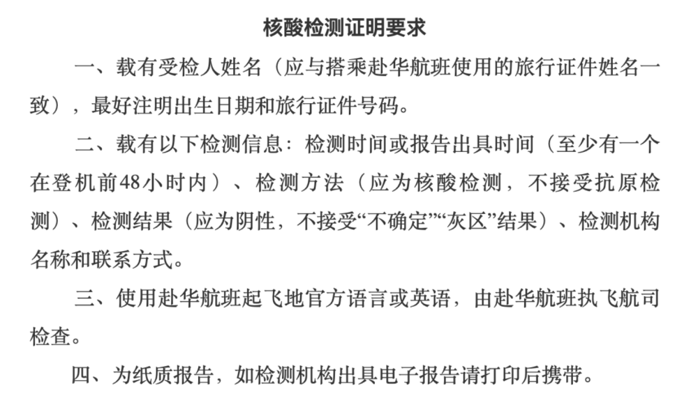

# 1月17日起，多国来华由所乘航司查48小时核酸！入境后海关抽查

中国驻韩国大使馆昨晚发布通知，根据中国政府2022年12月27日发布的新型冠状病毒感染乙类乙管后中外人员往来暂行措施要求，前往中国旅客须在行前48小时进行核酸检测，结果阴性者可赴华。

为确保国际旅行健康安全，自2023年1月17日起（当地时间）， **执飞赴华航班的航空公司将负责查验旅客登机前48小时内核酸检测阴性证明** ，请予以配合。
**中国海关将在旅客入境时对证明进行抽查** 。

中国驻韩国大使馆并不是唯一一个发布类似通知的。据第一财经记者的梳理，从1月15日开始已有中国驻多国大使馆发文，内容均为：
**1月17日起，执飞赴华航班的航空公司将负责查验旅客登机前48小时内核酸证明，中国海关将在旅客入境时抽查。**
包括中国驻美使馆，中国驻加拿大使馆，中国驻日本大使馆，中国驻新加坡大使馆等。

此外，伊朗马汉航空也于1月15日深夜发文，自1月17日起将在德黑兰机场值机柜台和中转区域，检查马汉航空赴华航班起飞前48小时内核酸检测阴性证明。

根据《关于对新型冠状病毒感染实施“乙类乙管”的总体方案》（下称“乙类乙管”总体方案），1月8日起，中国正式取消入境全员
**核酸检测和集中隔离。要求来华人员在行前48小时进行核酸检测**
，结果阴性者可来华，无需向我驻外使领馆申请健康码，将结果填入海关健康申明卡。入境后健康申报正常且海关口岸常规检疫无异常者，可放行进入社会面。

据记者了解，自1月8日到现在，从不少国家回国仍会有航空公司在登机前查验旅客的48小时核酸，但从有些国家回国，机场和航空公司已经不检查核酸。而此次中国驻多国使馆发布的通知，意味着对回国登机前查验48小时内核酸阴性报告的要求进行了强化严查。

对于实施“乙类乙管”以后，国内不再开展核酸筛查，为什么入境方面还保留入境前48小时核酸的要求，在1月13日举行的国务院联防联控机制新闻发布会上，外交部领事司司长吴玺回应称，“乙类乙管”并不是“乙类不管”或者“乙类不防”，我们要防的是跨境传播，便利的是人员的跨境流动。

“奥密克戎的致病率可能有所减弱，但是传染性有所上升，跨境旅行的时候，大家长时间处于密闭的空间中，感染的风险是很高的，所以我们要求来华人员在登机前48小时进行核酸检测，这也是为了确定旅行者本身没有受到病毒的感染，也是确保他的旅途更加安全，也是为了确保防止病毒的扩散。”吴玺表示，落地以后，海关会对有症状，或者是申报异常的人进行一个抗原的检测，这也是为了早发现、早治疗、早隔离，如果旅客本身没有什么症状，或者是没有被病毒感染，那么，这些措施对他们的旅行也不会有什么影响。

而随着我国放开对入境的相关限制，进入2023年，不少国家则陆续出台了各种针对来自中国旅客的入境限制措施，有的国家甚至 **暂时限制来自中国的旅客入境**
，不过 **也有不少国家对入境没有任何限制。【相关：** 一图读懂｜出入境放开并非说走就能走，各国对华入境限制到底谁严谁松】

对于这些国家的限制措施，外交部发言人汪文斌多次强调，少数国家罔顾科学和事实，仍执意针对中国采取歧视性入境限制措施，对此中方坚决反对，并将采取对等措施。

“对等措施”首先指向了韩国和日本。目前，中国已宣布暂停签发韩国公民赴华访问、商务、旅游、就医、过境以及一般私人事务类短期签证，以及暂停签发日本公民的赴华普通签证后，国家移民管理机构也对韩国、日本公民暂停签发口岸签证，暂停韩国、日本公民来华实行72/144小时过境免签政策。

