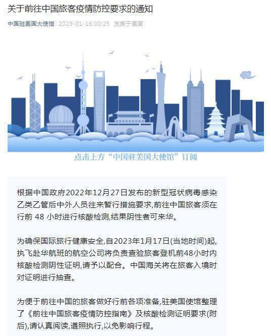
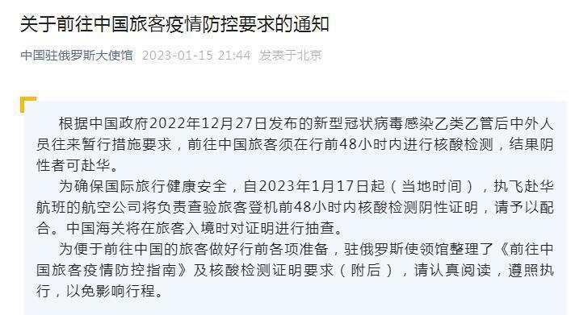
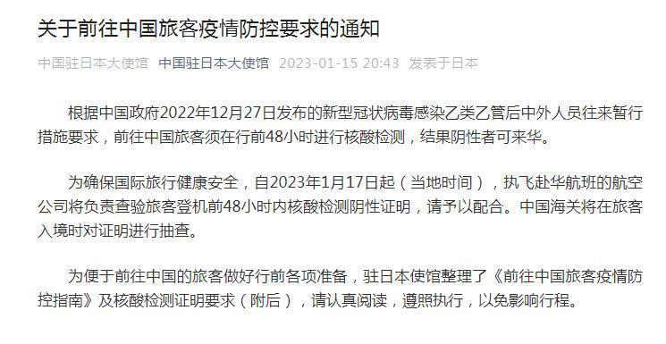
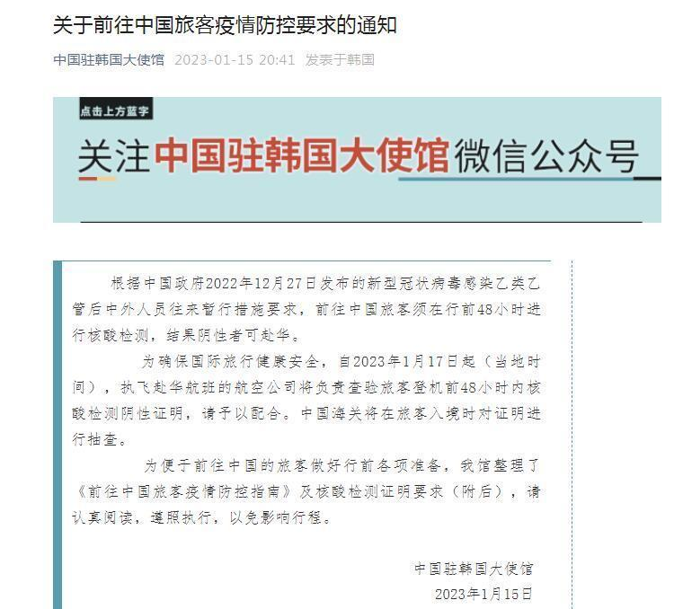
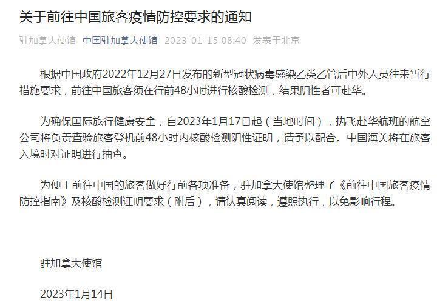
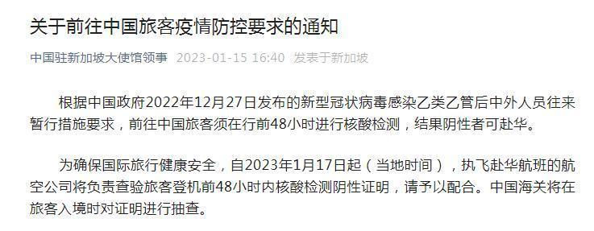
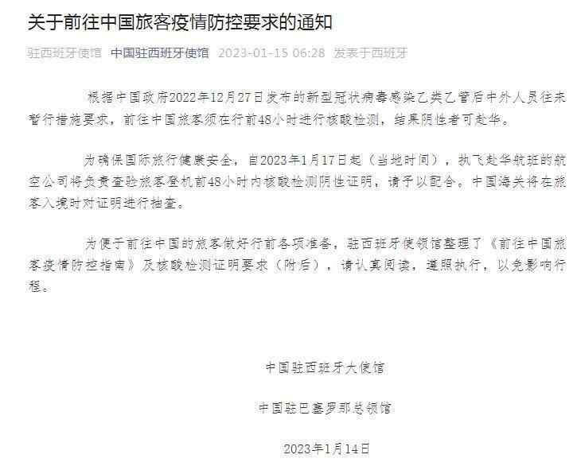
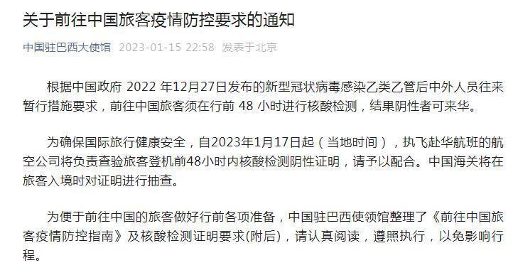

# 中国驻多国使馆：登机前48小时内核酸阴性者方可赴华

近日，中国驻多国使馆发布“关于前往中国旅客疫情防控要求的通知”：根据中国政府2022年12月27日发布的新型冠状病毒感染乙类乙管后中外人员往来暂行措施要求,前往中国旅客须在行前48小时进行核酸检测,结果阴性者可来华。为确保国际旅行健康安全，自2023年1月17日起（当地时间），执飞赴华航班的航空公司将负责查验旅客登机前48小时内核酸检测阴性证明，请予以配合。中国海关将在旅客入境时对证明进行抽查。

中国驻美国大使馆：

中国驻俄罗斯大使馆：

中国驻日本大使馆：

中国驻韩国大使馆：

中国驻加拿大使馆：

中国驻新加坡大使馆领事：

中国驻西班牙使馆：

中国驻巴西大使馆：

