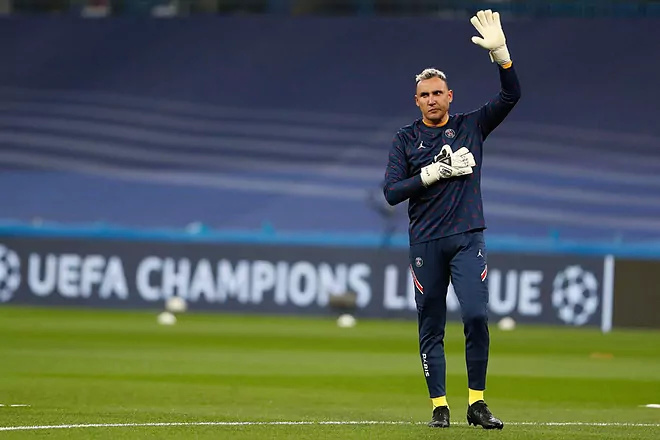

# 体育早知道｜库里41＋7勇士胜，塔图姆新高51分！梅西内马尔再被质疑

早间必读

NBA常规赛勇士客场127-118击败奇才，库里全场28投12中、三分15中6、罚球12中11拿到41分7篮板。普尔19投12中、三分12中7贡献32分，关键三分杀死比赛，库里普尔合砍73分14篮板拿下比赛。

NBA常规赛继续进行。一场东部对决中，凯尔特人队客场以130：118击败黄蜂队，绿军取得7连胜的同时，以33胜12负继续排名联盟第一位。

利雅得全明星队公布了友谊赛对阵巴黎的大名单，C罗领衔，塔利斯卡也入选。北京时间1月20日凌晨1点，利雅得全明星队将迎战来访的大巴黎，这支全明星队由利雅得新月和利雅得胜利的球员组成。

足球早报

在C罗加盟之后，众多顶级球员的名字都和利雅得胜利联系在一起，纳瓦斯或许是最有可能在冬窗加盟的球员。《马卡报》透露，在奥斯皮纳受伤之后，利雅得胜利已经向纳瓦斯开出了3年合同。

对于巴黎圣日耳曼来说，2023年的开局并不那么美丽，在15天时间内他们就输了两场比赛，分别是1-3不敌朗斯和0-1不敌雷恩，要知道巴黎之前可一直保持着不败金身。

C罗在社媒发布了两张照片。第一张是一家六口在一艘游船上的合影，包括总裁和乔治娜，还有两个儿子和两个女儿。第二张，则是C罗和乔妹两人看表演时的合影，还配文道：“和我的爱人们一起的美好时光。”

切尔西斥资1亿欧元签下了边锋穆德里克，普遍被认为砸钱太多，性价比偏低。英媒指出，蓝军其实有很多其他选择，比如布莱顿的日本边锋三笘薰。

根据英国媒体的消息，滕哈格将积极推动曼联与德赫亚、拉什福德、达洛特、卢克肖和弗雷德签下一份新合同。

据英国《太阳报》报道，曼市德比发生的争议，可能会导致IFAB进一步修改越位规则。

篮球早报

NBA常规赛激战正酣。骑士队主场迎来了鹈鹕队的挑战，双方进行的十分焦灼，鹈鹕队前三节占据微弱领先，骑士队末节发力一波11:0完成反超，并保持优势到比赛结束。最终，骑士队以113:103击败鹈鹕队，骑士队战绩变成28胜17负，鹈鹕队战绩变成26胜18负。

NBA官方公布了湖人vs76人的最后两分钟裁判报告。报告显示，比赛最后两分钟没有任何错漏判。这也意味着官方认定威少最后一攻没被犯规。

NBA名记Shams报道称，湖人球星安东尼-
戴维斯在右脚应力性损伤的康复方面取得重大进展，有望在全明星赛前复出。医学专家解析浓眉未来回归关键，而湖人记者也透露球队在布朗10天合同到期后，暂不打算签约新人，将空着第15个阵容名额。

NBA官方公布了第13周的东西部周最佳球员。尼克斯的布伦森当选东部周最佳球员，这是他生涯首次获此殊荣。国王的小萨博尼斯当选西部周最佳球员，这是他本赛季首次当选周最佳，生涯第三次获得这一奖项。哈登、恩比德等球星获得周最佳提名。

湖人会不会在今年休赛期交易詹姆斯？The Athletic名记David
Aldridge解析了其他29队状况后，认为詹姆斯潜在的下家有5队，他列出了5队的交易方案，并就可能性打分，最可能的下家竟然是老鹰。

综合早报

世界乒联常规挑战赛多哈站结束资格赛第2日争夺，在齐菲0-3输给朱成竹之后，国乒再次吃到败仗，26岁的孙闻0-3不敌韩国选手安宰贤，无缘资格赛决胜轮。孙闻也有高光时刻，比如他曾战胜张本智和，但是自从那场比赛之后，孙闻战绩平庸，如今又倒在了资格赛，让人无奈。

重要赛事预告

07:00 NBA常规赛 太阳VS灰熊

09:30 澳网女单第一轮 王曦雨VS普利斯科娃

10:00 澳网男单第一轮 谢尔顿VS张之臻

11:00 CBA常规赛 深圳VS广州

11:30 NBA常规赛 火箭VS湖人

12:00 澳网女单第一轮 张帅VS提格

15:00 CBA常规赛 江苏VS山东

15:30 CBA常规赛 青岛VS新疆

17:30 澳网男单第一轮 巴耶纳VS德约科维奇

19:30 CBA常规赛 山西VS宁波

19:35 CBA常规赛 浙江东阳光VS上海

03:45 足总杯第3轮 狼队VS利物浦

