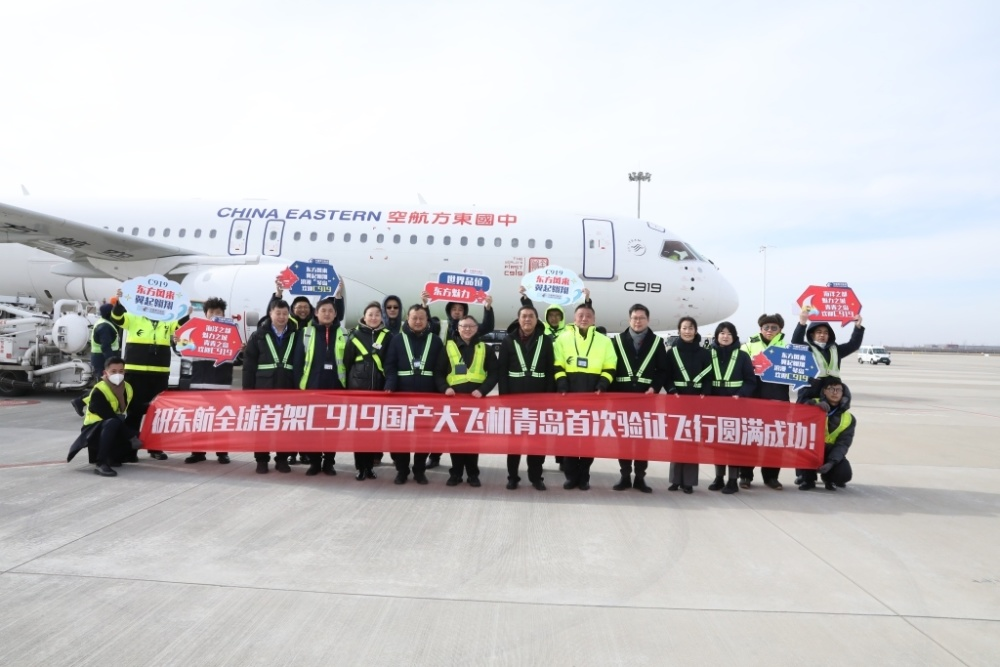

# 全球首架C919国产大飞机首达青岛，岛城人民有望2023年春搭乘

半岛全媒体记者 郝春梅 实习生 赵葳

东方风来，翼起翱翔；青青之岛，欢迎C919！

2023年1月15日11:14，印有“全球首架”“中国印”标识和专属“身份证号”涂装的中国东航全球首架国产C919飞机，执行验证飞行航班MU7811,从上海虹桥国际机场飞抵青岛胶东国际机场，C919飞机100小时验证飞行再添新航点。东航山东分公司、青岛机场、青岛空管站等驻场单位高度重视，安排现场保障人员早早就位，全力做好保障工作，共同见证这历史性时刻。

2022年12月9日，中国东方航空作为C919的全球首发用户，正式接收编号为B-919A的全球首架飞机。东航为全球首架C919配备两舱布局，164座，包括8个公务舱和156个经济舱，客舱拥有2.25米的过道高度，单曲圆弧造型设计的下拉式行李舱设计，能给旅客提供更大的顶部和前方视觉空间。客舱还选装了共20个12英寸吊装显示器，支持高清1080P电影放映，这也是东航单通道机队首次引入1080P的节目装载。

随着东航成功接收全球首架C919，国产大飞机事业从研发制造的“上半场”开始转入商业运营的“下半场”。围绕“飞出安全、飞出志气、飞出品牌、飞出效益”总体要求，东航投入商业运营的各项目标任务都在陆续落地。

2022年12月26日，东航C919飞机开始进行100小时验证飞行，全面检验东航各系统迎接、准备C919商业运行各项工作的保障能力，确保国产大飞机进入商业运行之后，东航能够为广大旅客提供良好的乘机体验，让C919的商业航班更加安全、更有效率。

目前，这100小时验证飞行已进入新阶段，验证飞机计划有新调整，涉及的起降机场从之前的11个增加到14个。C919飞机在飞抵青岛之前，已在上海、北京、成都、西安、海口等5城市、6座机场密集开展验证飞行。后续还将继续前往济南、南昌、武汉、合肥、南京、太原等航点，继续开展验证飞行。

据悉，在C919完成航线验证飞行后，中国东航将争取在2023年春将C919正式投入商业载客运营。届时，C919将出现在青岛、上海、北京、西安、昆明、广州、成都、深圳等优质精品航线上。东航也将努力把C919打造成东航“明星机型”“空中名片”，增进旅客、公众对东航C919的了解和喜爱，助力国产大飞机越飞越好。

