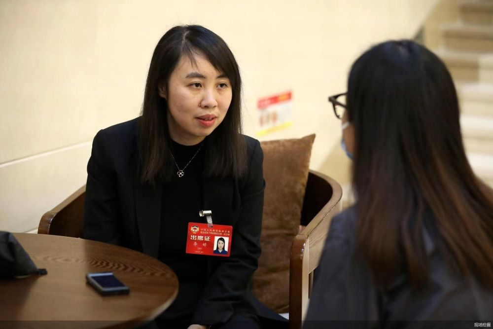

# 北京市政协委员：80%大学生理想状态是生育两孩，极少数希望生三孩

“三孩”政策落地近两年，生育相关话题热度仍居高不下。1月15日，北京市政协十四届一次会议进入第二天，市政协委员、中国人民大学社会与人口学院教授李婷在驻地接受记者采访时表示，推动生育率提升应注重系统联动，扶持做好0-3岁婴幼儿托育工作，并出台个体生育补贴、税收减免等组合性政策。

“少子化在全世界范围内都是大趋势。”李婷直言，随着社会的发展和进步，新一代年轻人的生育观念正在发生转变。“据我们团队对大学生群体开展的调研来看，80%的大学生理想状态是生育两个孩子，极少数人希望生三个，一个都不想生的‘丁克’群体占比只有4%。”

尽管大学生所代表的年轻人群体存在着生育意愿，但不敢生的现实困境同样不容忽视。“年轻人面临的婚育困境，实际上是包含了个人规划、事业发展等在内的复杂联动体系。”李婷表示，一方面生育和婚姻的物质基础大门大幅度提高，另一方面年轻一代对工作的观念也在改变。“工作成为很多年轻人心中实现人生价值的途径，特别是女性群体对工作的重视程度，已经提升到了新的高度。”

“提高生育意愿，关键在于提高适婚适育群体对未来发展的良好预期。”李婷说道。

北京商报记者梳理发现，与提高生育意愿相关的配套政策正逐步走进大众生活，提供生育补贴、扩大0-3岁婴幼儿托位数、对婴幼儿照护实施税收减免、日间照料支持……系列政策正不断托举“生育率”。

以各地已出台的生育补贴政策为例，深圳正公开征求《深圳市育儿补贴管理办法》意见，按照一次性和每年一次的形式发放育儿补贴。其中，生育第三个子女的家庭，在办理出生入户后将发放一次性生育补贴10000元，每年另发放3000元育儿补贴，直至该子女满3周岁。

“未来北京是否会推行育儿补贴或生育津贴，可能会在同类型城市试点后再做考量。”李婷表示，如果生育津贴能够起到效果，北京迟早会跟上政策的脚步。“生育补贴的比例确认要维持好平衡，一方面既要达到足够的刺激效果，另一方面又不能给财政造成巨大的负担，这是一项需要长期研究的政策。”

除了提高年轻人的生育意愿，不少已经做了爸爸妈妈的90后、80后甚至70后同样观望着再次生育的可行性。“目前大家都比较关心人工辅助生育技术是否将纳入医保。据我所知，目前卫健委也正在研判纳入医保的可行性。”李婷表示，生殖技术涉及到多个环节，每个环节的价格弹性都比较复杂，“包容性生育政策应该是国家未来发展的大方向，包容性核心在于帮助有生育意愿的人实现生育。”

北京商报记者 赵博宇/文 张笑嫣/图

