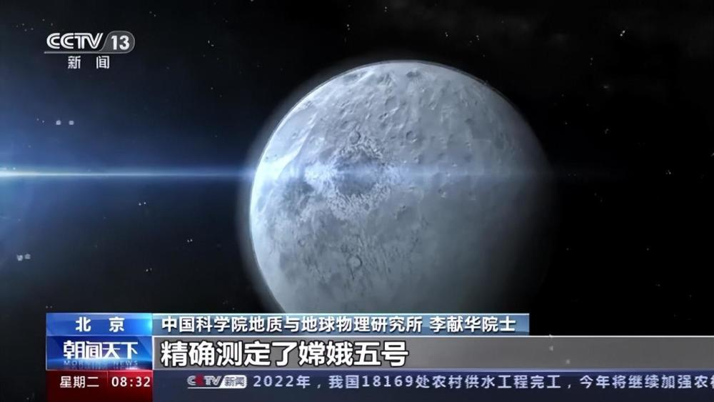

# 嫦娥五号重要成果：20亿年前的月球仍然“活着”

国家航天局公布了我国嫦娥五号月球样品的科研成果。科学家们通过对月球样品的研究，精确测定了月球岩浆停止活动发生在20.3亿年前。

嫦娥五号的首批样品于2021年7月12日向国内科学家发放，目前已完成五次样品分发，共计198份65.1克。

2021年，科学家团队通过对嫦娥五号采集月球样品中玄武岩的研究，证实月球火山活动可以一直持续到20亿年前，刷新了人类对月球岩浆活动和热演化历史的认知。

中国科学院地质与地球物理研究所
李献华院士：我们中国科学院地质与地球物理团队2021年取得很好的成就，发表了三篇的《自然》文章，精确测定了嫦娥五号月壤样品的年龄是20.3亿年，过去认为30亿年最晚到28亿年就结束了。

李献华院士表示，通过对嫦娥五号月球样品的研究，加深了人类对于月球的认识，因此他们也更加期待嫦娥六号任务能够带来更多新的发现。

中国科学院地质与地球物理研究所
李献华院士：南极艾肯盆地直径非常大，超过2000公里，是我们内太阳系最大的撞击坑，它很可能揭示了月球形成早期的很多的信息。嫦娥六号将是人类第一次到月球背面去取样返回，而且这个样品它带来的对月球演化的早期的信息有非常重要的科学意义，所以我们都特别期待。

来源：央视新闻

