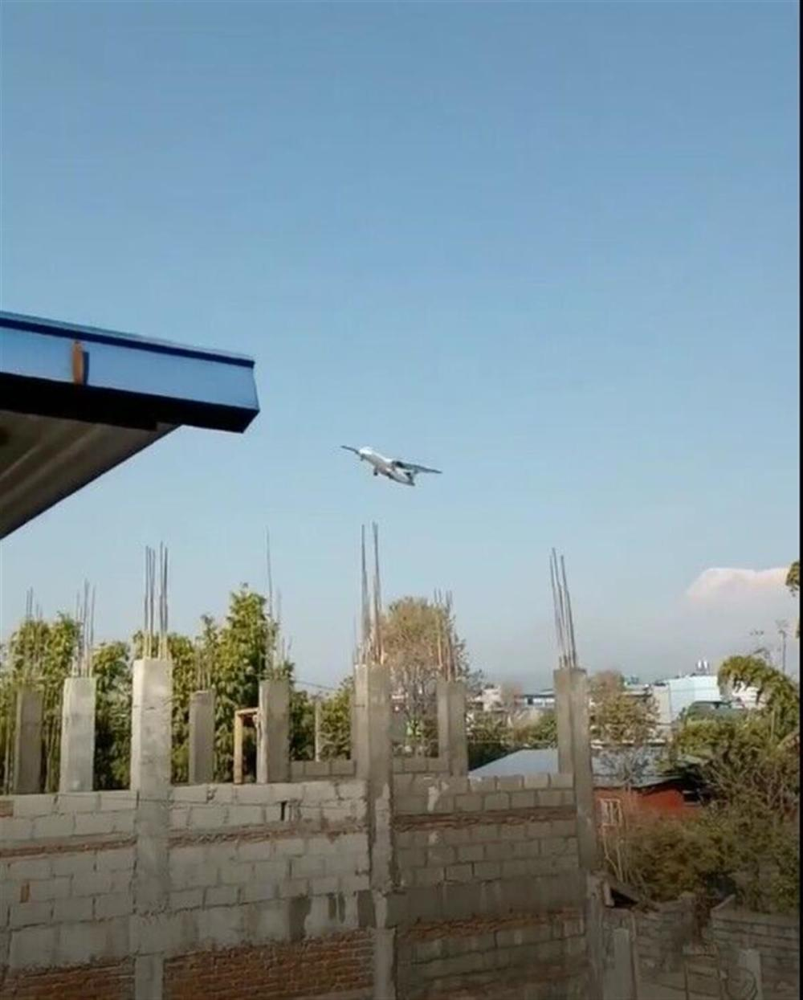
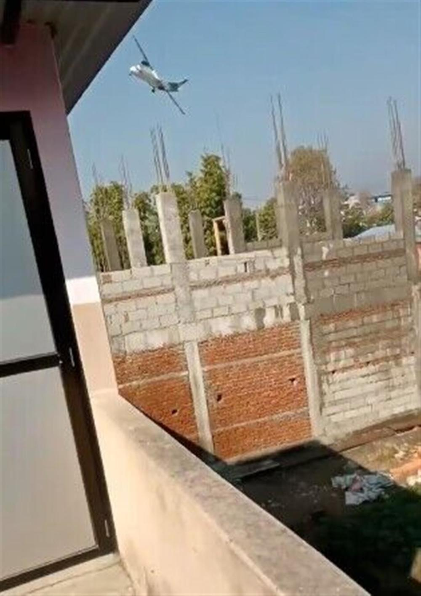
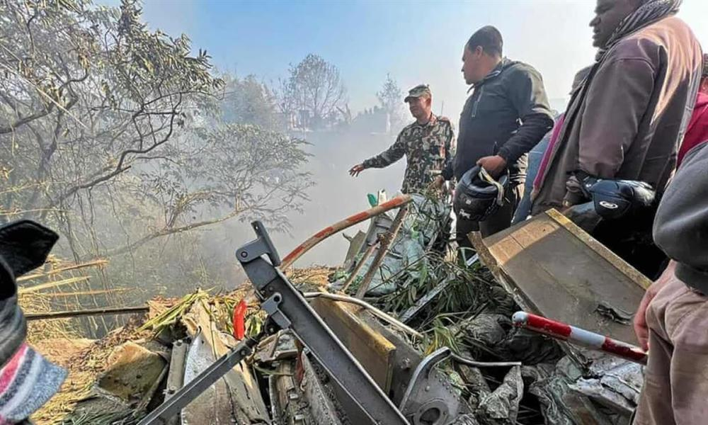

# 尼泊尔民航局发言人：客机事发前已获准降落，初判是技术原因坠毁

极目新闻记者 屈旌

据尼泊尔My
republic网站当地时间1月15日报道，尼泊尔民航局(CAAN)发言人表示，当天上午10点33分从加德满都机场起飞的飞机，在事故发生前已获准降落。

_事故飞机坠机前一刻画面
（来源：推特视频截图）_

他说：“天气不是问题，已经收到初步信息表明飞机是由于技术原因坠毁的。”“飞机还在空中时，就看到了火焰。”

_机场附近居民拍到的客机坠毁前画面（网络视频截图）_

这架飞机载有4名机组人员和68名乘客，由高级机长卡马尔和安居·卡蒂瓦达驾驶。

_事故现场的视频截图
（来源：Anadolu Agency/盖蒂图片社）_

据博卡拉国际机场消息人士透露，这架飞机是从西面降落时发生了事故。

_救援人员聚集在博卡拉坠机现场
（来源：Krishna Mani Baral/AFP/盖蒂图片社）_

据空中交通管制员介绍，博卡拉国际机场的跑道是东西向的。Runway 3-0是东跑道，Runway-1-2是西跑道。这架飞机最初寻求从东边（跑道
3-0）着陆的许可，后来从西边（跑道 1-2）转向跑道方向。

“事故是在老机场上空盘旋时发生的。”管制员说，“飞机本应在10秒内到达跑道，然而在中途遇到了意外。原因尚未透露。”

（来源：极目新闻）

