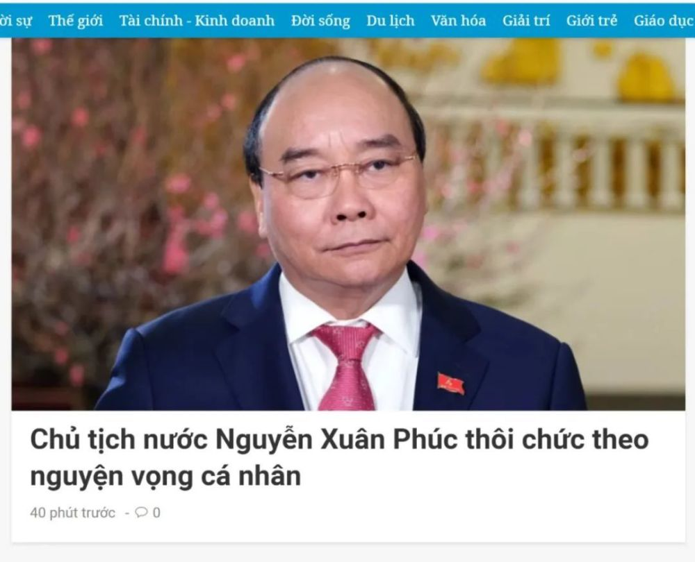

# 越南国家主席阮春福辞职：对防疫腐败“负政治责任”

据越南通讯社（越通社）消息，当地时间2023年1月17日下午，越南共产党第十三届中央委员会召开临时会议，就越共中央政治局委员、越南国家主席阮春福提出辞职和退休进行审议，同意阮春福辞去越共中央政治局委员、中央委员、国家主席、国防与安全委员会主席等职务。

越共中央政治局不设常委会，阮春福在现任政治局委员中排名第二，仅次于越共中央总书记阮富仲，被外界视为越南最高领导层“四驾马车中的二号人物”。临近越南农历春节，直到1月16日，阮春福仍以国家主席身份公开出席活动。他的任期原本持续到2026年。

_越南媒体报道阮春福辞职_

对于阮春福突然辞职的原因，越通社的报道称，在2016年到2021年的上一个总理任期内，阮春福“在领导、指导新冠疫情防控方面做出了巨大努力，取得了重要成果”，但随着有关核酸试剂腐败、援助包机腐败在内的防疫腐败系列案件被逐渐揭露，“在包括2名副总理、3名部长在内的多位官员违规、造成非常严重后果的情况下，他（阮春福）负起负责人的政治责任”，“深刻意识到自己对党和人民的责任，提出辞去分配的职务、辞去工作、退休的申请”。

越通社提到的“2名副总理”，即2023年1月5日刚刚由越南国会特别会议宣布罢免的常务副总理范平明和副总理武德儋。其中，范平明在越共中央政治局排名第七、在四位副总理中排名第一，是阮春福辞职前卷入防疫腐败问题的最高级别官员。

2023年1月3日，越南公安部办公室主任苏恩苏中将在例行记者会上表示，将力争于1月内结束核酸试剂案和援助包机案的调查，“被告人数有可能继续增加”。截至当日，已有141人因涉两案遭到起诉，警方追缴查封涉案资产超1.67万亿越盾（约合人民币4.9亿元）。

“改革派”代表人物

1月16日，阮春福最后一次以越南国家主席身份露面。他走访慰问了越南佛教协会证明理事会法主释智广和尚并向他拜年，向全国佛教教职人员、僧尼和佛教信徒致以新春祝福，祝愿他们身体健康、平安、佛事圆成。再之前的几天，他出席了新春文艺晚会，视察了边防部队，还为得乐省的贫困群众送上了新年礼物。

经济学专业出身、曾留学新加坡国立大学的阮春福，是越南经济改革中涌现出的专业官员的代表。2006年到2016年间，他在时任越南总理阮晋勇领导下工作，从政府办公厅副主任、主任逐步晋升为副总理、常务副总理并进入越共中央政治局，协助阮晋勇主持了行政程序改革、国企精简重整、推进“平衡外交”及引进外资等工作。

在此期间，理论战线出身的阮富仲在2011年越共十一大上成为越共中央总书记。2016年越共十二大召开前，阮富仲、阮晋勇年龄均已超过65岁。最终，阮富仲得到年龄豁免，继续担任越共中央总书记，阮晋勇的总理职位则由阮春福接任。

2021年1月，越共十三大召开，76岁的阮富仲和67岁的阮春福双双得到年龄豁免，阮春福随后当选越南国家主席，直到2023年1月辞职。

在本届政治局中，阮春福是资历最深的经济战线干部。现任政府总理范明正是公安战线出身；国会主席王廷惠曾是财经学者，2001年才进入政坛。阮春福担任总理时，王廷惠任河内市委书记。排位更靠后的常务副总理范平明，在阮春福担任常务副总理、总理时长期担任外交部长。

阮春福在越南经济改革和对外开放中的成绩，曾得到国际社会的高度评价。有数据显示，自2013年至2020年，越南劳动生产率增速追平了革新开放之初的水平，且“资本密集度对生产率增长的贡献下降，说明增长的主要引擎已经从大量投资转向了效率提高”。

长期担任世界银行等机构越南项目顾问的湄公河经济公司首席经济学家亚当·麦卡蒂曾对《中国新闻周刊》分析称，越南改革的方法“不是宏大的‘下一步’，而是上百个‘小碎步’，小步骤改革的最终目标是构建全球领先的高效商业环境。”

在此背景下，越共十一大进一步确立“生产资料多样化”、认可私营经济；越共十二大确立了加强反腐、推动国有经济改革、加强政府服务等目标；越共十三大将关注重心转向促进外资和推动科技创新、数字国家转型上。阮春福则是这些战略的具体落实者。

在越共十三大上，阮春福曾强调，越南领导层现在“不仅是规划2021年到2025年，还对未来十年的国家发展肩负责任”。也是在十三大上，阮富仲提出了越南中长期发展目标：到2045年建成高收入发达国家。

阮春福生于越南中部的广南省桂山县。当时正值越南战争期间，当地是南越政府控制区。但阮春福成长于一个参加革命活动的家庭。上世纪60年代末，未成年的阮春福由组织安排前往北方接受教育，随后考入河内国立经济大学。大学毕业时，越南已经统一，他回到家乡，在革新开放之初担任当地旅游、投资等部门领导，逐步成长为越南经济战线的最高负责人。

“步步为营，势不可挡”

最近半年来，越南高层临时召开的“特别会议”特别多。在1月17日的越共中央临时会议之前，1月5日，越南国会特别会议以476票同意、5票反对、3票弃权的结果，通过了解除范平明、武德儋职务的决议。此前的12月31日，两人已在越共中央临时会议上辞职。再往前，越共中央2022年6月和12月召开的两次特别会议，分别导致卫生部长阮青龙、河内市长朱玉英被开除党籍，外交部长裴青山及整个外交部党组受到纪律处分。

自2021年12月以来，在阮富仲的亲自指导下，越南政府公安部等部门就2020年新冠疫情爆发后的两大腐败案件展开侦察，除波及前述高层外，还逮捕了多位副总理助理、副部长，被捕司局级官员及疾控中心干部遍布四十多个省市及中央卫生部、科技部、外交部、公安部、交通部等诸多部门。

第一条腐败链是小型生物科技公司“越亚公司”通过行贿科技部、卫生部官员及各省疾控中心负责人，控制核酸试剂的官方审批和购买流程，随后通过抬高官方购买价格牟取暴利。据越南媒体报道，本案涉及交易金额4万亿越南盾（约合人民币11亿元）、已确认的行贿受贿金额8000亿越南盾（约合人民币2.3亿元），“是越南司法史上从未有过的巨额回扣”。

另一条腐败链是：新冠疫情爆发之初，越南政府就组织多部门协调安排航线和隔离措施，指定企业和航空公司承运包机，通过两年规划近2000架次“援助包机”，将来自60多个国家和地区的20多万越南公民接回国内。警方查明，在此过程中，一些旅行社及航空服务公司，通过贿赂外交部、公安部、交通部等部委及接收地政府的官员，在手续费、机票价格、回国隔离收费等多个环节“痛宰”回国公民，平均一次飞行就能收获超过十亿越南盾（约合人民币30万元），整起事件的非法获利估计高达数万亿越南盾。

越共中央总书记阮富仲2022年10月曾公开表示，这些防疫腐败案件，错误“不只是一个人，而是相互勾连，从党委书记到省长，到各级官方部门，甚至到中央官员”。他说，一些干部“一开始不接受（腐败指控）”，直到“拿出证据”。当时他还预告称，“不久的将来，还会有更多（官员）”、“（反腐工作）一步一个脚印，步步为营，势不可挡”。

不过，《日本经济新闻》等媒体评论称，即使防疫腐败涉及全国性问题，范平明这样层级的干部被罢免还是“极不寻常的”。新南威尔士大学研究员阮海洪说，越共中央自1994年“开始从决策层面重视反腐败斗争”，但2013年之前罕有高级官员因经济问题落马。

阮富仲成为越共中央总书记后，于2013年兼任越共中央反腐败反消极指导委员会主任，就此开启以“熔炉”（Dot
Lo）为名的反腐运动。越共中央政治局委员、胡志明市委书记丁罗升2017年因在越南油气集团任内的腐败问题被免职，后被判处13年有期徒刑，成为越南统一以来“落马”的最高级别官员，也是“熔炉”运动启动至今唯一一位正式因腐败被捕判刑的政治局委员。

不过，官方媒体《青年报》在范平明、武德儋辞职后指出，近两年来中央人事变动的一个新特征是，除了开除党籍，“有中央委员纷纷辞职”。在阮春福、范平明、武德儋之前，胡志明市原市长阮清风等三名中央委员已在2022年10月的中央会议上辞职。在此之前，三人均遭不同程度的纪律处分。《青年报》称，“如果他们不辞职，也会被免去职务”。

就在范平明、武德儋正式辞去党内职务的前一天，越共中央书记处常务书记武文赏再次公开强调了干部辞职问题。他说，要坚持干部工作“有进有出，有上有下”，要制造压力，让那些“不能胜任，威望降低”的干部在任内辞职。在1月3日的国会特别会议记者会上，国会高级官员阮氏青在回答有关罢免范平明的问题时再次重申了该政策，并表示国会代表们要“将人员更换视为正常的事情”。

2023年新年之际，阮富仲接受越通社采访时，提及核酸试剂案、援助包机案等“重大特大案件”。他说，这些工作“非常困难、复杂和敏感”，但得到了公众的支持。阮富仲还反驳了有关处理违法干部是“内斗”“派系之争”的说法。

记者：曹然

