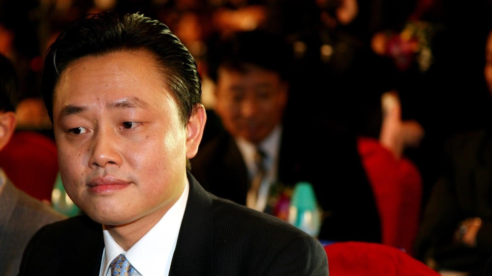
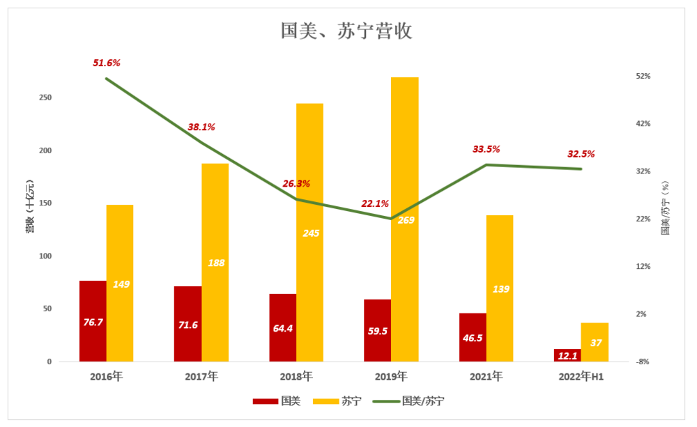
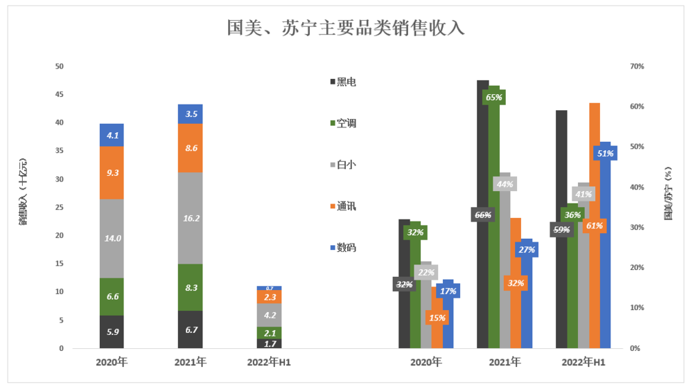
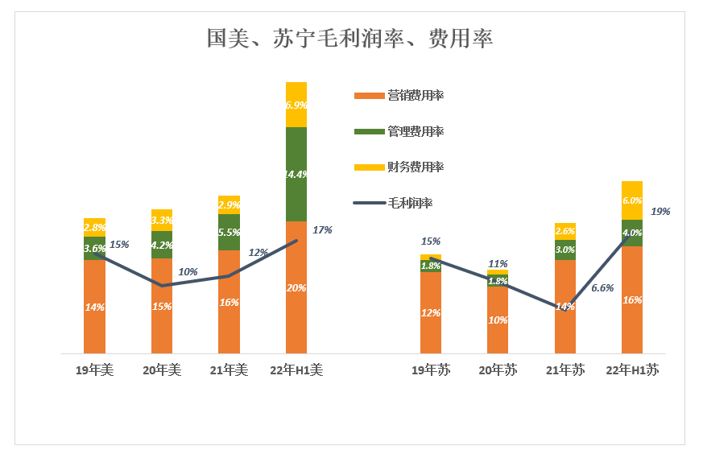
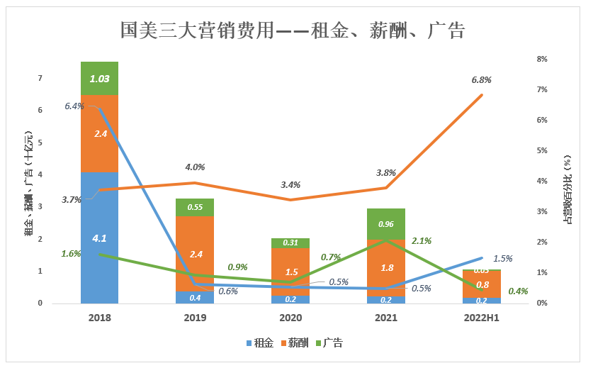
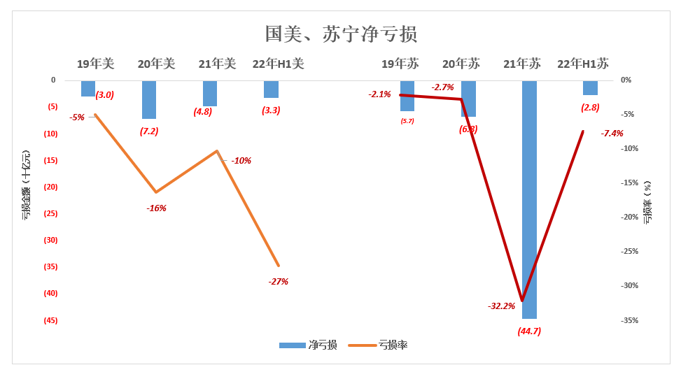
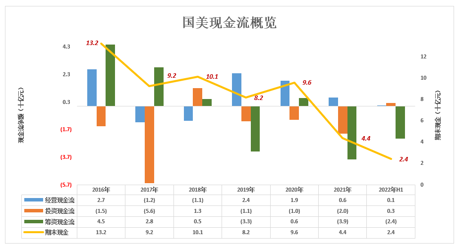
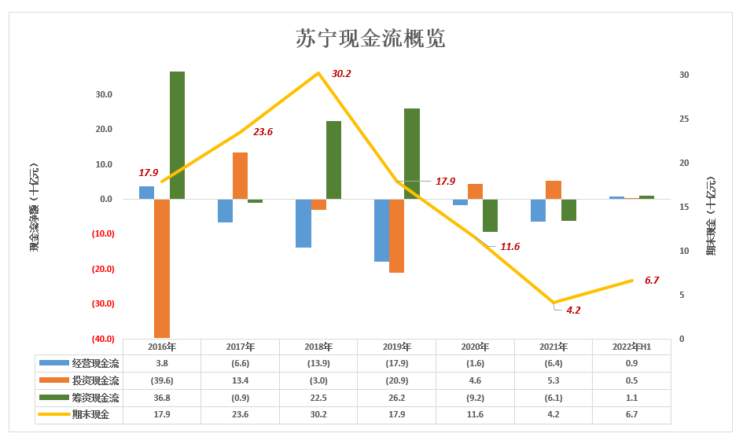
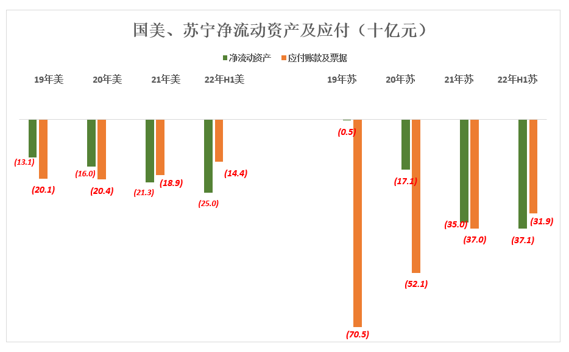

# 黄光裕做错了什么

作者｜Eastland

头图｜视觉中国

股权被冻结、被债权人起诉、裁员欠薪……国美困境不容忽视。

2020年6月24日，黄光裕获得假释，对国美的控制从此不存在“阻隔”。

2021年2月16日，假释结束，正式获释，黄光裕旋即召集高管会议，宣布“18个月恢复原有市场地位”。

其时国美营收规模已经滑落到老对手苏宁的五分之一，况且“原有市场地位”不在苏宁手里而在京东、天猫等电商平台。所谓“恢复原有市场地位”只是提振信心的口号。

黄光裕素来行事大胆，国美今天的局面是否因其罔顾现实、操之过急所致？搞清这个问题的最佳“参照”无疑是苏宁——曾是旗鼓相当的对手，又面临同样的宏观经济形势。

**从“五分之一”到“三分之一”**

2016年以来，国美营收持续下滑，与苏宁的差距逐步扩大。到2019年，国美营收仅为苏宁的22.1%。2020年进一步滑落到苏宁的17.5%。

“18个月恢复市场地位”不现实，缩小与苏宁的差距是实打实的进步，黄光裕做到了。

2021年国美营收464.8亿，相当于苏宁的33.5%；

2022年H1，国美营收121亿，相当于苏宁的32.5%。

2016年，苏宁日用百货销量占比还不到9%；2021年日百销售额达288.6亿、占营收的比例超过20%；2022年H1，日百销售额87.6亿、占营收的23.5%。

除日百这项新增的“非传统业务”，国美各主要品类销售收入与苏宁的比例显著提高。

黑电（影音）：2020年销售收入59亿、相当于苏宁的32%；2021年达苏宁的66%；2022年H1销售收入17亿、约为苏宁的59%；

空调：2020年销售收入66亿、相当于苏宁的31.7%；2021年达苏宁的65%；2022年H1销售收入21亿、回落到苏宁的36%；

白小（冰箱洗衣机+小家电）：2020年销售收入140亿、相当于苏宁的21.7%；2021年达苏宁的44%；2022年H1销售收入42亿、小幅回落至苏宁的41%。

面对相同的宏观环境及疫情冲击，国美显示出更大的韧性，缩小了与苏宁的差距——从不足苏宁的五分之一上升到苏宁的三分之一。

**黄光裕的“功力”**

黄光裕回归后，国美在可比品类毛利润率及费用率两方面都略占优势。

1）可比品类毛利润率

白小（冰洗+小家电）业务是国美、苏宁共同的亮点。国美显示出“碾压式”优势：2021年毛利润率达18%，苏宁意外跌至2.2%（2020年为13%）；2022年H1，苏宁白小毛利润率恢复为13%，而国美毛利润率达到22%。

黑电是苏、美起家的业务，黄光裕回归后国美该业务毛利润率实现反超：2022年H1，国美黑电毛利润率为17%，比苏宁高4个百分点，而2020国美落后一个百分点。

通讯、数码领域，电商优势尤为突出，国美、苏宁利润微薄。

特别是2021年，苏宁通讯、数码产品合计取得392.6亿营收，毛利润仅为1.8亿，毛利润率不到千分之五！同年，国美通讯、数码销售收入121亿、毛利润2.5亿、毛利润率超过2%。

2022年H1，国美空调业务毛利润率达到18.8%（2021年仅为2.2%），比苏宁的13.4%高5.4个百分点。

2）费用管控

苏宁近些年花大力气做起来的日用百货业务，2022年H1营收74亿、相当于国美总营收的61%，板块毛利润率达15.5%。

在毛利润率相差不大的情况下，苏宁营收规模是国美的三倍，费用率方面优势明显。以2022年H1为例：

国美、苏宁营销费用分别为24.4亿、61.1亿，国美营销费用率却比苏宁高3.8个百分点。

国美管理费用17.5亿、同比大涨64.5%，管理费用率14.4%（2021年仅为5.5%），同期苏宁管理费用不到15亿，管理费用率4%。

利息收入与支出相抵后，国美净付出8.3亿、财务费用率6.9%；苏宁财务费用净额22.3亿、费用率6%。

黄光裕回归后，国美营收规模与苏宁的差距迅速缩小，主要品类毛利润率全面超过苏宁，可谓“功力”不减当年。而且，在营收规模存在巨大差距的情况下，国美费用率与苏宁不相上下，亦彰显费用管控水平。

但2022年H1，两家营收下降50%以上，国美费用压缩空间所剩无几。总费用率大幅提高至41.5%。

**国美、苏宁先后“收缩战线”**

2018年国美巨亏54.9亿。2019年，在黄光裕“遥控”下，国美开始战略收缩，财年亏损降至30亿以下。

具体怎样收缩，从营销费用中“房租”“人员薪酬”“广告费用”可见端倪。

2018年，国美房租支出达41亿、占营收的6.4%；2019年房租支付仅3.7亿、占营收的0.6%；2021年租金2.3亿、占营收的0.5%。房租占比如此之低，说明国美零售“由重变轻”。

广告支出的波动很有意思。

先是果断压缩——2018年支出超过10亿、2019年直接砍掉一半，占营收的比例跌破1%；

然后大幅增长——2021年广告支出9.6亿、占营收的2.1%；

最后几近“归零”——2022年H1，国美广告支出仅为5400万元。

当年国美借“中缝广告”崛起，如今世易时移，黄光裕不再砸钱打广告，与马化腾不信“买量”的心路有几分相似。

人员薪酬相对难以压缩，2018年~2021年在营收的3.4%~4%之间波动。2022年H1，因营收大幅降低，人员薪酬占营收的比例提高到6.8%。

2021年是国美试图“翻身”的关键，不过增加2.7亿房租、多打6.5亿广告，合计9.2亿，对国美来讲只能算“小动作”，
**战略收缩的大方向没有改变。口号是口号，黄光裕其实非常务实。**

苏宁2019年略呈扩张态势，租金（包括使用权折旧、仓储）提高到81.3亿、占营收的3%（同期国美房租仅占营收的0.6%），薪酬支出增至143亿（比2018年多支28亿）、占营收的5.3%（比国美高1.3个百分点）、广告支出67亿（国美只有5.5亿）。

2020年，苏宁开始收缩，人员薪酬骤降至54.9亿，占营收的比例从5.3%掉到2.2%。

苏宁2019年发力，令国美营收降至自己的22%，不知有没有在黄光裕出来前给点“颜色”的意味。

回过头来看，如果苏宁2019年“收手”，今天的局面会好很多。

**“活下去”的要点**

如今国美、苏宁面临的挑战不是“恢复市场地位”而是活下去，有三个要点事关“生死”：经营活动现金流、可动用现金、偿债负担。

1）经营活动现金流

早在2014年，苏宁归属于上市公司股东的扣非损益已经“转负”（亏损12.5亿）；2018年亏损收窄至3.6亿，2019年又扩大到57亿。2021年，归属于上市公司股东的扣非净亏损达446.7亿、亏损率32.2%：2022年H1，亏损28亿。已被实施风险警示的“ST易购”行至退市边缘。

国美2017年陷入亏损，比苏宁晚了三年。2018年巨亏48.9亿；2019年收窄至25.9亿、亏损率5%；2020年巨亏损72亿、亏损率达16.3%；2021年略有好转；2022年H1亏损率放大至27%。

黄光裕亲自掌舵的2021年，国美加大了营销力度，营收恢复增长、亏损降低33%，令人看到转机。进入2022年，疫情多次反弹，国美、苏宁的日子都不好过，营收暴跌，亏损放大。

2）可运用现金

国美的收缩从2019年开始，除大幅压缩营销开支外，在现金流方面有非常明显的表现：

一是经营活动现金流一直保持“非负”；

二是投资活动现金流出保持“克制”；

三是筹资活动现金大幅净流出，尽量还债。

尽管采取一系列紧缩措施，国美账面现金仍然一路下滑至2022年6月末的24亿。

苏宁2017年经营活动现金流净额已经“巨负”，2018年、2019年分别为净流出139亿、179亿。投资活动现金净流出也于2019年达到峰值209亿。

在经营现金流为负时还大举投资，苏宁大肆举债，2018年、2019年筹资活动现金净流入分别为225亿、262亿。#出来混总是要还的#

不客气地说， **苏宁今天的困境与2019年之前的“托大”有很大关系。**

3）净营运资本与应付账款/票据

净流动资产则是用流动资产减去流动负债后的余额，也就是狭义的净营运资本（NWC）。

2019年以来，国美、苏宁净营运资本均为负值，但后者恶化的速度更猛。

2019年末，国美净营运资本为负131亿（2018年为负34亿）；2021年末为负213亿；2022年6月末为负250亿。

2019年末，苏宁净营运资本为负5亿（2018年为正380亿）；2021年末为负350亿；2022年6月末为负371亿。

净营动资本为负，意味着一年内可变现的资金不足以支付一年内必须偿付的负债，债务违约随时可能发生。

流动负债中特别值得注意的是应付账款/票据余额及周转天数。

国美、苏宁先后采取收缩战略，应付账款/票据余额逐步回落——2019年末到2022年6月末，国美应付账款/票据余额从201亿回落到144亿，苏宁从705亿回落到319亿。

2021年，国美应付周转天数为157天（2020年为187天），2022年H1增至301天，让人“捏把汗”。2022年H1，苏宁应付账款、应付票据周转天数分别为119天、89天。

**黄光裕复出后没做错什么，只是原有商业模式需要脱胎换骨式转型，又逢消费不振和疫情冲击。好比开着飞机修飞机，又遇到强气流。**

*以上分析仅供参考，不构成任何投资建议

