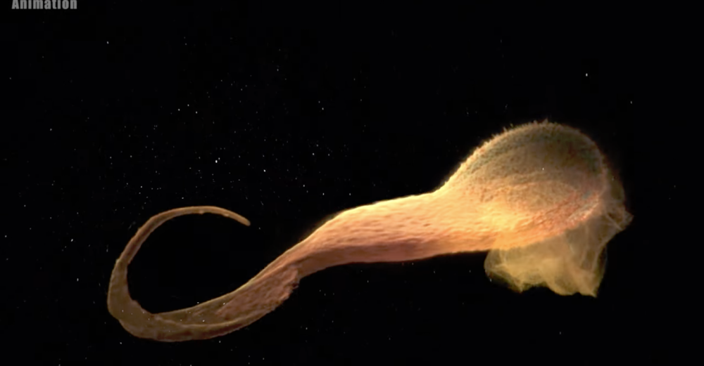
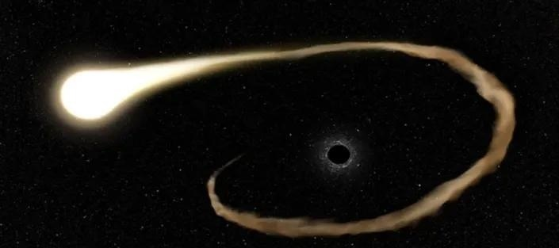
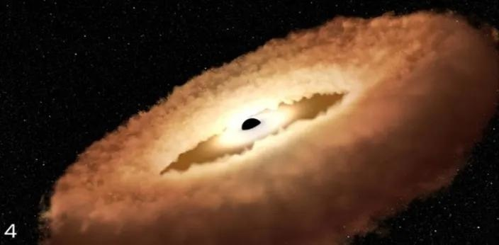

# NASA捕获到3亿光年之外，恒星被黑洞吞噬的画面

IT之家 1 月 15
日消息，虽然人类已经可以观测黑洞，但我们目前对这种极端天体的了解仍然很有限。因为黑洞被事件视界所覆盖，阻挡了我们对黑洞进行探寻的脚步，所以目前人类还无法观察到黑洞的内部结构。

如果黑洞能够吞噬一切，包括恒星和光，那么，这些物质最终会去往何方呢？

美国国家航空航天局 (NASA) 拍摄到了一幅十分罕见的画面 —— 3
亿光年之外的一颗黑洞化身吞星者，将一颗路过的恒星碾碎并把它拉长，最终在宇宙中产生了一个和太阳系一般大小的气体云。

_▲ NASA 的一幅插图，显示了一颗恒星（右）遇到黑洞后的结果_

虽然最新的詹姆斯・韦伯拍出来的照片更具有话题性，但这张照片实际上是哈勃望远镜拍摄到的。因为运气好，恒星坍塌的地方比一般情况下更靠近望远镜。因此，天文学家可以在长时间内观测这一事件，这使他们能够捕捉到更多的数据。

去年 3 月，哈勃太空望远镜发现了这一黑洞吞星事件，NASA 本月在西雅图举行的天文学会议上汇报了这一结果。NASA 官方将此类事件称为“潮汐破坏事件 /
潮汐瓦解事件”，简单来说就是一颗毫无戒心的恒星在宇宙中漫游时不幸遇到黑洞的故事。

目前，黑洞仍是人类已知宇宙中最强的存在之一，其引力难以想象，甚至光都无法逃脱。一个最典型的黑洞质量大约相当于 100
个太阳，而一些超大质量黑洞甚至可以抵过数十亿个太阳。

IT之家查询发现，目前银河系中最大的已知黑洞是人马座 A*，它的质量相当于 430 万个太阳，而迄今为止人类所探测到的最大的黑洞是凤凰
A，它位于凤凰星团的中心，距离地球约 57 亿光年，其质量堪比 1000 亿个太阳。

从 NASA 放出的图像来看，这一事件的最终结果是恒星残骸被周围的黑洞拉成一张“甜甜圈”，NASA 给它的正式命名为 AT2022dsb。

目前，这颗恒星距离地球约 3 亿光年，大约位于 ESO 583-G004 星系的核心位置。尽管有着深不可测的距离，但天文学家可以通过分析恒星通过其组成元素
(如碳和氢) 的光范围发出的紫外线来研究 AT2022dsb。

据悉，该事件最初在 2022 年 3 月 1 日被俄亥俄州立大学的天文学家的超新星全天自动巡天 (ASAS-SN) 计划发现。NASA
解释对此称，AT2022dsb 比其他类似事件更加接近地球，导致天文学家拥有更长时间的观察期。

最重要的是，更长的时间可以使科学家们能够使用紫外线去了解这张“甜甜圈”，相比于通常用 X
射线研究出来的结果更详细，这可以为天文学家提供有关事件中元素的更多信息。

_▲ 恒星残骸被黑洞拉成环形，最终落入黑洞，释放出大量的光和高能辐射。_

