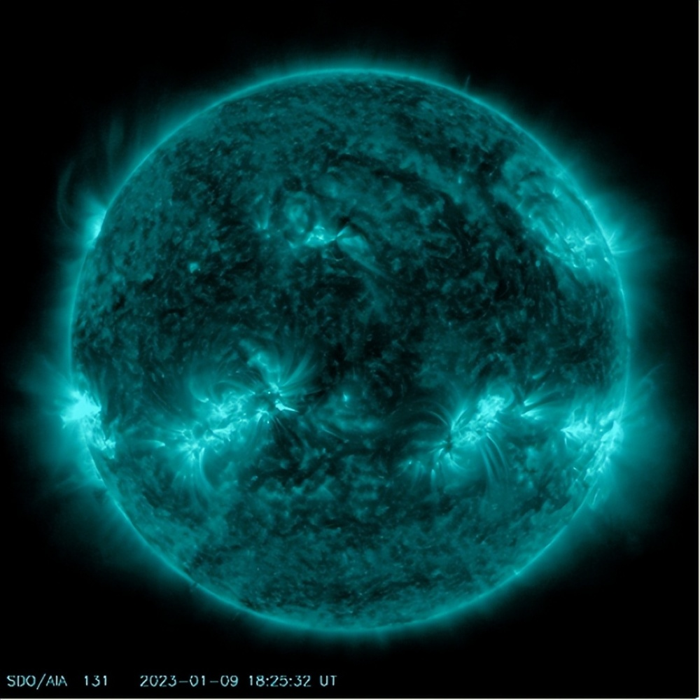
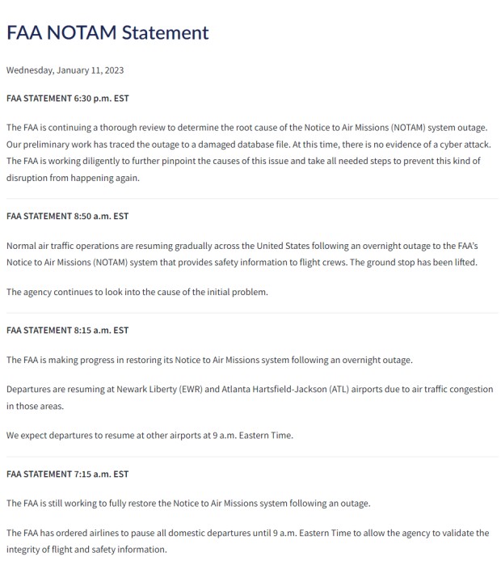
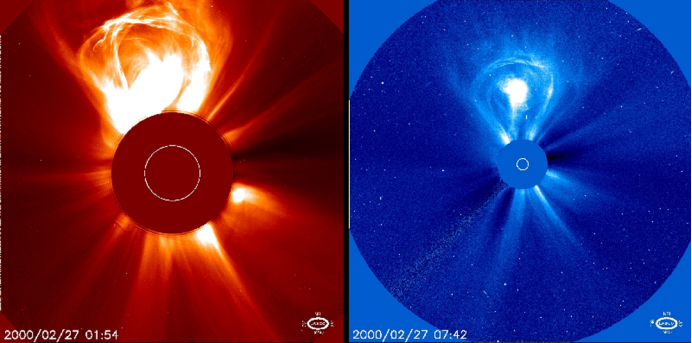
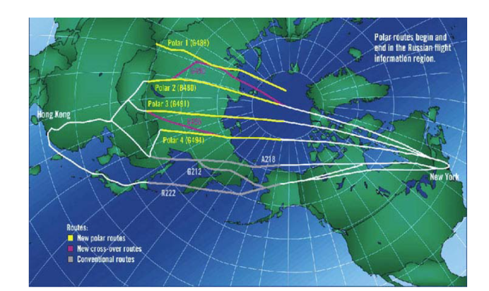
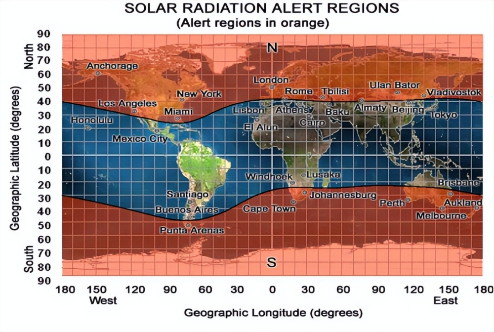

# 全美航班停飞，罪魁祸首真的是“史诗级”的太阳耀斑吗？

2023年已经到来，大家逐渐恢复了生龙活虎的状态，而太阳似乎也耐不住寂寞，前来凑热闹：北京时间1月6日、1月9日和1月10日，太阳上相继爆发生了三次较强的耀斑。其后，在美国东部时间1月11日，美国的民航运输发生大瘫痪，全美航班悉数停飞。

有一些媒体在报道时，将这段时间的太阳活动和美国航班停飞联系在了一起，称是这些“史诗级”的太阳耀斑引发的地磁暴，导致了全美航班的停运事故。

_1月9日X1.9级耀斑的极紫外观测图像，左侧的闪光即为耀斑爆发（图片来源：NASA）_

但是，事实真的是这样吗？

简单直接的回答是：近期爆发的耀斑并非美国航班停飞的罪魁祸首，这几次耀斑也远谈不上“史诗级”，但包括耀斑在内的太阳爆发，的确能够导致特定航线的民航飞行受到影响。

美国航班停飞的原因是什么呢？

根据美国联邦航空局（FAA）网站上就本次停飞事件发布的消息，造成全美航班集体趴窝的原因是发布航行通告的NOTAM（NOtice To Air
Missions)系统瘫痪了。在航班飞行前和飞行过程中，飞行员和与航班运行相关的各个部门都要通过该系统，获取事关飞行安全及效率的关键信息。根据目前FAA初步的调查结论，NOTAM系统的瘫痪原因来自于自身的bug，与太阳耀斑没有关联。

_FAA针对航班停飞发布的声明，声明指出NOTAM系统的瘫痪可能由于自身数据库文件的问题（图片来源：FAA）_

真的是“史诗级”的太阳耀斑吗？

要弄清近期爆发的这三个耀斑是否是“史诗”级，要从耀斑的级别来看。耀斑是太阳上一种辐射突然增强的局部爆发现象。耀斑级别的划分，则是根据耀斑爆发释放的软X射线强度（严格的说是“通量”，这里不展开解释这个名词）的最大值来确定。

首先，我们将耀斑由弱到强分配到A、B、C、M、X
等几个等级范围，再根据某次耀斑事件的具体强度来确定字母后的数值。我们可以简单的把字母理解成耀斑的“年级”，把字母后的数字理解为耀斑在年级中的“分数”。

2023年1月份已经爆发的这三次耀斑，分别为X1.2、X1.9和X1.0级，确实属于耀斑家族中最强的X级，但距离“史诗”这个级别则仍有很大差距。

历史上记录到的最强耀斑是2003年11月4日爆发的X28级耀斑。而X28的定级并非来自准确的测量，因为耀斑强度已经超过了当时卫星上测量设备的量程，实际的级别可能比X28更高。

而史上15个最强耀斑的“分数线”，也在X9.0级，远高于2023年1月这几个耀斑的强度。因此，打个比方来说，2023年1月的几个X级耀斑就像人群中身高在一米八左右的人一样，虽然称得上是高个子，但还没有到姚明的程度，并不能称为“史诗”。

从实际影响地球的情况看，这几个耀斑对地球的影响主要集中在电离层变化导致的短波通信异常上。美国空间天气预报中心在X1.9级耀斑爆发后，发布了地球附近高频无线电通信质量的R3级预警。该机构对无线电通信的预警分为5级，R3级处于中档水平，而这一等级的预警在为期11年的太阳活动周中平均会发出175次。不过，地球附近的高能粒子环境没有很大的变化，2023年1月上半月也仅有一次较弱的地磁暴。总而言之，这几次耀斑对地球附近空间环境的影响相对有限。

同时，耀斑本身不能直接诱发地磁暴。虽然耀斑和另一种太阳爆发现象——日冕物质抛射（CME）经常结对出现，但就如同雷电不能湿润大地，泽被万物的是从天而降的雨滴一样，引发强地磁暴的一般是日冕物质抛射，而不是耀斑。

_日冕物质抛射在日冕仪中的图像。日冕物质抛射和太阳耀斑经常伴随出现，爆发过程也可能存在关联，但并非同一种现象。（图片来源：NASA）_

太阳耀斑对民航有什么影响呢？

那么，排除这次耀斑事件与航班停飞的直接关联后，民航界是否就可以对太阳耀斑的影响高枕无忧了呢？答案也是否定的。

从北美向东亚飞行时，综合球面上的最短路径和大气环流方向等因素，相比于横跨太平洋，使用北极上空的航线则更为经济高效。航空公司可以由此节省燃油成本，为机组和旅客节约飞行时间。

以波士顿飞往香港的航线为例，使用极区航线每次可以节省138分钟的飞行时间和33000美元的飞行成本。
然而，在2003年10月底到11月初的一段时间内，包括史上最强的X28级耀斑在内的一系列强烈的太阳爆发，使得北极部分航路无法使用，FAA要求航空公司选择较低纬度的航路继续执行航班，造成了燃油消耗和飞行时间的增加。

_2003年10月至11月的极区航路情况。由于HF无线电通信可靠性的下降，原来经由Polar3航路的飞行的航班被要就改用Polar4乃至更低纬度的航路。（图片来源：NOAA）_

航路中断的罪魁祸首是极区高频（HF）无线电通信的中断。由于北极地区陆地稀少、荒无人烟，无法沿航路布置空中交通管制常用的甚高频（VHF）无线电收发台，只能依赖传播距离较长的HF波段。在地球大气层的顶部，有一层被称作“电离层”的圈层。HF无线电通信质量的好坏直接受电离层控制。在耀斑使电离层发生剧变时，原本可以远距离传输的HF波段不再可用，空中交通管制人员无法有效指挥极区的空中交通，因而部分极区航线不得不停用。在纬度较低的地区，虽然跨洋飞行时的HF无线电传输也受到了影响，但尚能够依赖静止轨道的通信卫星维持一部分通信，而北极则是静止轨道通信卫星的盲区。

_2003年10月至11月的辐射告警区域，该区域标记为红色。民航管理部门建议该区域的航班降低巡航飞行高度，减少接收到的辐射剂量。（图片来源：NOAA）_

即便北极的HF通信能够勉强恢复，辐射也是极区飞行需要考虑的一个风险。极区是太阳活动辐射效应影响民航飞行最强烈的区域。当然，如果你不是每周几次往返于北美和东亚之间，无需为此担心。在太阳活动相对平静的时段内，跨越极区的单次飞行所受到的辐射剂量在0.1-0.2mSV之间。而有关机构推荐的每年飞行过程中接收到的辐射剂量上限为1mSV。

但是，如果太阳活动异常剧烈，则应该留心此时的辐射情况。1859年曾经爆发过一次真正的“史诗级”太阳耀斑。如果同样的事件发生在现在，单次极区飞行所受到的辐射可高达20mSV。若此时仍在极区飞行，会对乘客和机组人员本人带来健康风险。当然，各国的空间天气监测预报机构也在紧盯“航空辐射”的情况。在2023年10月至11月期间，相关机构就曾发出通告，建议在纬度35度以上飞行的长途航班，将巡航高度由40000英尺降低至36000英尺。这样虽然同样会增加油耗，但却能够更多的利用大气层的辐射屏蔽效应，保护乘客和机组人员的健康。

太阳活动有着11年的周期，随着太阳从2019年底的极小期“沉睡”中逐渐苏醒，并逐步向2024—2025年的极大期迈进，未来几年还会有越来越多的太阳活动，可能对地球上的方方面面产生影响。

在互联网传播发达的今天，有些报道为了提升自身的关注度，对一些新闻事实进行不切实际的夸大和演绎。建议大家还是尽可能的多关注主流媒体和权威渠道发布的信息，比如科普中国账号。

出品：科普中国

作者: 李会超（哈尔滨工业大学（深圳））

监制：中国科普博览

参考内容：

1\. 中科院空间环境预报中心发布的“本周综述”和监测数据，http://www.sepc.ac.cn/。

2\. NOAA，2004，Service Assessment：Intense Space Weather Storms October 19 –
November 07, 2003

3\. NOAA, 2004, Technical Memorandum OAR SEC-88, HALLOWEEN SPACE WEATHER
STORMS OF 2003

