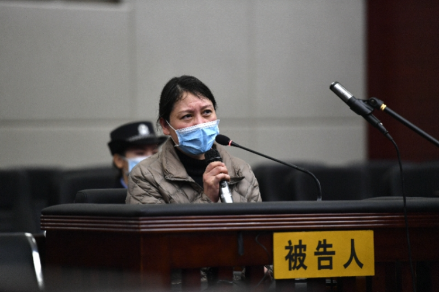

# 劳荣枝案死刑复核进展：家属称其辩护律师已到最高法阅卷

劳荣枝案正在死刑复核阶段。1月18日，南都记者从劳荣枝家属处获悉，劳荣枝的辩护律师日前已到最高人民法院阅卷，由于案卷材料多，多达61盘光碟和20余本卷宗，加上春节假期临近，律师年后将继续阅卷，估计还需要一个月时间。最高法办案人员表示将充分保障律师的全面阅卷和发表辩护意见的权利。劳荣枝家属认为，今年春节前不大可能通过死刑复核程序。刑事律师付建表示，目前我国法律对律师阅卷的期限无明确的规定。律师阅卷后递交书面法律意见，等待最高法合议庭复核。

1月18日，劳荣枝的家属告诉南都记者，1月16日，辩护律师也向最高人民法院提交了一份《专家论证情况的说明》，对合肥案中殷某的死亡时间、殷某写给其妻子纸条上的字迹是否为劳荣枝的字迹进行了专业审查。文检专家出具的意见显示，纸条上的添加笔迹并非劳荣枝所写。

刑事案件进入死刑复核阶段后，有哪些具体流程？

知名刑事律师、河南泽槿律师事务所主任付建告诉南都记者，最高法《关于办理死刑复核案件听取辩护律师意见的办法》规定，辩护律师可以到最高法办公场所查阅、摘抄、复制案卷材料。目前我国法律对律师阅卷的期限无明确的规定，需要根据卷宗数量以及案件的进展情况，由辩护律师和法院沟通。律师阅卷后，可以递交书面的法律意见。

付建表示，接下来，最高人民法院合议庭成员复核过程中，通过阅卷、提讯被告人、庭外调查核实证据等审查和复核，同时听取检察官和辩护律师的意见，最终作出核准或者不核准死刑判决的裁定。核准死刑的案件交付执行，不予核准的案件会发回重审。

南都此前报道，南昌中院一审认定，1996年至1999年，由劳荣枝从事陪侍服务物色作案对象，法子英实施暴力，二人先后在江西南昌、浙江温州、江苏常州、安徽合肥实施犯罪，致7人死亡。后劳荣枝使用化名长期潜逃。法院认定劳荣枝犯故意杀人罪、抢劫罪、绑架罪，数罪并罚，决定执行死刑，剥夺政治权利终身，没收个人全部财产。劳荣枝一审后当庭提出上诉。2022年11月30日，江西高院二审裁定维持原判。判决后，劳荣枝提出申诉，该案正处于死刑复核阶段。

采写：南都记者 黄驰波

