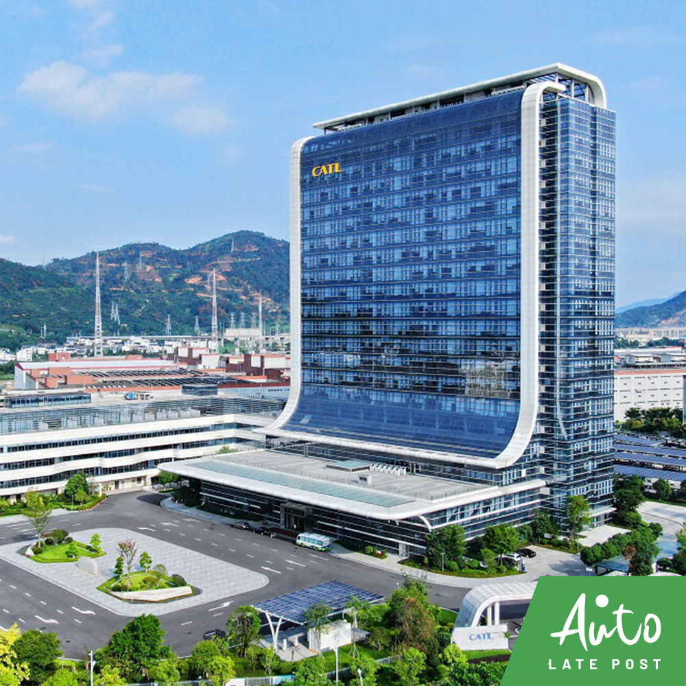

# 宁德时代调整生产组织架构，决策权向总部集中

一个更灵活、更全球化的生产体系，应对更多元、分散的客户组合。

**文丨李梓楠**

**编辑丨程曼祺**

动力电池行业是大规模、高技术制造业，制造能力和扩产效率是动力电池公司的核心竞争力。不断提升制造能力要依靠精细、高效的生产管理体系。

《晚点 Auto》独家获悉，围绕制造体系，宁德时代上周宣布了一项组织架构调整，在各生产基地之上新设一层大区结构。

宁德时代目前有 32 个电池和材料生产基地，现在它们被分为 6 个大区。大区划定依据不是地理距离，有可能是客户或产品线。据《晚点
Auto》了解，位于宁德时代总部、相隔仅一条河的湖东和湖西基地分别被划分到大区 1 和大区 2，德国图灵根基地和宁德时代总部 Z 基地则被划到大区 4。

汇报关系相应变化。调整前，宁德时代基地最高管理人为基地运行总监，他们向宁德时代供应链与运营体系联席总裁冯春艳汇报，冯春艳向宁德时代董事长兼总经理曾毓群汇报。调整后，各运行总监向
6 个大区经理汇报，大区经理向冯春艳汇报。

1975 年出生的冯春艳与曾毓群共事多年。曾毓群 1989 年毕业后加入广东东莞新科磁电厂工作，后于 1999 年参与创立主营消费电子锂电池的
ATL（东莞新能源），2011 年创立宁德时代。冯春艳也曾在新科磁电厂工作，后加入 ATL
和宁德时代，历任宁德时代高级经理、公司监事及供应链与运营体系联席总裁。一位宁德时代投资人评价，冯春艳是曾毓群最得力的助手之一。

宁德时代在宣布调整的邮件中表示，调整是因为业务体量增加、制造基地数量增加，新结构更有利于敏捷应对客户变化、拉通资源和有序扩张。

增加管理者和管理层级是企业扩张时的普遍选择。据了解，从 2020 年到 2022 年末，宁德时代员工数从 3.3 万人增长至超 10 万人，生产人员从 2
万人增长至超 7 万人，年产能从 69.1 GWh 增长至约 300 GWh。

调整同时意味着，宁德时代生产制造体系的一些决策权会向总部集中，以提升效率。

宁德时代各生产基地的运行总监有较大权限，除负责基地日常生产运营外，大部分生产基地拥有自己的人力部门，运行总监有权任免、提拔基地内的员工。运行总监还可以建立一些面向客户的研发项目。宁德时代总部统管销售、客户分配，技术、产品研发，原料、设备采购和产品交付等。

一位接近宁德时代的人士称，去年宁德时代管理层注意到了部分生产基地有重复建设的现象。一个例子是，两个相距很近的生产基地过去几年分别建立了自己的研发中心，在研发项目、设备采购上有一些重复投资。这位人士称，调整后，宁德时代内的一些资源可以被更好地共用，这能提升扩张、扩产中的效率。

整个智能电动汽车市场正面临更激烈的竞争和更多变数，宁德时代现在需要组织起一个更灵活、更全球化的生产体系，以应对更多元、分散和全球化的客户组合。

据东吴证券研报，2022 年前三季度，宁德时代前 5 大客户为特斯拉、吉利、蔚来、广汽和小鹏，除特斯拉的装机量占比为 18 % 以外，其余大客户占比均小于
10%。

老的大客户中，特斯拉增速放缓，去年共卖出 131 万台车，未达到 150
万台的目标。特斯拉、小鹏、广汽和蔚来都在近两年增加了新的动力电池供应商。广汽和蔚来也已宣将自研、自产电池。宁德时代的另一个客户理想汽车也在与欣旺达合作研发电池，二者可能会达成供货协议。

宁德时代的更多新订单将来自加大投入电动车的各国传统车企，如大众、现代、宝马、本田，和仍在进入市场的新玩家，如小米。他们在宁德时代的装机量占比会提升。宁德时代已获得了小米的订单，本田去年
12 月给了宁德时代 8 年内采购 123 GWh 的大合同。

更激烈的竞争对动力电池制造的考验还在于车企销量有不确定性，对电池的需求也跟着
“说不准”。部分车企与宁德时代的订单为一年一签，每年定一个装机量区间，但预测值会与实际情况有出入。宁德时代需要更灵活地调整生产计划，以应对需求变动。

宁德时代需要面临的整体市场变化还包括，2023 年，中国电动车销量增速大概率会放缓，而现在中国占全球电动车销量的近 6
成。过去一年，中国电动车新车渗透率已达 27%，电动车进入大众市场，它将更多受到宏观经济、整体消费意愿的影响。同时中国政府从 2023
年起停止了新能源补贴，新售出的电动车不再享受约 1 万元的补贴。

现在销量最大、增长势头最强劲的比亚迪自己生产电池，不用宁德时代供货。比亚迪 2022 年卖出近 186 万台电动车，在中国市占率为 29%。

2022 年，宁德时代的全球装机量占比从前一年的 33% 上升到 37%，在竞争最激烈的中国市场，占比则从前一年的 52% 下降至 48%。

