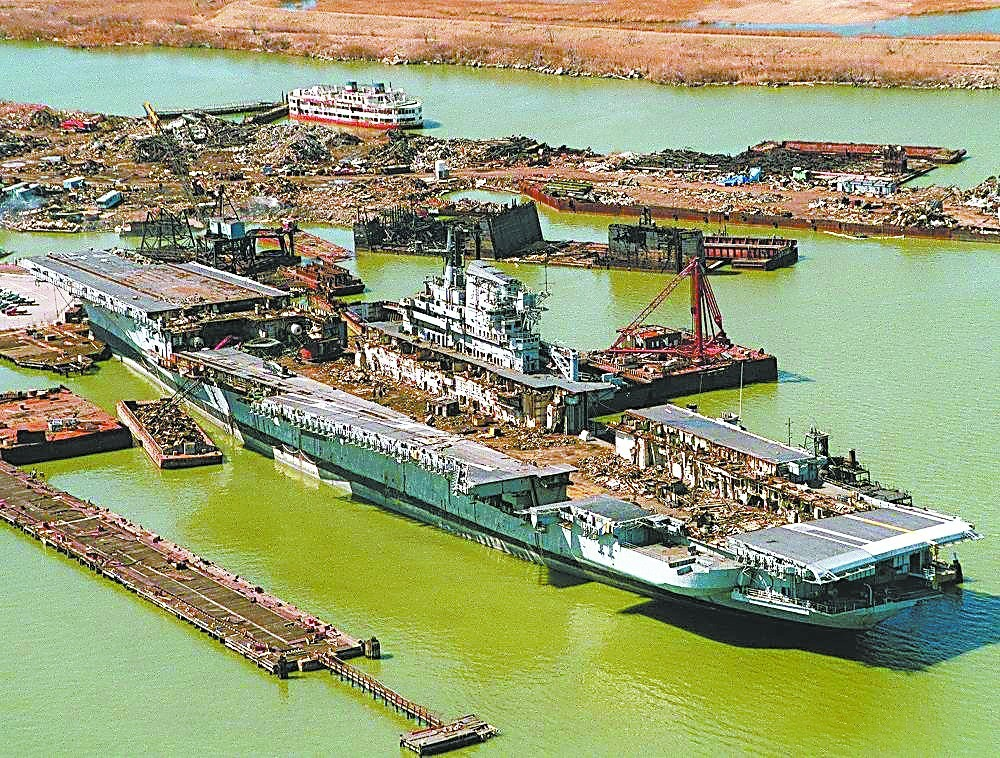

# 巴西退役航母已海上漂泊数月，曾有退役航母拆解8个月实现无害化处理

【环球时报特约记者 晨阳 环球时报记者
马俊】近日有关巴西退役航母“圣保罗”号“无家可归”、在海上已漂泊数月的消息引起诸多关注。服役期间霸气十足的航母，退役后却落得如此下场，不免引起外界的好奇：航母退役后的处理为何成为“老大难”问题？

**为何退役航母“出路难寻”**

据西班牙“防务新闻”网站1月14日报道，曾经作为巴西海军旗舰的“圣保罗”号航母，退役后于2021年以200万美元的价格出售给土耳其造船商瑟克海事贸易公司。该公司原计划将这艘巴西航母从里约热内卢送往土耳其进行拆解，但因为该舰含有大量石棉等破坏环境的材料，因此被禁止穿越直布罗陀海峡以及进入土耳其领海。瑟克海事贸易公司被迫将该舰归还巴西，但巴西港口也拒绝接收。几个月来，这艘退役航母一直在巴西伯南布哥州的海岸附近徘徊，有可能最终被遗弃。

据美国“商业内幕”网站介绍，各国航母退役后的处理的确是“老大难”问题。通常而言，由于航母造价昂贵、建造费时，包括美国在内，大部分国家的航母退役后首先考虑封存以备不时之需。但在封存期间，仍需要花费相当多的经费对航母进行必要维护，同时它还会占据宝贵的码头资源，因此受财力制约，部分国家的航母退役后会尽快转手出售。例如“圣保罗”号航母其实就是巴西于2000年从法国购买的“福煦”号航母，印度海军第一艘“维克兰特”号航母也是于1957年从英国购买的二手老式航母。

但无论是封存还是出售给其他国家，随着时间推移，这些航母最终都将彻底退役。除了少部分“幸运儿”能以纪念舰的身份保留下来，其余大部分都将被送到拆船厂等待拆解。据介绍，单从航母构成材料而言，其价值相当高，船体由数万吨高性能钢材组成，从内部设备中还可以回收大量稀有金属。例如英国“卓越”号轻型航母标准排水量为1.6万吨，它以210万英镑的价格售出，并于2017年被送到土耳其拆船厂，最终从中回收了11854吨黑色金属、611吨有色金属和112吨电缆，回收率超过94%，拆船厂获益超过1000万英镑。

此前财大气粗的美国海军也曾将退役航母当成靶舰用于各种武器测试，但随着近年来国际社会环保意识的增强，此类做法几乎绝迹了——关键因素就在于这些海上庞然大物含有诸多对环境有害的物质，如果未经处理就沉入大海，可能造成严重的环境污染。美国“奥里斯坎尼”号航母2006年被作为人工礁石沉没，但在将其沉入海中之前，拆解团队不间断工作了8个月，才对其实现了环境无害化处理。

据介绍，早期航母为了强化战时生存力，大量采用石棉作为阻燃材料，但后续研究证明，石棉会逐渐分解为极微小的微粒，如果长期吸入可能引起石棉肺和癌症等恶性疾病。法国“克莱蒙梭”号航母1997年退役后，就因为舰体包含500-1000吨对人体有害且可致癌的石棉材料，被舆论称为“毒航母”，在国际上闹得沸沸扬扬，在海上漂泊了几年都无处接收，最终是对环保要求较低的印度承接了拆船业务，但埃及政府在舆论压力下，仍一度拒绝该航母通过苏伊士运河前往印度。这次在海上漂泊没着落的“圣保罗”号航母，其实就是“克莱蒙梭”号的姊妹舰，因此它落得同样下场也就不足为奇了。

除了致癌的石棉材料外，在拆解航母过程还会出现废油、铅、汞、多氯联苯等有毒物质污染，对周边环境和操作人员的威胁相当大，要对其进行无害化处理需要付出高昂的成本。这也是美国海军以1美分的象征性价格将“小鹰”号和“肯尼迪”号两艘退役航母出售给拆船公司的重要原因。

**拆解航母有讲究**

据介绍，要拆解排水量动辄数万吨的航母，是一个相当庞大的工程。首先，需要将航母上还可以利用的部件拆除下来。美国《星条旗报》2019年就披露，美国第一艘核动力航母“企业”号退役后，就拆下了蒸汽弹射装置、电子设备、发动机风扇等数百个零部件用于其他舰船，“虽然这艘航母是1961年服役的，但它经历了多次现代化改造，很多零部件还有很长的使用寿命”。例如该舰重达32吨的右舷锚已经被翻新，安装在“华盛顿”号航母上。

拆除掉全部可回收零件的旧航母，下一步就将被“大卸八块”。相比于常规军舰，航母的结构繁复，舰体材料强度大，内部管线布局复杂，因此拆解难度更高。目前各国采用的拆解方法有多种。最理想的是在干船坞中，以建造时的相反顺序进行拆解工程。船体要按照合同约定的标准尺寸进行切割，施工过程要运用辅助设施来保证船体稳定，防止发生构件坠落或者结构坍塌等意外事故。在此期间，必须妥善处理包括石棉、油漆、溶剂、机油和燃油残渣等在内的大量有毒有害易燃物品，需要良好的通风措施。

但这种方法的问题在于干船坞数量有限，租金又贵，何况造船厂也需要干船坞新建和维修船只，因此退而求其次的方法是船池拆解法。这是指在避风的水道沿岸挖出一条类似池塘的细长浅沟，拖船将待拆解的航母拖入船池。这种方法比干船坞或码头拆解便宜，污染可控，没有沉船的风险，而且可以从船体的三个方向施工。但拆解需要按照步骤进行，并顾及舰体结构强度和平衡，否则容易出现意外。

相比之下，印度拆船业备受诟病的原因就是采用成本最低的冲滩法，即让航母在涨潮时冲滩搁浅，退潮时从前往后大块切割。当船体前部拆解完成后，以拖船顶推，直到船尾上岸。按照这种方法，作业过程中会产生大量污染物，船上所有液体和残片都会直接进入海洋。讽刺的是，由于成本低廉，不少西方退役航母都是在印度进行拆解。

**退役核航母面临特殊挑战**

相比之前退役的各国常规动力航母，美国冷战时间建造的核动力航母相继进入退役阶段，对美国海军构成严峻挑战。以“企业”号为例，该航母2017年退役后，由于拆解方案未定，一直停放在造船厂码头，直接影响美国海军现役舰艇的维护工作。《星条旗报》称，美国海军提出的相关拆解作业规划长达428页，首先需要对该航母8座核反应堆进行清除和拆卸，其中移除反应堆的冷却水就长达几个月。目前该航母使用的核燃料棒已被取出封存，但核反应堆可能残存低放射性辐射，必须拆解并由数百个小型容器隔绝包装，再运送到美国法律允许的3个处置场安放。预计整个拆解过程可能要花费10年以上。

美国海军在相关报告中也注意到核动力航母的处理难题。各国目前都采用“全寿命期费用”来评估舰艇的成本，包括规划、设计、制造、安装、调试、使用、维护维修、现代化改装乃至最后的报废处置等整个寿命过程所支出的总费用。在“全寿命期费用”中，造价仅是其中一小部分，报废费用所占比重不容忽视。美国政府问责办公室的报告显示，“企业”号的拆解过程费时费力，成本可能高达15亿美元，相当于一艘中型常规航母的建造费用。更糟糕的是，由于拆解过程耗时过长，将影响到美国海军造船厂对现役舰艇的维护工作。如果美海军决定让民营企业拆解这艘航母，估计成本会略低，但由于核动力航母涉及诸多军事机密，美海军又担心核心技术可能会外泄。更糟糕的是，随着“尼米兹”级核动力航母也将在未来数年内相继退役，这些核航母的处理问题将更加麻烦。

也正因为核航母的拆解工作难度大、费用高，它还成为五角大楼内部反对建造核航母的重要理由之一。

