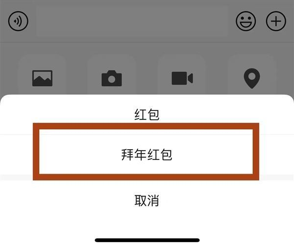
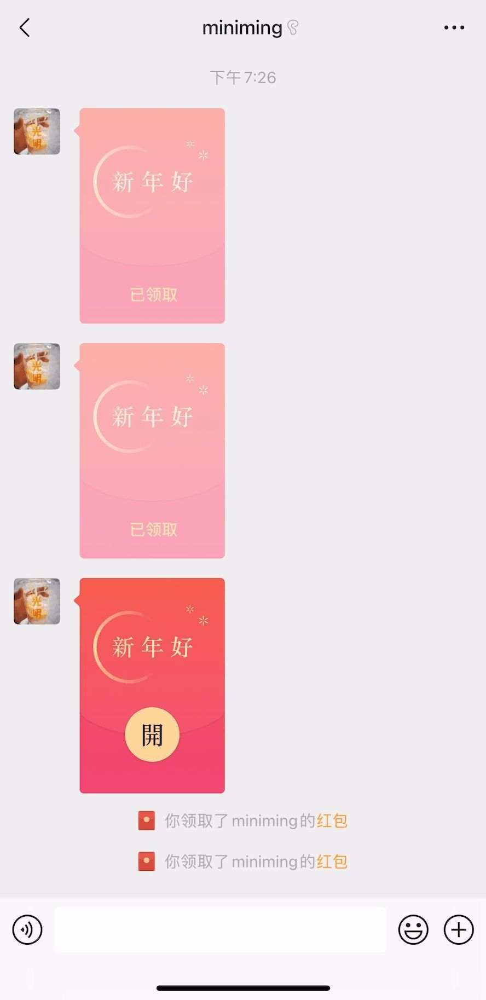
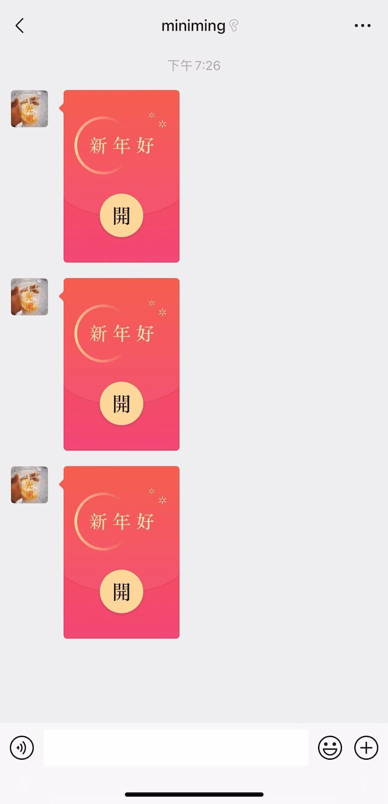

# 微信拜年红包上线：支持语音祝福 还能添加“兔飞猛进”新状态

2023年春节假期即将到来，新一轮抢红包大战又要上演了。

为了让发红包更有趣味，日前，微信上线全新“拜年红包”， **大家在发红包的同时，还可选择录制语音为好友送上祝福。**

另外， **拜年红包会随机选择一些吉利数字，比如：1.66、2.88、6.66、8.88、9.99等，** 每个数字配套带有不同的祝福语和不同的动态效果。

其中，1.66元红包对应的祝福语为“祝你身体健康”，动态效果是长辈们喜欢的荷花；2.88元红包为“祝你好事发生”，动态效果是柿子和花生；
**8.88元红包为“祝你财源滚滚”，该动画效果是一只小兔子在用脚滚元宝，十分萌趣；9.99元红包“祝你福气满满”，动画是小兔子将“福”字的气打满。**

据了解，当好友领取了拜年红包，还可以将红包的祝福语设置为微信状态。设置为微信状态后，在对话页面会显示一只“兔飞猛进”的金兔，还有“迎新春”的文字状态。

除了单聊对话框里可以发拜年红包，春节期间， **群聊里也可以发直播红包了，** 一键开启“直播拜年+发红包”。

想给好友发送全新拜年红包的话，仅需将微信升级至最新版本即可。

