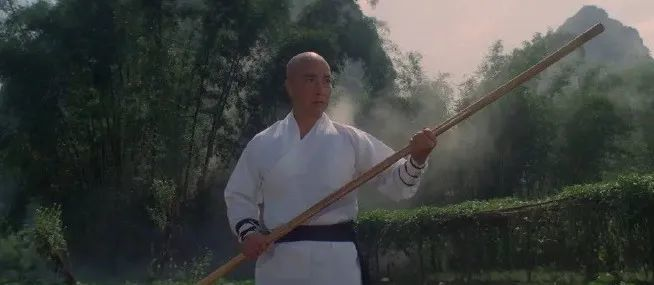
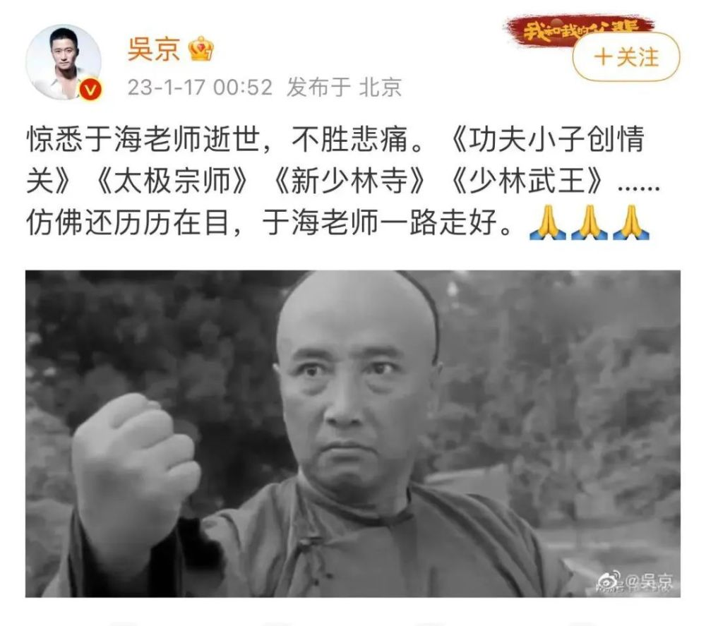
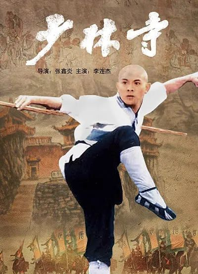
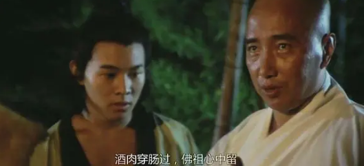
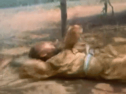
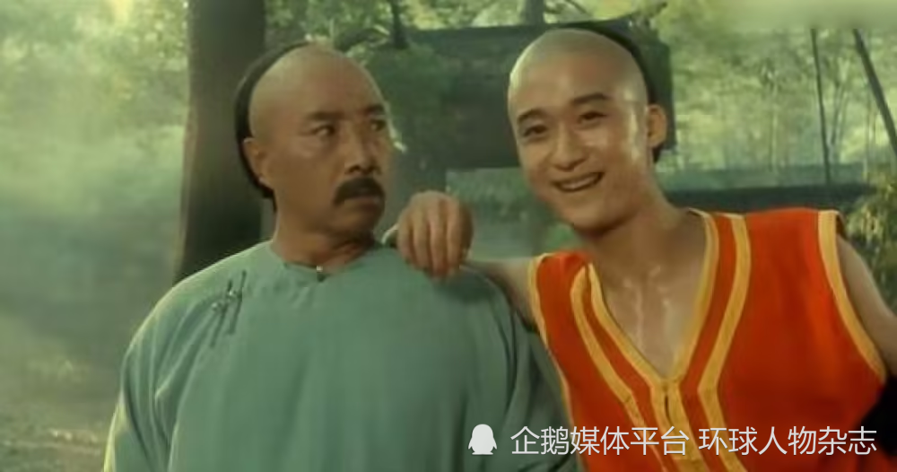
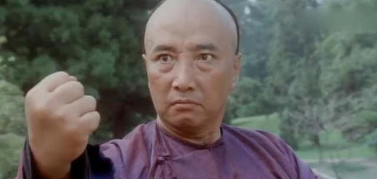
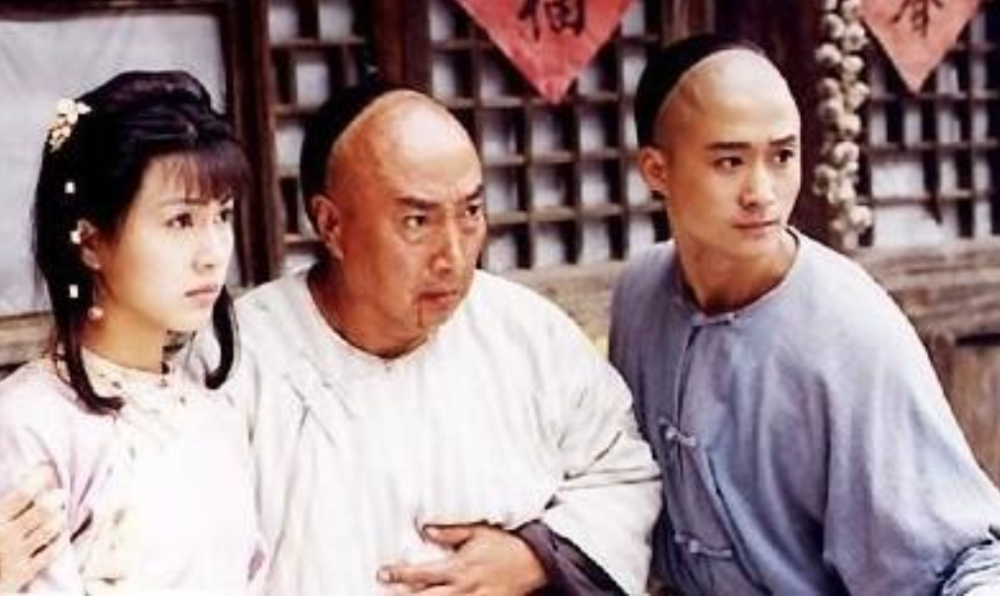
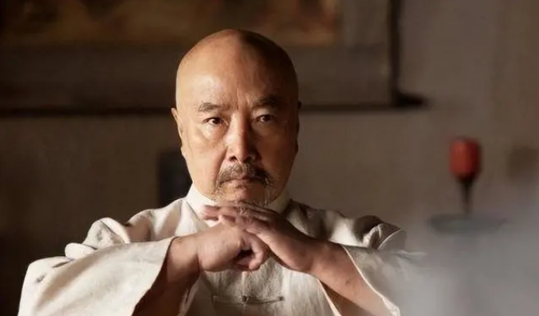

# 曾随周总理出访的一代宗师，走了

**他是真正的武术大师。**

作者：付玉梅

于海的名字不算家喻户晓，但一提到他留下的电影，提到他片中的弟子，人们脑海中就会闪现出一个身怀武林绝技的宗师形象。

武打明星出身的李连杰、吴京都是他的“好徒儿”，与他合作了《少林寺》《功夫小子闯情关》《太极宗师》《少林武王》等一系列经典武侠剧作。

荧幕之外，他更是一位具有深厚武术功底的功夫大家，有着“螳螂拳王”之称。

无论是在影史还是武林，他都创造了一个时代。如今的他，辞别江湖。

据电影人余咏透露，国内著名武术家、演员于海逝世，享年81岁。

_吴京深夜发文悼念_

《少林寺》一炮而红

进入影视圈，于海算是“大器晚成”。

“少林，少林，有多少英雄豪杰都来把你敬仰。”

1982年，电影《少林寺》轰动大江南北，少年李连杰一炮而红，成为红遍全世界的“功夫小子”。

_《少林寺》海报。_

片中李连杰师父、昙宗和尚的扮演者就是于海。彼时他40岁了，这是他参演的第一部电影作品。

片中，李连杰饰演的小和尚觉远刻苦用功，练就高强武艺，惩恶扬善。而于海饰演的昙宗大师，身上不仅有作为师父的严厉，更有父亲一般的慈爱。他一生侠肝义胆，菩萨心肠，却不幸中箭身亡，只留下“匡扶正义”几字。

_于海（右）和李连杰。_

“要练武，不怕苦”“酒肉穿肠过、佛祖心中留”……时至今日，昙宗大师眉头微皱、眼神慈爱向小和尚训话的样子还在许多观众的脑海中挥之不去。

于海与李连杰就此结下“师徒情谊”。在剧组拍摄间隙，他还教李连杰练陈氏太极拳和螳螂拳。

说到李连杰，于海总是叫他“小杰”。于海说，自己当武术教练比较早，和“小杰”的启蒙师父吴彬是同一辈的，“我算是他的客师”。

鲜有人知，于海还是这部电影的动作武术指导。他也亲自上阵，展露了高超武艺。

在拍摄过程中，他遇过极为惊险的时刻。

《少林寺》拍摄的时间非常紧张，片中的马戏很多，于海只用了两个上午的时间练习骑术，便投入拍摄。

片中有一组他在一条小路上骑马疾驰的镜头。他的马速很快，拐弯时，没想到一棵杨树挡在前面，他想收疆已赶不及，身子平飞了出去……

所幸，他本能地用两条胳膊护住头部，而用以当做护具的手臂却没能幸免：手腕、肘部脱臼，左手撞断。

事隔多年，于海向媒体提起此次险情还是感到后怕。到底是习武之人，他庆幸自己反应还算敏捷，否则他撞坏的不是两条手臂，而是脑袋。

敬业卖力的表演，拳拳到肉的真功夫，匡扶正义的少林武僧，都深得观众喜爱。在那个票价只有1毛钱的年代，《少林寺》创下1.6亿元的票房神话。

“师父专业户”

《少林寺》之后，于海就成为武打电影中的“师父专业户”。

1984年，《少林寺》导演又召集了大量原班人马，推出《少林小子》。拍摄期间，于海的伤还没完全好，但时间不允许他养伤。

《少林小子》在杭州黄龙洞拍外景时，不巧赶上酷暑季。躲在阴凉地里围观的观众，每天都有好几个中暑晕倒的。

如此酷热的天气，不动都躁得慌，还要拍打戏，难度可想而知。于海在与“群匪”打斗时，不慎右腿筋断骨折，被送到医院手术。之后，他打着石膏回到外景地，不到两个星期，又拖着伤腿继续拍戏。

于海曾两次在银幕上表演螳螂拳。《少林寺》中，他和于承惠饰演的王仁则交手时，曾经有过惊鸿一瞥的短镜头。

而在后来的《南北少林》中，他终于能相对完整地展示自己的七星螳螂拳。被反派用剑击落长棍后，只见于海饰演的南少林高僧释忍气定神闲，双手勾起，作螳螂状。

如同这段评价：“他跃然奋臂、前手引后、后法催前、勾挂锯错、势势衔接、招招相连、上下交替、快而不乱、刚柔相济、身法密连，打得气势宏烈、矫捷迅猛，既有骇人心魄的雄威，又有滔滔不绝的酣畅，令人赏心悦目，由衷赞叹。”

在与李连杰合作多部影片后，于海遇到了自己的另一个“荧幕御用徒儿”——吴京。

_于海（左）和吴京。_

1995年的电影《功夫小子闯情关》是吴京的出道作品。那时，于海在片中扮演的是对吴京多加管教的严父。

当时，无论是在演戏还是武术上，于海都对初出茅庐的吴京多加关照。

随后，在1997年的《太极宗师》、1999年的《新少林寺》、2002年的《少林武王》中，于海饰演的人物都是吴京的师父。

《太极宗师》中，于海饰演的太极高手陈正英至今仍是难以逾越的经典。

片中，他破例将吴京饰演的杨昱乾收为弟子，并传授毕生所学。日后，杨昱乾谨记师恩，将“陈氏太极”倾囊而授给有心之人，也将其发扬光大。

于海和吴京将习武之人的浩然正气、重情重义演绎得有血有肉。在于海逝世消息传出后，有网友留言：“他们是最好的陈正英和杨昱乾”。

_于海（中）。_

直至《太极侠》2013年上映时，于海已经年过七旬了。他再度演绎一代太极宗师，勾起了不少人的回忆杀。

这样的年龄参演动作电影有着不小的挑战，但对他来说，心中那份功夫情怀难舍难断。

接受媒体采访时，于海称自己虽然已年过七旬，但身体一直比较硬朗，每天都会坚持练功。

他还调侃似地说：“我也就能演个师父、和尚、方丈之类的角色了，毕竟年纪到这儿了嘛。”

他将情怀倾入一部部经典的影视剧作中，直至去年仍有新作问世。

真正的武术大师

于海一直表示，拍戏只是他的业余爱好，自己其实是一个武术老师，体育工作者。

他的习武生涯是从“拜师”开始的。

1942年，于海出生于山东省烟台市。小时候，他体弱多病，父亲便打算送他去习武增强体魄。父亲找到自己的好友，七星螳螂拳掌门林景山，想将12岁的于海托付于他。

林景山一生主攻螳螂拳，对梅花枪、六合棍、剑术等传统武术也有钻研，是当地赫赫有名的武学大师。

众多武侠剧中有这样一句经典台词：“我看你骨骼清奇，是块练武的好料子……”而林景山更看重的是对方的习武之心。

当看到于海时，林景山一下被这个目光坚韧的小伙子打动了，决定收为弟子。

于海没让师父失望，天资聪慧且刻苦努力。日后，他成为了门派的第六代传人。

为锻炼螳螂拳必需的指力，他每日单手提着沉重的陶罐上下运动，还主动往陶罐里加沙，增加难度。

学拳法光靠勤快还不够，还得靠悟。

螳螂勾手和耍拳的身姿并非轻易习得。他为了掌握诀窍，经常跑去后山观察螳螂，盯着它们的一举一动。据说最夸张时，他捉回百余只螳螂，让自己和这些小家伙们共处一屋。

在和螳螂的你来我往之中，螳螂的每一个姿势，怎么进攻，怎么防守，头往哪边转，身体往哪边动，都印在了于海的脑子里。

于海后来在接受采访时还说，师父不收他学费，“学也不行，不学也不行，就这样练上了武术”。

跟着师父，于海又学了长拳、器械等。16岁那年，他参加全国、省、市三级武术比赛时连闯三关，以优异的成绩被山东省体育运动技术学院招收，成为国家正式的武术运动员。

从此，他更加离不开武术。

他多次在全国比赛中荣获剑术、棍术、螳螂拳及全能冠军，成为中国著名的武术运动员之一。

在那个中国功夫风靡全球的时代，他还多次带队出访过美国、法国、土耳其等30多个国家。

1960年底，他随同周恩来总理、陈毅外长访问了缅甸。

1966年至1986年，他被任命为山东省武术队队长兼总教练，带领山东省武术队一直闯在全国先进行列。

即便是后来涉足影视圈，于海也没有懈怠传承工作。他把担子交到了儿子于涛手上。

于涛9岁就开始随父亲习武，多次在全国重大武术比赛中夺冠。2001年，于涛陪同父亲在山东威海成立了一所武术文化交流中心，这是中国唯一的“于海螳螂拳培训基地”。

_晚年的于海依然不时秀出螳螂拳。_

于海曾说：“在教学生基本技术动作的同时，要把怎么做人等内容也教给学生，这是最重要的。”

于海重德，不论是武德、师德，还是艺德。

他说，这张脸能给他带来一些方便，但也给他带去了不少麻烦。在公众场合被认出时，即便当时再累，心里再有想法，他也会一一满足影迷合影签名的要求。

他说：“我永远记得，‘没有影迷就没影星’‘盛名之下，其实难副’这两句话。”

“英雄谁属非我莫属，热血尽化尘与土……”《太极宗师》主题曲响起。

那位屹立江湖，一身正气的宗师于海，永远留在我们心里。

部分资料来源：中国宁波网、烟台大众网、中国新闻社、新京报等。

总监制： 吕 鸿

监 制： 张建魁

主 编： 许陈静

编 审： 苏 睿

