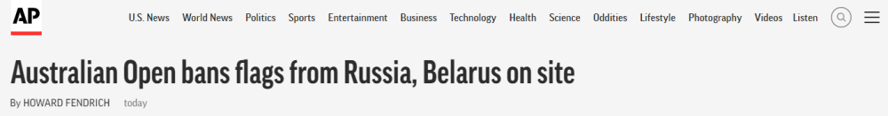
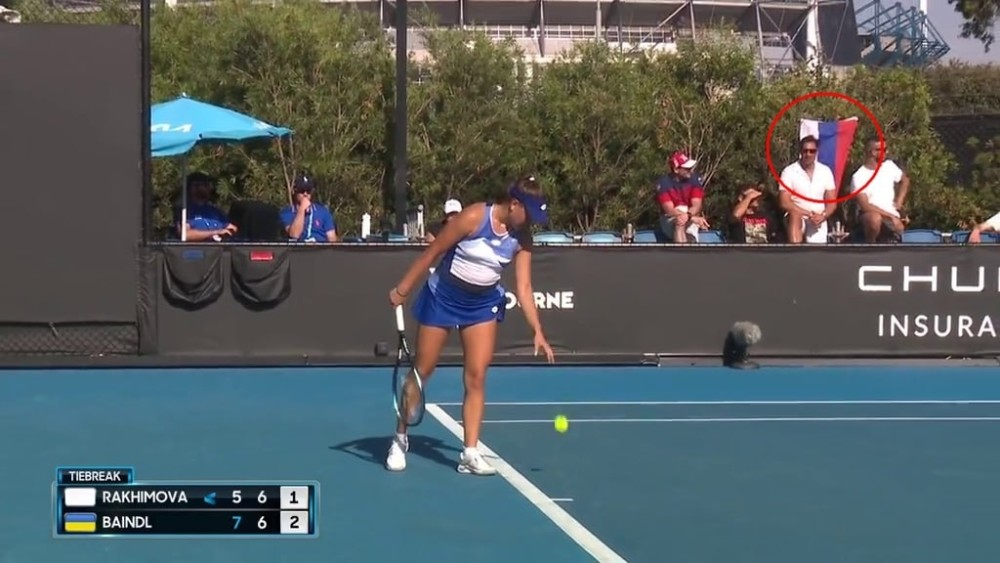
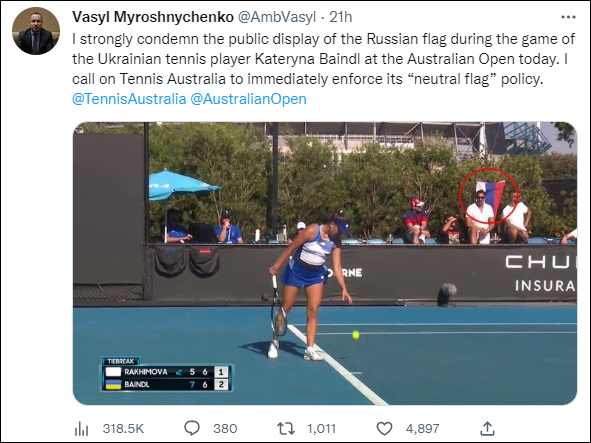
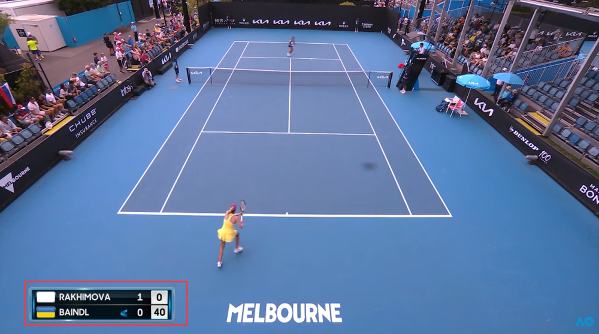
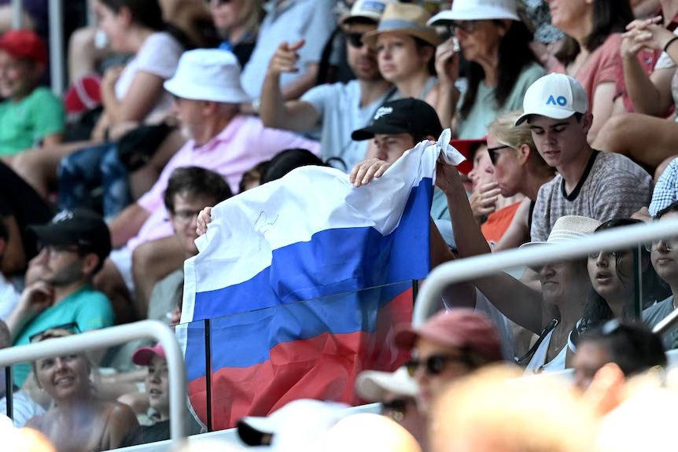

# 澳网公开赛现俄罗斯国旗，乌克兰大使不满，澳网急回应

（观察者网讯）据美国体育媒体ESPN、美联社等外媒1月17日报道，在澳大利亚网球公开赛首日，一面白、蓝、红三色的俄罗斯国旗出现在比赛场边，引得现场的乌克兰球员球迷当场报警，乌克兰驻澳大利亚和新西兰大使随后也愤怒发推批评这一行为，并呼吁澳大利亚网球协会做出行动。对此，澳大利亚网球协会17日回应称，澳网现场禁止出现俄罗斯和白俄罗斯国旗，禁令立即生效。

_美联社报道截图_

当地时间1月16日，2023年澳大利亚网球公开赛在墨尔本公园开赛。据报道，在俄罗斯球员卡米拉·拉希莫娃（Kamilla
Rakhimova）和乌克兰球员卡特琳娜·班德尔（Kateryna Baindl）的第一轮比赛期间，场边看台上的俄罗斯国旗在人群中清晰可见。

据彭博社援引澳大利亚《时代报》称，在这面俄罗斯国旗出现后，现场的乌克兰球员球迷随即打电话给保安和警察。

现场的俄罗斯国旗也引起了乌克兰驻澳大利亚和新西兰大使瓦西里·米罗什尼琴科（Vasyl
Myroshnychenko）的愤怒，他于16日发推并@澳大利亚网球协会和澳网的推特账号称，“我强烈谴责今天在澳网公开赛上乌克兰选手凯特琳娜·班德尔的比赛中（有人）公开展示俄罗斯国旗的行为。我呼吁澳大利亚网球协会立即执行‘中立旗帜’的政策。”

由于俄乌冲突，俄罗斯和白俄罗斯的网球运动员虽然获准参加澳网，但他们只能以“中立”运动员身份参赛，因此他们的国籍在任何官方日程或赛事结果上都不被承认，他们国家的国旗也不会出现在电视画面上。在拉希莫娃与班德尔比赛期间，澳网TV的赛况画面就将拉希莫娃国旗部分用白色空白代替。

17日，澳大利亚网球协会对这一澳网首日的意外状况作出回应。该协会在一份声明中说，在赛场场边出现俄罗斯国旗一事促使其改变了比赛政策。

“我们最初的政策是，球迷可以把它们（国旗）带进来，但不能用它们来制造混乱。”澳大利亚网球协会解释道，“但昨天发生了一起事件，（俄罗斯）国旗被放置在赛场边。”受这一事件影响，澳大利亚网球协会决定，“澳大利亚网球公开赛现场禁止出现俄罗斯和白俄罗斯国旗”。该协会还补充称，“禁令立即生效。我们将继续与球员和球迷合作，以确保提供最佳的环境来享受网球。”

就在这一禁令宣布之前，据澳大利亚广播公司（ABC）报道，17日早些时候，在俄罗斯球员安德烈·鲁布廖夫（ Andrey
Rublev）与奥地利球员多米尼克·蒂姆（Dominic Thiem）的比赛中，球迷在看台上高举俄罗斯国旗。

同一天，白俄罗斯球员阿丽娜·萨巴伦卡（Aryna
Sabalenka）在第一轮比赛获胜后被问到新的国旗禁令时表示，她理解澳大利亚网球协会的决定，但更希望政治和体育保持分开。

**本文系观察者网独家稿件，未经授权，不得转载。**

