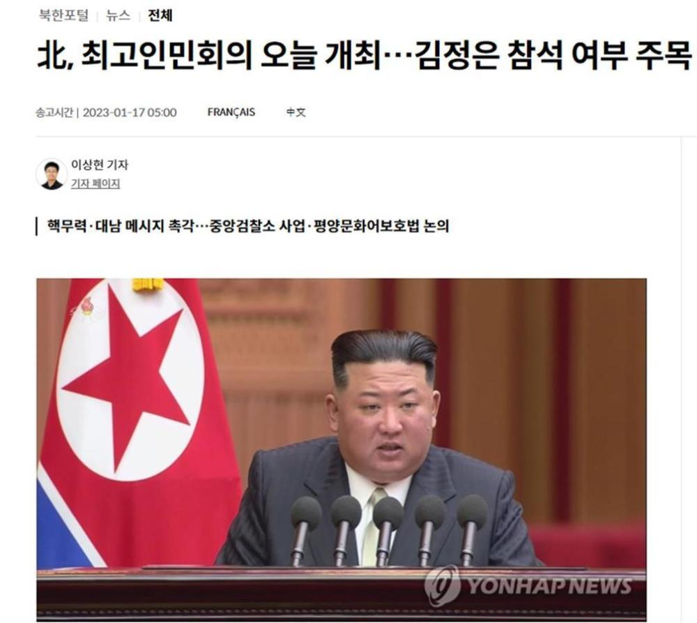

# 金正恩或将出席最高人民会议，加强核武力量，韩国政府正密切关注动向

极目新闻记者 李曼英

据韩联社1月17日报道，朝鲜第14届最高人民会议第8次会议将于17日在平壤召开，韩国政府将密切关注相关动向。尤其关注朝鲜最高领导人金正恩是否出席，对外释放何种信息。

_报道截图（图片来源：韩联社）_

据报道，本次会议将敲定去年12月26日至31日举行的劳动党八届六中全会上的今年各领域项目计划及国家预算案。金正恩从2019年开始频繁出席最高人民会议，发表对外政策，对韩美释放信息。在2019年4月的最高人民会议施政演说中，他表示有意与美国举行第三次朝美首脑会谈；在2021年9月的演说中，他对韩方表示有意修复韩朝通信联络线路；在去年9月的会议上，他阐明将推动核武政策法制化的立场。今年最值得关注的是金正恩是否与会，又会对外释放何种信息。

据分析，若金正恩此次与会，并发表演说，他很有可能提出将加强核武力量，并对韩美释放信息。韩国统一部副发言人李孝贞在记者会上表示，政府正密切关注相关动向。

（来源：极目新闻）

