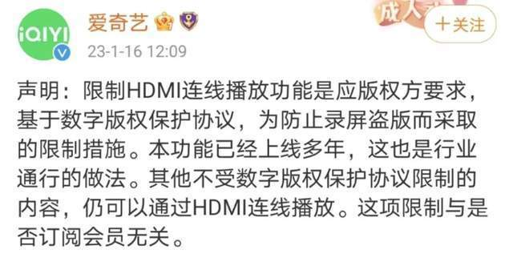
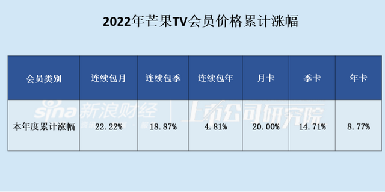
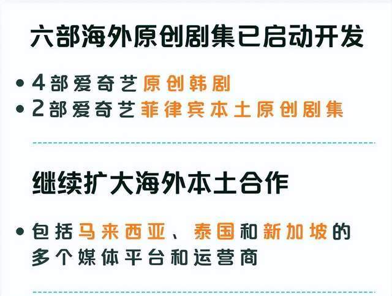
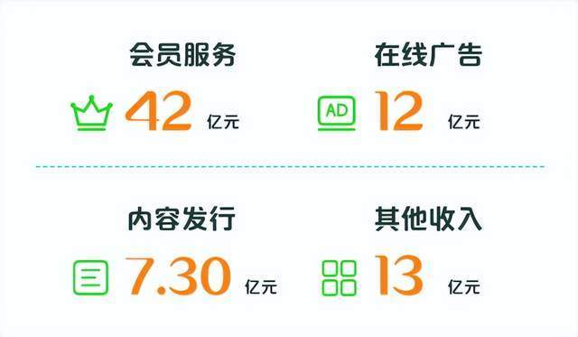

# 限制投屏之后，爱奇艺又禁止HDMI连线播放：即便得罪用户也要减少亏损

爱奇艺被曝禁止连线播放

**站在风口浪尖上的爱奇艺，又把HDMI连线播放禁了。**

近日，爱奇艺被曝禁止HDMI连线播放，在使用HDMI线连接电视时，界面能正常显示，但点击播放却显示“由于版权原因，此内容不支持HDMI连线播放”。

随后，爱奇艺官微发布声明称，限制HDMI连线播放功能是应版权方要求，为防止录屏盗版而采取的限制措施。

同时，爱奇艺表示该功能已经上线多年，与是否订阅会员无关。

但是网友并不买账，不少人认为全行业只有爱奇艺限制HDMI连线投屏，优酷、腾讯、B站、芒果TV都可以，实在是离谱至极。

更离谱的是，前几日，爱奇艺因限制黄金VIP投屏清晰度引起热烈讨论，甚至还遭到了上海消费者保护委员会等官方机构的点名。

面对官方的点名批评，爱奇艺不为所动，并回应称：会员等级不同权益不同，黄金会员可以投屏，但只能享受480P的清晰度，若想获得更高的清晰度，需充值成白金会员。

**目前看来，爱奇艺已经对电视端的播放功能进行了多重限制。**

值得一提的是，近两年来，爱奇艺一直频繁调整会员价格以及相关收费规则。

2020年11月，爱奇艺将月卡价格从19.8元涨至25元；2021年12月，爱奇艺VIP会员再次涨价；去年12月16号，爱奇艺黄金VIP会员连续包月的价格由22元涨至25元，连续包季的费用则由63元提至68元，每季度上涨了5元。

2020年以来，爱奇艺进行了三次提价，在三年时间里，其黄金VIP会员的连续包月涨幅高达67%。

不过，会员费涨价的不只有爱奇艺，其他长视频平台也是如此。

2022年1月，芒果TV将连续包月的价格调整为19元/月之后，又在7月再度上调，将连续包月的价格从19元涨到了22元，涨幅为22.22%。

_（图源：新浪财经）_

没过多久，腾讯视频、优酷视频也相继进行了会员价格的调整。

2022年4月，腾讯视频宣布涨价，其VIP连续包月的价格由20元上调至25元，连续包季的价格从58元上调至68元，连续包年的价格则从218元上调至238元。

同年6月，优酷会员近五年来首次涨价，连续包月价格从19元涨至25元，涨幅为31.58%。

需要注意的是，2022年12月，优酷会员账号被限制登录，目前只能登录一台手机，而此前却可以同时登录三台手机设备。

随后优酷官方回应称，这一限制是为了保护用户账号安全，“打击黑灰产”。

**可以说，会员涨价已经成为长视频平台提高营收最重要的手段。**

纵观国内的长视频平台，不难发现，如何平衡自身利益和用户需求依旧是一个大难题，未来也将对内容制作和商业变现等能力提出更多挑战。

长视频持续亏损

近年来，长视频平台饱受用户争议，“不厚道”、“吃相难看”的标签被牢牢贴在了身上。

既然如此，爱奇艺们为何还要冒天下之大不韪，得罪广大用户呢？

**究其原因只有一个，那就是减亏。**

长期以来，几大长视频平台长期亏损已经算不上什么新鲜事了。

往年财报显示，2018-2021年，爱奇艺累计亏损超320亿元；2019年，腾讯视频亏损30亿元；阿里大文娱亏损157.96亿元。

之所以年年亏损，无非是支出和盈利严重失衡所致。

多年来，几大长视频平台不断购入国内外影视作品版权，以争夺流量高地。

_（2021年Q3财报，图源：爱奇艺）_

以爱奇艺为例，2022年第三季度财报显示，营业成本为57亿元，其中内容成本高达43亿元。

此外，《2021年中国网络视听发展研究报告》显示，短视频人均单日使用时长逐年递增，2021年达到125分钟，高于长视频27分钟。

短视频的崛起，大大抢占了长视频的使用时长，也是因此， **长视频的广告收入也在不断压缩。**

腾讯方面，网络广告在第三季度的收入为215亿元，同比下降5%，其中媒体广告收入为26亿元，下降了26%。

爱奇艺方面，去年前三季度其在线广告收入分别为13亿、12亿、12亿，远远低于会员服务收入的45亿、43亿、42亿。

显然，长视频一边疯狂烧钱，一边又无法依靠广告进行输血，亏损困境难解。

不过，近两年来， **长视频平台依靠削减项目，亏损已经大幅度收窄。**

有数据显示，2022年前8个月共备案网络剧545部，较上年同期的839部减少294部，同比降幅35%。

爱奇艺方面， **2022年实现了罕见性盈利。** 去年第三季度爱奇艺总收入75亿元人民币，实现了大幅逆转，该季度爱奇艺还实现了连续三个季度盈利。

优酷方面，阿里发布的2023财年第二季度（2022年7月1日至9月30日）财报显示，数字媒体及娱乐分部的经调整EBITA为亏损1.17亿人民币相比去年同期的9.31亿亏损，同比大幅缩减87.4%。

去年前三季度B站亏损60.10亿元，亏损程度远远大于优酷。

近十年来，长视频平台已经烧掉了1000多亿，目前为止，腾讯、B站、优酷仍未实现盈利，摆脱亏损之路依然道阻且长。

变相涨价并非良策

但不管怎样，减亏不是薅消费者羊毛的借口。

毕竟，对大部分用户来说，为了减亏进行会员涨价是可以理解的，但是套娃式充会员这种变相涨价的手段，踩在了消费者的雷点上，实在是不可取。

以备受争议的超前点播为例，2019年，腾讯视频率先推出“30元提前解锁《陈情令》最后六集”吸引了近300万人付费。

自此，各大长视频平台纷纷效仿，仅2021上半年全平台开放超级点播的剧集就有67部。

与此同时，超前点播模式也引发了一众网友的不满，许多消费者表示难以接受二次付费。

此外，人民网评、中消协、上海市消保委等官方账号也曾对超前点播模式进行批评。

迫于压力，2021年10月4日，爱奇艺、腾讯视频和优酷视频三家视频平台于同一天宣布取消超前点播，但是长视频平台始终没有停止对付费模式的探索。

去年6月，腾讯视频播出的《梦华录》热度高涨，为了提高流量转化率，腾讯视频在剧集即将结束之际，推出了大结局点映礼。

随后，优酷的《沉香如屑》和《冰雨火》、芒果TV的《少年派2》等都相继推出了大结局点映礼。

明眼人都看得出来，所谓的大结局点映礼无非就是换壳重生的超前点播。

但是，消费者对大结局点映礼的不满似乎并不像此前针对超前点播那般强烈。

《2022长视频平台用户满意度报告》显示，70.89%的用户愿意为优质视频产品付费；超七成的用户在有条件的情况下接受热播剧“付费直播大结局”；近六成用户希望分级付费，但要提前告知用户规则。

_（图源：中国消费者报）_

也就是说，用户反对的不是超前点播，而是不考虑消费心理和接受度，一味地让用户付费，又无法满足消费者需求。

由此也可以看出， **对长视频平台而言，内容才是最大的底气。**

新内容时代下，观众对影视作品的要求越来越高。在这种情况下，如果长视频的内容，还不如短视频的制作精良，观众必然不会心甘情愿地买单。

从长远角度看，长视频平台还需要继续在盈利模式上进行探索，精进内容与服务，以满足消费者需求。

对长视频来说，变相涨价的舆论风险巨大，要想实现盈利不如从内容下手。

总而言之，长视频寒冬已至，爱奇艺们每走一步都应该慎重慎重再慎重。

作者 | 潘多拉

