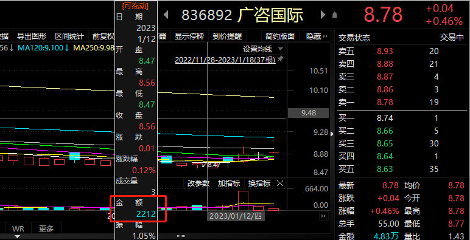

# 北交所流动性低迷！有个股一天成交额不足1万元，市场信心欠佳

每经记者：王海慜 每经编辑：肖芮冬

最近，北交所流动性低迷的现象引发了市场的较多关注，事实上，这样的情形其实已经持续了一段时间。

据记者不完全统计，从去年11月以来，北交所开始出现有个股一天成交额都不足1万元的极端情况。自去年12月中旬以来，这种极端情况出现的频率开始提高，在最近一个月内，已经有4个交易日出现过这种情况。

另据统计，截至昨日收盘，去年12月以来上市的33只北交所新股中，有29只处于破发状态，破发率达87.9%。

现在北交所出现的流动性困局反映了市场的信心欠佳，而各方也在寻求化解之道。记者从多位知情人士处获悉，最近一个多月的时间内，北交所方面已经就现有制度向市场征求过几轮意见。例如，近期北交所曾组织券商的研究所、投行等部门召开相关座谈会。

去年11月北交所迎来开市一周年，在此期间北交所曾集中释放了一轮政策利好。某业内人士认为，近期北交所展开此类座谈的目的应该主要为了一周年后的后续改革和一系列新规走调研程序。

北交所面临流动性困局

_今年1月12日，广咨国际全天成交额仅2212元_

自去年12月中旬以来，这种极端情况出现的频率开始提高，在去年12月16日、12月28日，以及今年1月4日、1月12日，均有一只个股出现过这类极端情况。

而这样的流动性问题不仅仅发生在个别北交所个股上。从能体现交投活跃度的换手率指标来看，据Choice数据统计，今年以来，有27只北交所个股的日均换手率不足0.1%，占比16.6%；有125只北交所个股的日均换手率不足0.5%，占比76.7%。

相比之下，今年以来，在全部4900余只沪深A股中，仅有19只个股的日均换手率不足0.1%，占比0.4%；有604只沪深A股的日均换手率不足0.5%，占比12.3%。

甚至最近一些北交所上市公司在发布相关重磅利好的情况下，对股价的刺激作用都十分有限。

例如，微创光电（BJ430198，股价4.76元，市值7.68亿元）1月11日公告，2023年1月9日收到了2022年12月30日与国网四川综合能源服务有限公司签订的《物资采购合同》正式文本，合同金额为1.23亿元；2023年1月9日收到了2022年12月31日与湖北省数字产业发展集团有限公司签订的《数字城市建设项目(城市大脑运行管理中心)产品销售及技术开发(委托)合同》正式文本，合同金额为4250.28万元。两份合同金额合计1.65亿元。

2019年、2020年、2021年微创光电的营业收入分别为1.67亿元、1.96亿元、1.54亿元。也就是说，从最近三年的角度来看，上述1.65亿元的合同对公司而言无疑是重大利好。然而自公告发出后，公司股价却乏善可陈。

据记者了解，对不少投资者而言，由于北交所二级市场机会偏少，他们参与北交所的目的主要在于打新。不过现在即使是打新，对投资者来说也是一个不小的难题。

据Choice数据统计，截至昨日收盘，去年12月以来上市的33只北交所新股中，有29只处于破发状态，破发率达87.9%，其中上市首日破发的比例达84.85%。

市场为何对北交所信心不足？

在一些业内人士看来，上述种种现象其实反应了现在市场对北交所的信心欠佳。

董秘一家人创始人崔彦军1月17日向记者表示，现在投资者对北交所信心欠佳的主要原因在于，“北交所投融两端没有均衡发展，发行速度过快导致资金端捉襟见肘。上市企业行业偏传统，难以吸引新增资金入市。”

“此外，转板道路不畅通，导致北交所估值缺失参照，只能将新股和老股进行对比，导致新股发行价和老股价格逐级下跌。”他指出，“如果今年一季度转板预期明确，北交所优质标的将对标沪深同行业估值。”

某券商人士则指出，当前市场对北交所信心欠佳的主要有两方面，“一个是北交所定位创新型中小企业，而创新型的定义又不够量化；其次，北交所的赚钱效应对投资者还不太稳定。”

昨日，粤开证券首席经济学家、研究院院长罗志恒就北交所当前面临的流动性困局的成因，向记者进行了较为详细的分析，“首先，北交所具有较高投资者门槛，参与者以机构为主体的市场结构本身流动性就不会特别高。无论港股，还是美股，流动性都不及A股主板（个人投资者居多），因为机构普遍更理性、交易策略更体系化、投资预期更一致等。从这个意义上，北交所的流动性应该更多去对标机构投资者为主体的市场。”

其次，罗志恒表示，“北交所相较科创板、创业板，先天优势仍显不足，直接导致企业数量、质量都有差距。科创板具有硬科技属性，面向世界科技前沿，估值基础更好；创业板继承了老创业板投资者账户资源，流动性基础更好。而北交所设立晚于上述两板，直接导致企业数量更少，规模更小。进一步导致，市场无法承载大体量资金。基金公司的可投标的少，单一股票的持仓上限不高，机构资金从利益最大化角度考虑，收益成本不匹配，入场意愿低。”

“最后，北交所制度优势不明显以及市场生态还不健全。虽然两融、混合制度在推进，但其实其他板块已有之，没有明显制度特色。同时，没有建立起北交所投研生态，信息传递效率低。二级市场活跃离不开信息的充分交流，北交所由于基金参与度低，导致没有建立‘公募基金佣金分仓’的形式来支持研究团队，上市企业缺乏研报覆盖，北交所也缺少相关政策支撑，导致投资者（尤其散户）获取信息难度较大。”罗志恒这样分析道。

各方寻求化解之道

罗志恒建议，对应上述问题，北交所可以着力的方向有如下几方面：

第一、加快扩容速度，兼顾市场质量，以量引质；

第二、进一步提高企业包容度，坚持错位竞争，放低身段，包容其他板块之外的行业，包容亏损；

第三、吸引、打造明星企业；

第四、建立特色化制度，例如可以不可以先行试点T+0，存量发售等；

第五、打造适合价值发现的二级市场生态，提高投研体系建设，加强机构和投资者交流。

值得一提的是，据了解，对于北交所是否可以先行试点T+0，目前业内讨论的比较多，但争议也比较大。有业内人士认为，预计北交所试点T+0短期内难以实现。

虽然现在北交所面临着一定的流动性困局，事实上，各方也在寻求化解之道。记者从多位知情人士获悉，最近一个多月的时间内，北交所方面已经就现有制度向市场征求过几轮意见。

另外，据某业内人士介绍，近期北交所曾组织过相关座谈会，北交所的有关领导出席，此次调研的是券商研究所、投行等部门，“据我了解，后面基金公司也被请去开座谈会了。”

在他看来，北交所展开此类座谈的目的应该主要为了一周年后的后续改革和一系列新规走调研程序。

另外，近期，多家媒体报道，北交所正在加速推动混合做市、融资融券交易制度的落地，预计春节后就会上线交易。

