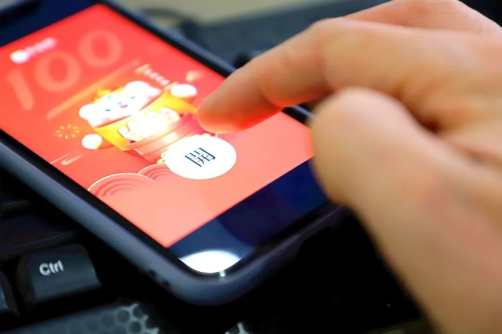
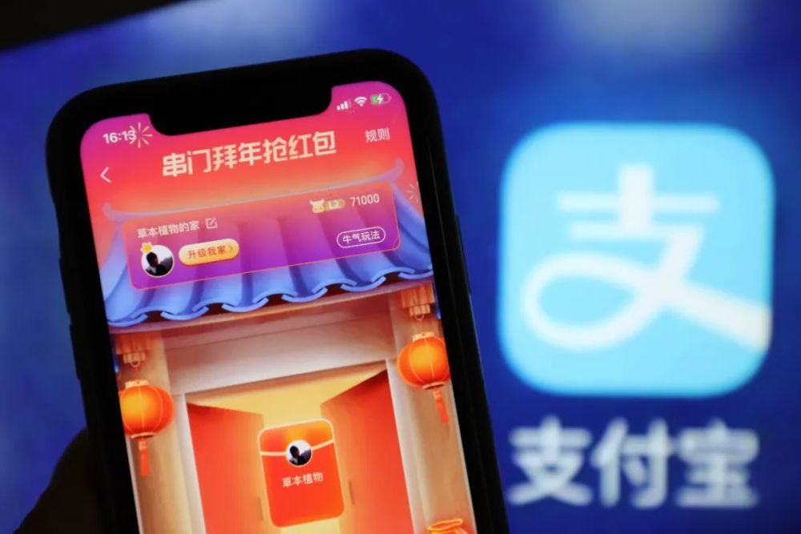

# 大厂不抢，互联网红包退出春晚舞台

**作者 |** 何畅

**编辑 |** 董雨晴

距离兔年春节只剩5天，和央视春晚相关的部分合作方终于浮出水面。

1月16日，抖音与快手均宣布与中央广播电视总台《2023年春节联欢晚会》达成合作，涉及直播、点播和短视频权益，用户可在两者的平台官方矩阵观看直播与回放。此外，微信视频号“竖屏看春晚”的直播入口也已上线。短视频层面的版权分销情况与去年类似，横屏与竖屏之间的“三国杀”又将展开。

不过，截至发稿，往年备受关注的红包互动合作始终未有着落。此前相当长一段时间内，这把交椅一直由互联网巨头把持，合作费用也一路上扬——2015年还是5303万元，2016年涨到了2.69亿元，2018年这一金额又升至3亿元，其后的报价可想而知。一位互联网公司员工向市界透露：“这个冠名的传统是一年要比一年高，现在这个环境，对于很多平台来说确实是一笔‘巨款’。”

另有一家中型互联网公司员工称，兔年央视春晚招标方此前与该公司有过接触，但考虑到投入产出比，该公司最终并未与兔年春晚合作。

与此同时，被传可能合作的美团、拼多多、小红书、B站，均未有相关消息露出。一位在两年前参与过春晚冠名项目的人士告诉市界，其所在团队当时为筹备相关业务，“提前一个月就进驻了项目组”。2020年快手拿下春晚独家互动合作伙伴权更是提前两个月就召开了官方发布会。因此，以当前的时间节点来看，多家互联网公司员工均认为，“兔年春晚将没有红包合作方”。

一位接近央视的人士对市界表示，“春晚的总赞助权益或将由一家消费企业拿到，有消息称是酒企。”不过，有白酒行业从业者表示，春晚历来没有让酒企做总赞助的传统。“一般酒企拿的都是零点报时的特约合作，这个位置最近几年也一直被洋河和古井贡酒占据。”

自微信在2014年春节前夕上线红包功能以来，一众互联网公司争先恐后地踏入春节红包战局，央视春晚舞台是其中竞争最为激烈的标的。

但今年，这场角逐消失了。

春晚红包不见了？

每年春节临近，都会出现关于央视春晚红包花落谁家的猜想。由于此类活动属于重大项目，涉及相关人员部署、算力需求匹配、流程反复测试等一系列环节，前期筹备时间较长，考虑到对外宣传的开展，通常会提早公布消息。以2022年为例，京东拿下央视春晚独家互动合作宣布于1月5日，当年除夕是1月31日，间隔20余天；而2021年，抖音竞标成功的新闻出自1月26日，虽为临时救场，却也在除夕两周前尘埃落定。

相比之下，今年的央视春晚红包迟迟不见动作。市界先后询问多家互联网公司是否参与其中，均得到了否定的答案。一位相关人士提到，今年互联网公司赞助央视春晚红包的可能性不高。在其看来，按照此前的逻辑，每一年合作价格都在上涨，因此在今年这样的行业情况下“必然很难找到金主”。另有就职于某家互联网公司的知情人士称，其所在公司的确就该项目进行了一定程度的接洽，但考虑到成本和效益，最终未能成行。

当然，面对春节这个辞旧迎新、阖家团圆的重要传统节日，各家平台也针对性地推出了相应的营销活动和策划内容。不过，与过去动辄豪掷几十亿元的红包大战相比，今年的氛围未免显得过于低调。

字节跳动旗下抖音、今日头条与西瓜视频等多个平台联合上线了集卡分2亿元红包的玩法。同时，抖音单独推出了奖金总额为4亿元的找红包活动，参与放烟花、猜灯谜等年俗游戏亦有红包奖励，前者奖池为1亿元，后者最高可得666元。字节跳动并未透露春节红包投入的具体情况，但根据已有信息计算，或不足10亿元。

百度准备了总额为8亿元的红包：常规集卡和以拉新等动作为代表的“团圆红包”均为3亿元，除夕派发红包雨2亿元，旗下百度极速版和好看视频一并携手，和字节跳动一样，属于矩阵式打法。

千呼万唤始出来的支付宝集五福活动新增了直播间集卡、生肖卡等方式，只是总额依然为5亿元，数年来雷打不动。

至于阿里巴巴旗下淘宝、天猫与淘特以及京东、拼多多、美团等电商和本地生活服务平台，则选择走年货节路线，除了京东通过“全民炸年兽”和“击鼓迎春”两项活动瓜分总计为20亿元的红包、优惠券和实物奖品外，其他平台仍旧基于自身业务特色加以推进，和常规大促对齐，强调“春节不打烊”。

_（图源：视觉中国）_

细心的用户会记得，从阿里巴巴、百度到京东，乃至字节跳动，都曾经突出重围、携红包出现在央视春晚的直播画面中。值得一提的是，红包“含金量”峰值出现在2021年。据艾媒咨询统计，当年春节期间，互联网平台发放红包总额超180亿元。其中，抖音、快手和百度分别以20亿元、21亿元、22亿元的依次加码吸引了众多关注的目光。在这轮比拼大潮中，拼多多最终凭借28亿元的红包总额摘得桂冠。除此之外，还蹦出来一位自带亮点的选手——头顶“欠122亿”LOGO脱颖而出的乐视。

时过境迁，当年出手阔绰的巨头，如今已谈不上积极。眼下，唯有快手还在主动出击，想和用户一起“分20亿”。

昔日大战从何起

如果向前回溯，最先与央视春晚红包结缘的是腾讯。2013年11月，一次基础产品中心的头脑风暴中，时任微信红包团队产品总监的弓晨和同事们想到，可以在2014年春节时将公司内部发红包的传统做成一个应用，吸引普通用户使用，以增加启用微信支付的用户数量。两个月后，经过十余天通宵达旦的赶工，微信红包正式上线，并在春节期间迅速蹿红。

微信官方团队披露的数据显示，该年除夕共有482万人在微信上抢红包，到大年初八，这个数字达到了800万，被用户领取的红包总计超过4000万个。

提现需要绑定银行卡，微信支付用户因此大增，这也是马云口中“珍珠港偷袭”的由来。他在一个名为“江湖情”的来往扎堆群组内写道：“幸好春节很快过去，后面的日子还很长”。

然而，这只是起点。2015年，央视春晚首次启用新媒体全程互动。彼时，作为总导演的哈文直言：“期待让每一个人都成为春晚中的一份子，不仅乐享视听盛宴，更在互动中获得快乐。”

“微信之父”张小龙亲自上阵，带领微信红包团队将“摇一摇”抢红包的互动形式搬上了央视春晚舞台。微信方面透露，除夕当日微信红包收发总量达10.1亿次，摇一摇互动峰值为8.1亿次每分钟，效果一骑绝尘。

央视春晚红包的近身肉搏正式拉开帷幕。2016年，支付宝斥资2.69亿元将央视春晚的红包互动权握在手中，这个价格是前一年的5倍。马化腾也难免感慨：“央视有个投标，我们输了，对方非常拼。”

_（图源：视觉中国）_

红包总额同样更上一层楼。微信发了5亿元红包，支付宝就投入8亿元。阿里巴巴带着支付宝和淘宝连续三年赞助央视春晚，不仅使集五福家喻户晓，还将支付与社交业务又往前推进了一步。

流量可口、机会难得，这块诱人的蛋糕吸引着越来越多的互联网公司前赴后继。2019年，腾讯与阿里巴巴功成身退，参与央视春晚红包互动环节的换成了百度。9亿元现金红包的威力不可小觑，百度主App日活跃用户数量峰值冲上3亿，相较上一年年底的1.6亿，几近翻倍。

风水轮流转。2020年起，短视频赛道的两员大将——快手和抖音相继出马，前者希望借助10亿元的央视春晚红包再下一城，后者则一口气赞助了4台卫视春晚，打出了“分20亿”的口号——比字节跳动旗下App矩阵上一年的春节红包总额又多添了4亿元。

最热闹的还属2021年，和央视春晚合作的抖音将“分20亿”进行到底，快手、百度和拼多多则依次将“分21亿”、“分22亿”和“分28亿”的标语放上了LOGO。再加上“欠122亿”的乐视，在抖机灵与真花钱之间，红包大战愈发激烈。

2022年是一个转折点，除了在央视春晚发出15亿元红包的京东，以及喊用户瓜分8亿元的美团，支付宝、抖音、快手和百度均延续了之前的红包总额，分别为5亿元、20亿元、21亿元、22亿元。至此，不论是互联网公司的春节红包策划，还是央视春晚红包，都与水涨船高的过去说了再见。

春晚的力量超乎想象

互联网公司与央视春晚的牵手有其特定的历史背景。

2015年央视春晚打造了很多“第一次”：第一次无偿授权海外转播，第一次开放社交媒体直播，第一次设立吉祥物，以及第一次选择以微信为代表的互联网平台承接新媒体创意互动……在媒介融合与创新、主动开拓发展全新媒体路径的趋势下，一些力求多方共赢的合作悄然铺开。

对当时风头正劲、一路高歌的互联网公司来说，央视春晚抛出的橄榄枝意味着巨大的流量和影响力，即使它不再是除夕娱乐活动的唯一选择，地位始终不改。换句话说，只要“过年看春晚”的仪式感还在，前者势必能够借此机会扩大品牌声量、突破用户圈层、实现快速增长，在彰显自身能力的同时，为处于发展中的业务注入新的活水。

“聚流量”之外，另一个目的是“秀肌肉”。2018年，百度的日子并不好过，业绩遇阻、负面迭出，屡次被调侃“掉出互联网第一梯队”，不复当年风光。因此，央视春晚成为其捍卫技术实力、刷新品牌形象的重要契机。与之相似的还有京东，在将定位升级为一家兼具实体企业基因和属性、拥有数字技术和能力的“新型实体企业”后，除了向下沉市场进发，名副其实亦是关键。

_（图源：视觉中国）_

至于快手和抖音，它们趁着移动互联网的东风，在短时间内快速爆发，需要在更为广泛的目标人群中完成对品牌的全面塑造，进而助力业务持续拓展。在这一前提下，主流且受众基本盘领先的央视春晚自然是优选。

某种程度上来讲，能接得住央视春晚流量的平台，绝非平庸之辈。时任央视广告经营管理中心主任任学安曾在提到快手对央视春晚的诚意时表示，快手在过去数年中几度投标，“每一次我们打开信封都很无奈，因为那是天文数字，那时我们觉得快手的体量还不够大，需要再观察一下”。

得到CEO罗振宇也在某一年的跨年演讲中讲述了类似的故事。他说，自己想上央视春晚投个广告，却被拒之门外。对方回绝他的理由是：“互联网公司想在春晚投广告，有个小门槛，日活得过一个亿才有得考虑，不然，广告出来的瞬间，服务器就会崩掉。”

最终，这让罗振宇用了一句话概括了央视春晚的价值——我们对春晚的力量一无所知。

降本增效下前行

然而，时至今日，互联网行业已走过跑马圈地的高速增长时期，开始着眼于提升经营效率、寻求“有质量的增长”。曾经高抢破头“撒钱”的互联网公司也经历了角色的全面转换，埋头发力，回归低调。

来自中国互联网络信息中心的数据显示，2020年至2022年，我国移动互联网用户规模分别为9.86亿、10.29亿、10.47亿，增长走势平缓。而互联网行业的整体竞争格局已趋于稳定，包括支付、电商、本地生活服务、视频、搜索、在线音乐等在内的分支领域，无论是用户、场景还是商业模式，均被瓜分殆尽。以此为前提，央视春晚红包的流量与“能量”，对迈入“平稳常态”的互联网公司而言，不再是必需品。

与此同时，随着反垄断的钟声敲响，平台经济迎来了强监管时代。

机制愈发完善，规范逐步补齐，近十年来仰仗资本与流量所向披靡的互联网公司，告别了碾压式的无序竞争，也终结了划分阵营对峙的那段历史。与之对应的是“由虚向实”，加码硬科技领域，并从“加入购物车”转向“做减法”。近两年间，腾讯就先后减持了京东、Sea、美团等多家互联网公司的股票，转而向更多的新兴科技公司下注。

增长魔法和“钞能力”失灵，“降本增效”取而代之。收缩、调整、优化，几乎每一家互联网巨头都学会了攥紧钱袋子过冬。一度大举招聘的字节跳动，将“去肥增瘦”放在了第一位；过去被视为“养老胜地”的腾讯，如今每一笔预算都要考核投入产出比；比起营收，百度开始更为关心毛利润、经营利润和现金流……赚钱、盈利，现在升级为整个互联网行业的重中之重。

钱自然要花在刀刃上。当老板为难以扭转的亏损发愁、员工为悬而未定的年终奖忧心时，大手笔的投放势必经过更为严苛的审视和考量，除了短期增长，更要长期价值，而这并非一时之功。

从这个角度分析，作价不菲的央视春晚红包合作，很难再如当年一般吸引一众互联网公司的追逐。和撑起“面子”相比，后者更倾向于做好“里子”，即围绕核心目标、结合平台特色、瞄准业务前景，而不是单纯地比拼谁出的钱多——余粮有限，得省着花。

春晚红包的故事讲到这里，似乎要告一段落了。

以2015年为起点，互联网公司带着金钱、人员、技术和创意，与央视春晚一同度过了8年光阴。每一年春节，都有人为此加班加点、彻夜不眠。也许，挥手作别未必是一件坏事。就像一位用户所说的那样：“几块钱不会影响我对这些平台的使用，与其搞营销还不如多钻研一下用户体验，那才是立身之本。”

