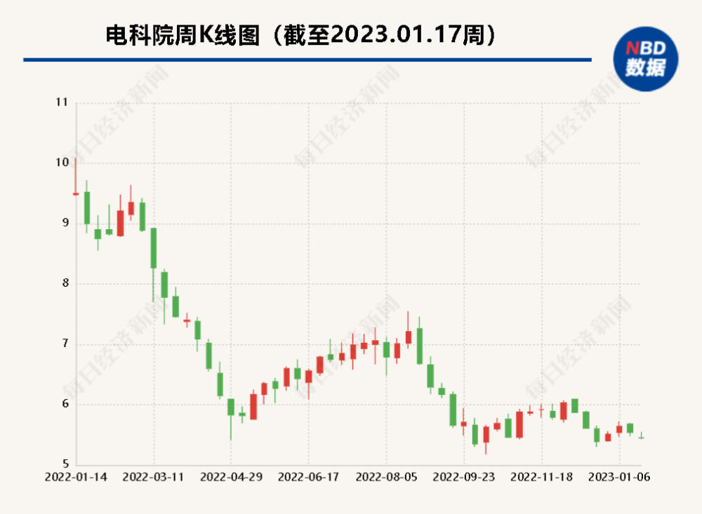
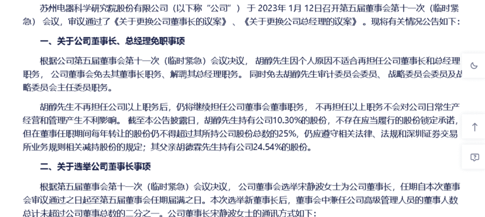

# 电科院实控人父子“内讧” 儿子董事长职位被免：与父亲理念上存在分歧

每经记者：程雅 每经编辑：张海妮

1月12日，电科院（SZ300215，股价5.51元，市值41.78亿元）一则罢免公司董事长及董秘的公告引发了市场的关注。

公告称，电科院将更换公司董事长、董秘。但在这次重要的董事会会议上，有独立董事提出反对意见，一名独立董事则未参会。其中，独董赵怡超在反对理由中提到，更换董事长的背景是胡德霖（公司创始人）与胡醇父子间的矛盾。

公开资料显示，胡醇，1978年生，现年45岁，持有公司10.3%的股份，被免职、解聘之前，他担任电科院董事长、总经理职务；胡德霖出生于1951年，现年72岁，持有公司24.54%的股份；两人为公司控股股东及实控人，而究竟是什么原因，让这对父子产生了矛盾？

1月16日，胡醇在接受《每日经济新闻》记者独家采访时表示，父亲胡德霖与其在公司经营理念上存在一定分歧。

端倪：表决权委托协议被解除

资料显示，胡德霖于1993至2019年11月担任电科院（及电科院前身）董事长（执行董事）、总经理；2019年11月至2021年1月任公司董事。

2002年，胡醇24岁，也进入电科院工作，曾历任电科院前身监事；2019年11月，胡醇接过父亲的接力棒，任公司董事长、总经理。但2021年1月，胡醇因工作原因，申请辞去公司董事长、总经理职位，期间，董事长职位由胡德霖接手，2021年11月，胡醇才又重新开始担任公司董事长。

2011年5月，电科院成功上市。从当初的招股说明书来看，父子二人一直为一致行动人关系。细算下来，二人已共同拼搏了二十余年，究竟发生了什么，导致胡醇董事长一职被罢免？

要说起二人关系的转变，一项表决权委托关系的变化，或许透露出一丝端倪。

2021年10月14日，胡德霖与其一致行动人胡醇签署《表决权委托协议》，将其所持1.86亿股（占公司总股本的24.54%）股份对应的表决权委托给胡醇行使，二人合计持股34.84%。

值得一提的是，公告表明，除协议明确约定外，甲方（胡德霖）在协议项下不享有单方撤销及终止委托表决权的权利，未经乙方（胡醇）同意，协议项下委托表决权不因任何事由而撤销或终止。

但2022年12月13日，电科院公告称，此前胡德霖因考虑个人身体健康方面的原因可能无法正常行使作为电科院股东的表决权，将表决权委托给儿子胡醇行使，但现在，影响其正常行使表决权的因素已排除，胡德霖决定解除《表决权委托协议》。

_图片来源：公告截图_

而此次表决权委托的解除，或许也成为胡醇董事长一职突然被罢免的铺垫。

董事会“临时紧急”开会：董事长被免职

1月12日，电科院公告称，根据第五届董事会第十一次（临时紧急）会议决议，审议通过了罢免公司董事长、总经理胡醇以及董秘费振俊的议案，并改选宋静波为董事长，李杰为总经理，刘丹丹为董秘。

_图片来源：公告截图_

解聘胡醇、费振俊的理由均为“因个人原因不适合再担任”。同时，胡醇还被免去了公司审计委员会委员、战略委员会委员及战略委员会主任委员职务。

此次董事会通知于1月12日以书面送达、电子邮件形式发出，由半数以上董事推举的董事宋静波召集和主持，会议应出席董事九名，实际出席董事八名，独立董事王雪靖缺席，也未发表独立意见。

董事会上，独立董事赵怡超对相关议案提出反对意见。其表示，本次会议违反公司法和公司章程，会议通知时间过短，应该为5天；此外，召集人不是董事长，只有董事长不履行或不能履行才能半数推选召集人和主持人，胡醇并非不能履行职责。本次董事会通知及召集无效，做出的决议无效。

值得一提的是，赵怡超还提到，更换董事长的背景是胡德霖与胡醇的矛盾，拟选举的董事长无相关经验，胡德霖和胡醇系公司实控人，拟选举的董事长不是公司实控人，控制公司不稳定。

除董事会会议外，电科院还由监事会主席李卫平召集和主持了第五届监事会第六次（临时紧急）会议，同样审议通过了上述议案。

胡醇：董事会违反召集程序，有违公司治理准则

不论是董事会还是监事会，都表明是“临时紧急”会议，究竟是何原因，让公司急于罢免董事长及董秘？胡德霖、胡醇父子之间又究竟有何矛盾？

1月16日，在接受《每日经济新闻》记者独家采访时，胡醇表示，根据《公司章程》规定，召开董事会需要提前5天发出会议通知及议案，而1月12日董事会召开从当天中午发出邮件通知到正式召开会议，间隔不足2小时，时间太过仓促。

“我认为在委托表决权有争议（的）情况下，此次董事会在明显违反召集程序的情况下强行免去本人的董事长职务，明显是有违公司治理基本准则，此行为不利于公司正常生产经营开展，不利于维护和保障投资者利益，本人提出强烈抗议。”胡醇称。

而说起父子二人产生矛盾的缘由，胡醇则表示，胡德霖与其在公司经营理念上存在一定分歧，因此胡德霖单方面撤销了表决权委托协议。

但胡醇认为，胡德霖单方面出具的《关于解除表决权委托的告知函》不具有法律效力。根据《表决权委托协议》第四条约定，胡德霖在本协议项下不享有单方面撤销及终止委托表决权的权利，未经本人同意，本协议项下委托表决权不因任何事由而撤销或终止。因此，也在考虑是否走诉讼程序。

胡醇称：“我觉得，如胡德霖先生对于之前的表决权委托安排，或是股份转让的承诺有反悔的意愿，均可通过双方友好协商沟通的方式，达成一致解决方案，过程应以不影响上市公司经营稳定为大前提。”不过，对于双方在公司经营理念方面的分歧具体是什么，胡醇未进行具体解释。

今日（1月17日），《每日经济新闻》记者就相关问题致电电科院，但工作人员拒绝接受采访。

记者也尝试联系胡德霖，但截至发稿未联系上对方。

2022年前三季度业绩下滑

电科院是一家全国性的独立第三方综合电器检测机构，主要从事输配电电器、核电电器、机床电器、船用电器、汽车电子电气、太阳能及风能发电设备等各类高低压电器的技术检测服务。

细数下来，电科院已经上市十余载。从近几年业绩来看，一直较为稳定，自2016年以来，公司营收一直稳步增长。2016年实现5.53亿元营收，2019年营收规模已经扩大到8.06亿元。

不过，2020年，受疫情影响，电科院业绩出现下滑，实现营业收入7.02亿元，同比下降12.9%，实现归母净利润8663.18万元，同比下降47.98%。2021年，公司业绩转好，实现营业收入8.63亿元，同比增长22.83%；实现归母净利润1.93亿元，同比增长122.43%。

但2022年前三季度，电科院业绩再次出现下滑，实现营业收入5.07亿元，同比下降18.93%；实现归母净利润4077.58万元，同比下降69.01%。报告期内，电科院交易性金融资产下降80.37%，系持有的理财减少所致，利息费用同比减少31.59%，主要系报告期内偿还部分借款导致利息支出减少；其他收益同比减少51.74%，主要系报告期内收到的政府补助减少导致。

在2022年半年报中，电科院介绍，依据行业统计和调查，2019~2021年，公司在总资产、营业收入、高压电器和低压电器检测市场占有率等方面连续三年均名列行业前茅。2022年上半年，受疫情零星散发或局部暴发的影响，企业经营压力较大。公司作为我国高低压电器检测领域的领军企业之一，对国内电器检测行业的发展起着举足轻重的作用，且公司自身优势符合电器检测行业未来发展趋势。

