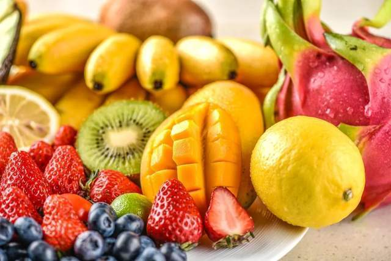
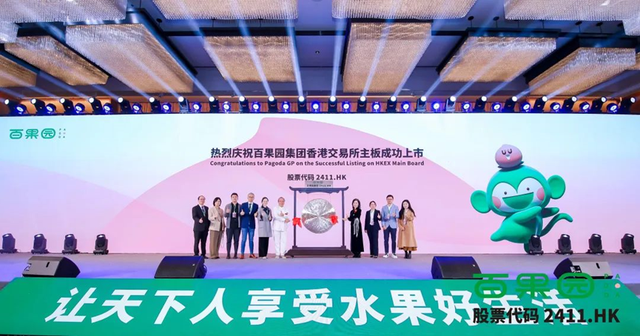
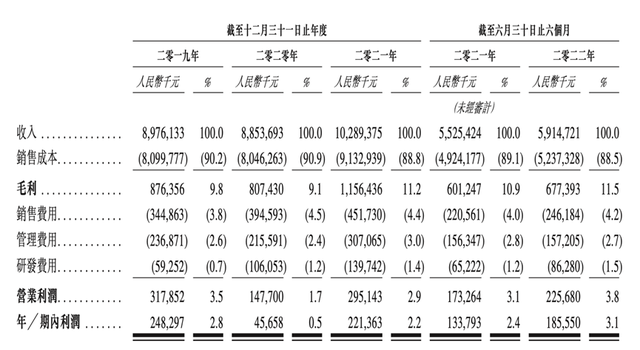
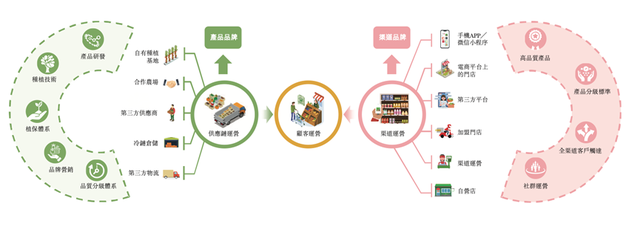

# 百果园成功上市，3年营收近300亿，但水果生意仍不好做

作者 | 行藏

编辑 | 杜仲

来源 | 观潮新消费（ID：TideSight）

继洪九果品上市后，百果园终于在今日成功登陆资本市场。

虽然百果园没能冲击成“水果第一股”，
但从营收规模和门店数量看，百果园稳坐国内水果零售行业头把交椅。据弗若斯特沙利文数据显示，按2021年水果零售额计，百果园是中国第一大水果零售商，占中国总市场份额1%，而前五大参与者合计占总市场份额3.6%。

和众多赚C端钱的水果商不同，百果园主要赚加盟商的钱。20年来，百果园已拥有超5600家门店。

值得注意的是，百果园是2023年第一个消费IPO，首日上市高开16.43%，截至收盘市值近百亿。消费正在回暖，市场信心正在提振。

01 3年营收近300亿

百果园成立于2001年，在深圳开出第一家线下门店，2008年拓展在线销售渠道，线上线下双线发展。

据招股书显示，2019年-2021年百果园营收有所增长，分别为89.8亿元、88.5亿元和102.9亿元；毛利分别为8.76元亿元、8.07亿元、11.56亿元，净利润分别是2.48亿元、0.46亿元和2.21亿元。

在很多消费者看来，百果园的水果品质好，价格也不低，但百果园挣的并不多。2022年上半年，百果园的营收为59.15亿元，利润为1.9亿元，净利率仅有3%，2019至2021年，百果园净利润率分别为2.8%、0.5%和2.2%。

2015年，百果园还建立了行业第一个全品类水果果品标准体系，把水果标准分为招牌、A、B、C四个等级。其中，招牌级及A级水果售价及利润率较高，2021年占到营收的70%。

招股书数据显示，目前百果园有5643家线下门店，遍布全国22个省市的140多个城市，门店数量行业第一。其中5624家为加盟门店，其余19家为自营门店。所有加盟门店中，4576家是自行管理的加盟门店，1050家为委托管理的加盟门店。

加盟商为百果园贡献了不少营收。2019-2021年，百果园加盟门店占总营收的比例分别为87.9%、84.6%和81.3%。

2022年上半年，百果园来自加盟门店的收入为46亿元，占营收的比例为80.3%；来自自营门店的营收为3169万元，占营收比例为0.6%；来自区域代理的收入为5.63亿元，占营收比例为9.8%。

从收入结构上来看，销售水果及其他食品的收入依然占据百果园总收入的大部分，2021年收入为99.9亿元，占同期总收入的97.1%。

除了销售水果，百果园也有果干及果汁等果制品，大生鲜产品主要包括鸡蛋、蔬菜、肉类及海鲜、粮油、乳制品。但大生鲜类收入贡献较低，2022年上半年为2.7%。

一手做加盟扩大规模，一手整合产业链降本增效，同时还走高端化路线增加利润，在余惠勇20多年的精耕细作下，百果园已成为中国最大的水果连锁零售商。

百果园此次上市募集资金净额中，约45%将用于改善及加强集团的运营及供应链体系，约25%将用于升级和改进集团的核心IT系统及基础设施(主要为中台)。

02 俯首捡钢镚的生意

长期以来，中国老百姓是在路边摊买水果，实惠且新鲜，这也让路边摊成为了水果零售的主流业态。

1984年，武汉地区开设了全国第一家农贸批发市场——武汉皇经堂农产品批发市场，从那以后水果开始告别路边摊，进入农贸市场。90年代中后期，随着家乐福、沃尔玛等连锁商超入华，水果又进入了商超系统。

直到世纪之交，真正的水果连锁生意才开始出现，百果园创始人余惠勇便是第一批吃螃蟹的人。

1995年，炒股失败的余惠勇带着400元再度南下深圳，江西农业大学毕业的他选择了自己更熟悉的领域，在新保蔬菜公司当售卖员。1年后，余惠勇跳槽到爱地公司担任经理，负责水果等农产品的销售。

彼时下海浪潮盛行，余惠勇便投身到连锁水果的生意。2001年，他在深圳开了第一家百果园，选址于繁华的福华路，开业首天便卖出了1.9万元，“要像麦当劳一样卖水果”成为余惠勇的目标。

但很快，余惠勇便意识到把水果做成连锁并不简单。水果属于农产品，非标化的农产品与标准化的连锁天然相悖，这注定了连锁水果是门苦生意，用余惠勇的话就是“俯首捡钢镚”。

连锁化的第一步是标准化，需要从源头打通整条供应链，从种植生产、采摘物流到终端销售，实现全链路业务覆盖。

在采购环节，百果园合作的供应商超过1300个，主要为水果种植基地和水果包装厂，百果园还投资了几十个种植基地和农业科技公司，优化上游的供应链布局，提高标准化程度。

物流环节是水果连锁的关键，长途运输易导致水果损耗，短途运输覆盖半径有限，无论是仓储还是物流成本都是难题。

为解决运输问题，百果园采取全国多仓的模式，共建立29个仓库，作为区域初加工和配送中心，覆盖周围300公里以内的门店。目前，百果园能够把损耗率控制在5%以内，低于行业平均水平。

解决了物流，下一步便是零售终端。百果园定位水果连锁零售，从种植到零售全产业链覆盖，成本自然居高不下，毛利和净利相比于友商都更低。

在余惠勇看来，不赚钱是因为没有足够大的规模能够摊薄成本，于是百果园开启了加盟模式。

2015年，百果园门店刚刚突破1000家，到了2022年，百果园的门店总数达到5643家，其中加盟门店为5624家，约占99.66%，7年时间门店量翻了5倍。

扩大规模之外，百果园在供应链标准化的基础上也开始了自主产品的研发，通过源头直采提高产品溢价。近些年，百果园瞄准中产消费人群，陆续开发出红芭蕾草莓、良枝苹果、猕宗猕猴桃等31个自有品牌，走高端化路线。

百果园的股权比较分散，上市前，余惠勇直接持股比例为25.5971%，通过深圳惠林持股3.9247%，宏愿善果持股为8.6499%，恒义利投资持股为8.0442%。余惠勇持有30.51%的宏愿善果股权，及40%的恒义利投资股权。

余惠勇同时与妻子徐艳林通过持有深圳惠林、宏愿善果及恒义利投资间接合计持有百果园9.82%的股份，余惠勇和徐艳林夫妇合计持股约35.38%。

天图是百果园最早的机构投资人，目前也是其最大的机构投资人。天图投资管理合伙人潘攀表示：“百果园经历了多个完整的经济周期，是一家成熟稳定且长期主义的公司，百果园的利他和信任文化，深刻影响着中国连锁业的变革，同时百果园团队有理想、有格局、也一直在顺应趋势迭代变化。放眼中国的生鲜市场，未来空间还很大。”

03 万亿水果江湖争锋

南百果，北鲜丰，西洪九，水果巨头们争抢第一股多年。

虽说同处水果赛道，但三者走出了不同的路子。洪九果品主打“端到端”模式，侧重上游端直采，负责选品、物流直至销售给终端批发商；百果园走的是O2O模式，早早切入水果种植端，形成从源头种植、原产地采购到门店销售的全产业链格局；鲜丰水果则是2B模式，集新零售、智慧冷链物流和供应链为一体。

定位不同，运营模式不同，三家水果巨头的消费群体也都不一样。洪九果品、百果园后，鲜丰水果也在上市途中。

不过相比之下，洪九果品更赚钱。2022年上半年，洪九果品的毛利为11.23亿元，毛利率为19.6%；而百果园的毛利为6.77亿元，毛利率为11.5%，仅是洪九果品的一半。

近年来，随着消费水准的提升和健康意识的增强，生鲜食品在国名经济的重要地位日益凸显。随着消费升级，优质的水果格外受消费者青睐，需求量增长快速。

中国人均年鲜果消耗量由2016年的约43.9公斤增至2021年的52.7公斤，预计2026年将达到60.5公斤，但仍远低于《中国居民膳食指南》建议的日均200-350g（即每年73至128公斤）的水果摄入量。与中国饮食结构较相近的日本，其人均水果的年消费量是中国现人均的1.4倍，中国水果市场增长潜力巨大。

此外，新兴的零售渠道也在快速增长。虽然商场、夫妻老婆店、菜市场等传统渠道仍为中国鲜果零售的主要渠道，但新兴的零售渠道（社区团购、社区生鲜连锁店、即时电商及综合电商）快速崛起，预计其将逐渐成为消费者购买水果的主流渠道。

据弗若斯特沙利文数据，中国生鲜的总零售销售额由2016年的34685亿元增加至2021年的56353亿元，复合年增长率为10.2%，且预计于2026年将达到84830亿元。其中，中国水果零售市场的市场规模预期于2026年达到17752亿元。

万亿水果市场，生意不如想象中的好，但高频消费的特点并不影响巨头“抢着”入局。虽然市场集中度低，但头部的参与者竞争激烈。

要么有巨额资本支持，要么有足够的时间投入。随着上中下游供应链不断被整合，水果市场也在朝着数字化、标准化、品牌化发展。

