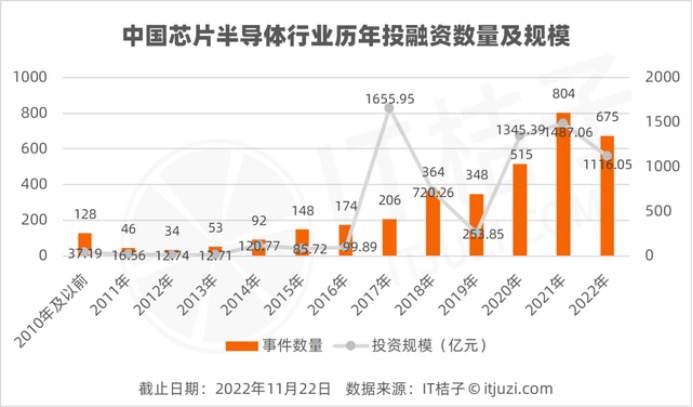

# 硕士毕业生年薪50万，芯片行业抢人大战降温

_来源：视觉中国_

作者丨叶蓁

编辑丨康晓

出品丨深网·腾讯新闻小满工作室

对中国科技大学微电子专业研三的李明来说，去年秋招已顺利拿到了大厂的offer，但整个秋招并不如之前那般火热，高薪抢人的状况并未出现。

2021年前后，VC圈几乎都在看半导体，过亿的天使轮、高估值成为行业常态。整个行业钱很多，招聘需求自然增加，薪酬水涨船高。而过去的2022年，全球芯片产业过剩危机愈演愈烈，部分芯片的市场价格从高位跌落，二级市场上多家企业市值也蒸发腰斩，行业融资事件相对减少。

“今年集成电路硕士的就业，形势的确不如去年，薪酬也没有去年给的那么高。企业给出的薪酬大致在35-50万之间，也分学校和城市，985毕业的和芯片设计岗要稍微高一些，”北航集成电路学院的一位博士后告诉《深网》。

毕业生感受到的2022年企业秋招的趋于理性，背后是芯片企业用人策略的调整，“但需求依然还是很旺盛，一个优秀的候选人简历如果当天挂到了网上，一天内至少会接到十几个猎头的电话。”上海策德人力资源有限公司合伙人张微微告诉《深网》，“芯片产业在当下这个阶段很像十年前的互联网，在资本的加持下，近几年涌现了很多扩张型的公司，且大多数都拿到了风险投资，产生了大量的用人需求，也给猎头行业带来了机会。”

《中国集成电路产业人才白皮书（2019-2020年版）》显示，我国集成电路人才在供给总量上仍显不足，2022年，芯片专业人才缺口预计超20万人。在这种状况下，虽然短期招聘降温，但未来几年，芯片相关毕业生依然是科技产业最稀缺的人才之一。

**薪酬50万难度提升**

李明是中国科技大学微电子专业研三的学生，去年6月中上旬，由于各大公司陆续开始了校招的提前批，李明也密集的投递简历。李明刚开始对于秋招很乐观，在他看来，微电子这个专业就业主要在以上海为辐射中心的长三角和北京深圳等地，他把目光锁定在了海思，英伟达、高通、AMD、大疆等大企业以及TP-
LINK、集创北方等。

但随着时间的推移，秋招市场的寒气击碎了李明之前的乐观心态。到九月，李明只收到了合肥长鑫、TP-
LINK、集创北方以及一些创业公司的offer，薪酬集中在40W+。其他企业如豪威、大疆、蔚来等仅仅参与了笔试，却始终没等到面试机会。

各种小道消息漫天飞，如北美停止了NCG的审批、某企业以前离职的员工大量回流等等，而华为海思的秋招计划也不明朗，并未有实质的进展。

直到10月份，李明在密集的笔试面试以及漫长的等待中，终于又拿到了平头哥和高通等公司的意向，不过，也有全部面试通过但最后没有拿到意向书的情况，如地平线、Zeku(哲库科技)、小米等等。

要知道，在2021年火热的秋招市场中，不少转专业做芯片的应届生仅经过若干时间的培训，薪酬便能普遍达到40万。

但回顾整个秋招的经历，与其他专业对比，与其说是芯片“寒冬”不如说是行业回归理性。

一位业内人士告诉《深网》：2021年半导体行业就业情况过于疯狂，很多行业人才都转入芯片半导体这一风口，高薪就职的情况比比皆是，自然也就出现了自身能力与薪资不匹配情况。近半年，企业高薪抢人的状况那种狂热再未出现。

目前企业给出的薪酬大致在35-50万之间，北航集成电路学院的一位博士后告诉《深网》。

IT桔子数据显示：2021 年中国芯片半导体融资事件达超 800
起创下历史记录，行业单笔平均融资为1.85亿左右。2022年，由于消费电子等市场出货量下滑，芯片荒缓解，芯片需求也趋于饱和。数据显示，截至2022 年 11
月 22 日，行业融资事件为 675 起，而据钛媒体报道，2022年前8个月内，中国吊销、注销芯片相关企业达到3470家，超过往年全年企业数量。

“我们计划招聘的人数只有去年的三分之一，但我们今年这次收到的简历比去年还多。”一家西安的芯片公司人力资源负责人表示，“近几年行业确实招聘了许多不太合格的研发人员，许多门外汉上了速成班后转行了，无法应对企业的需求。”

关于这点，李明感触很深，这一轮企业笔试和面试中，李明感觉到不像前两届师兄说的那么简单，只要有流片经验就可以，要求要高许多。

11月，李明和同学参加了华为的面试，相关负责人表示，华为的机会会更多留给还没有签订三方协议的应届生，尽管如此，到了十二月中旬，符合上述条件的李明的同学，最终也没等到华为的录用通知。

**缺口与乱象**

李明的专业是数字集成电路设计（数字IC设计）。在芯片产业链上，分为设计、制造、封装测试三大领域，近几年国内产业发展则集中在芯片设计领域。

在政策和资本的加持下，国内芯片设计企业的数量在短短的几年迅速增长。相关数据显示，2017年时，芯片设计企业的数量为1380家，到了2020年已经突破2000大关达到2218家，最近的2021年这个数字又有所提升，达到2810家。

芯片设计企业的大量增加也意味着对IC设计人才的需求量急剧增加。“IC设计企业最大的成本就是人。”芯片设计公司澜起科技相关人士表示，全国每年毕业的优秀IC设计人才可能只有1000-2000人。

数据显示，2021年国内直接从事集成电路产业的人员约54.1万人，设计业、制造业和封装测试业的从业人员规模分别为19.96万人、18.12人和16.02万人。2022年，芯片专业人才缺口预计超20万人，到2023年前后全行业人才需求将达到76.65万人左右。

“目前，芯片领域还是比较看重出身的。”张微微认为。张微微之前在房地产领域做猎头，这两年转到了芯片领域，她一周大约会见到3-5个芯片研发候选人，大部分候选人在芯片领域有3-8年或者8-15年的的工作经验，候选人薪酬一般约在50万到200万之间。

目前开设芯片相关专业的高校集中在一流大学和双一流大学。首批“集成电路科学与工程”一级学科博士学位授予点仅有18家高校，包括北京大学、清华大学、中国科学院大学、浙江大学、北京航空航天、电子科技大学、华中科技大学等。

中国工程院院士、浙江大学微纳电子学院院长吴汉明表示，目前90%的教学内容是芯片设计，但制造也是集成电路产业重要一环，一名成熟的工艺工程师，培养周期起码需要3-5年。

为了留住人才，即便台积电和阿斯麦这些龙头公司也在涨薪。台积电2022年大部分员工调薪幅度落在5％-10％，上一年台积电已将工资上调了20％。光刻机设备ASML自2021年7月起，半年内调薪幅度便达15％-19％。

“做芯片没有人才是不行的。我们不仅试图找到行业里最资深的人、最有经验的人、最好的专家，也必须重视人才梯队建设，马里亚纳团队里已有不少应届生。”OPPO芯片产品高级总监姜波告诉《深网》。

人才的长期需求跟芯片产业的发展有着直接的关系。2018
年之后，受国家政策的支持引导、国家集成电路产业投资基金的建立以及随着智能制造发展，芯片业被推到历史潮头，资本在这个沉寂已久的行业不断出手，融资数量及规模都增长较快。

伴随着大量的资本进入集成电路产业，整个行业的薪酬也发生了变化。

“芯片领域一些优秀的工程师，市场上80%公司的offer他都可以拿到。有几个候选人告诉我，在2018年之前，他们的月薪只有两万，近几年翻两番和三番的都有。但之前七八年的工资涨幅其实都不大。”张微微透露。

芯片工程师身价上涨，企业用人成本压力增加。部分从业者认为，这样的薪资并不合理，“以前（薪资）低并不代表现在高是合理的，以前低不合理，现在高也不合理。”

2013年，米磊联合发起成立早期风险投资基金中科创星，目前已投资孵化394家硬科技企业。他把投资硬科技的这10年形容为从极夜到极昼的转变，当下硬科技有多火爆，当年就有多冷门。特别是半导体领域，刚开始投资芯片那几年，芯片人才有10年没涨过工资。

米磊认为，难免会出现局部过热、资源浪费、人心浮躁等情况，这些乱象会导致劣币驱逐良币，会对行业企业和人才的长期健康发展造成巨大伤害。

“资本把芯片行业重新置于聚光灯下后，整个行业变得也很浮躁。大量的资本进来后，我们团队经常被人挖走，有的事情刚做到一半，人才就被挖走了。”一家芯片创业公司的管理层告诉《深网》。

对应届生来说，“面临着结婚和买房，在经济上有压力，这样导致他们在看机会的时候，看的更多的还是薪酬，而职业发展的规划、职场的稳定性、还有职业的含金量都被后置了。”策德芯片团队负责人熊芳芳告诉《深网》，“应届生选择进入大厂，薪酬可能就40-50W，跳一次槽，薪酬可能就翻一番，还是有蛮大的诱惑力。但如果没有长期的职业规划，一旦行业进入洗牌期，他的稳定性肯定是最差的。”

**腾讯新闻出品内容，未经授权，不得复制和转载，否则将追究法律责任。**

