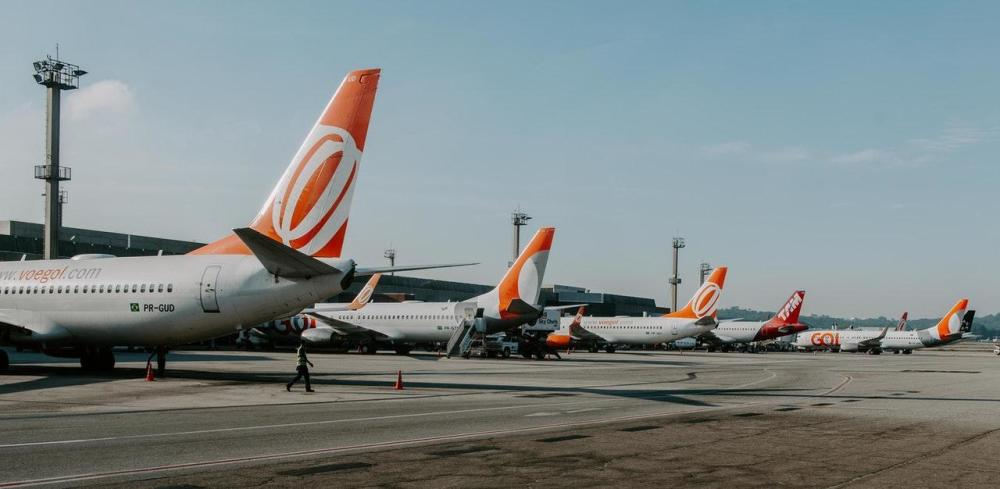

# 这届空姐，面试通过率堪比考公务员

本文来源：时代财经 作者：林心林

过去三年面临人才流失的一线民航队伍正亟待补充。

_图片来源：pexels_

就在1月初，中国南方航空2023年第一场空乘招聘在广州落下帷幕。据南航人力资源部副总经理张鹏介绍，共约有22000余人报名了此次的南航乘务员面试，但面试通过率却不足3%，竞争激烈程度堪比公务员考试。同步地，海南航空、首都航空等航空公司也在广州、西安等城市进行首轮招聘。

招聘火爆背后是民航业的逐步复苏。

1月6日召开的2023年全国民航工作会议上，民航局局长宋志勇喊出了2023年民航局力争实现盈亏平衡的目标。

从一年亏损千亿到力争盈利，依托的是2022年底“新十条”等一系列政策颁布以及春运的来临，这一切都在加速推进着国内民航业的恢复。

飞常准民航看板数据显示，1月7日-13日春运首周，国内航线实际执行客运航班量连续7天上涨，日均客运航班量破万班次，这也是时隔近5个月国内航班再破万。

招聘中断三年再恢复，通过率不足3%

早在2022年末，各大航司就相继恢复了中断三年的招聘。

12月3日，中国南方航空招聘网更新了三则乘务员招聘信息，开放普通乘务员、“明珠之蓝”外语特长乘务员、“云上明珠”精英乘务员职位的招聘。紧随其后，吉祥航空、春秋航空、厦门航空、海南航空、天津航空等也重启了招聘；除乘务员外，不少航空公司也开放了安全员、地面服务保障等职位。

大规模重启招聘缘于近年行业一线从业人员的流失。

国内某航司在职空乘董丽告诉时代财经，她所在的航司2022年底一线员工数比2021年少了20%。民航局信息中心数据亦显示，截至2021年12月31日，全民航共有97307名乘务员持证上岗，而在2019年则有108955名乘务员，两年间全民航在职乘务员减少了超10%。

因此航司都在防控政策优化之后加大了乘务员的招聘，南方航空2023年就计划招收空乘岗位3000人。根据蔚蓝长龙的统计数据，预计2023年全年国内航司乘务招聘人数将超万人。

尽管国内民航业目前尚未完全复苏，但招聘通道一重启，大批怀揣飞天梦的人还是涌向了航空公司。

2022年空乘艺术生刘琦，在年底12月报名了南航、海航、首航共三个航司的招聘。今年1月5日，刘琦从从青岛来到了广州参加南航线下复试面试，“很多人都是拖着行李箱从全国各地飞过来广州面试，还有一些已经是飞过几年的空姐，现在重新回到这一行。”

不过，专业出身的刘琦并没有通过南航复试，“从报名、初试到复试，结伴面试的小伙伴越来越少，但最后还是没有挺到终审。”

据刘琦了解，南航仅初试就已经淘汰了大部分人，一路过关斩将通过的人不到十分之一。“竞争太激烈了，我们复试组里有个女生是大学本科、英语六级高分、获得过一堆奖项，面容仪态出众，但复试也没通过。”

南航人力资源部副总张鹏近期就表示，2023年南航第一场空乘招聘共约有22000余人报名，通过网上筛选、线下复试、终审等环节，最终共有500余名面试者进入体检环节，面试通过率仅约2.27%。

可以窥见，尽管各大航司忙于补充人员，但竞争仍旧激烈。空乘培训人员刘韬对时代财经表示，疫情之前几大航司的招聘就十分激烈，如今停了两三年重新开放，堆积了许多空乘专业方向的人员等待就业，因此竞争会更加残酷。

“空乘岗位对学历、专业方面的要求比较宽松，薪资条件、工作环境都比较符合年轻人首份工作的期待，所以一直以来面试通过率就不高，疫情前也在2%-5%的水平。”刘韬称。

董丽亦表示，由于疫情关系，许多航司还积压了一些早在2019年就通过面试、等待培训上岗的准空乘人员，因此招聘需求可能也会相对缓和一些。不过，刘韬也称，目前仅仅是航空公司恢复常态化招聘的第一轮，年后航司还会进行多轮招聘。

民航业喊话今年盈亏平衡，航司也发起年终奖

比航司招聘恢复得更迅猛的，是客运航班的运力投入与恢复。

尤其是春运来临，让民航业重新繁忙起来，日均客运航班量频频破万。1月6日，国务院举行的新闻发布会上，中国民用航空局总飞行师万向东表示今年春运预计民航客流量将明显增长；全民航日均安排客运航班11000班，为2019年春运期间的73%左右。

从预订端看，航旅纵横最新提供的数据显示，截至到1月16日，春节假期期间的国内航线机票预订量超430万，比去年春节同期增长约67%；国内航司的出入境机票预订量超12.8万，同比增长近90%。

随着需求上涨，各大航司不断加大运力投放，增加航线申请。根据民航局数据，截至1月5日，在国内定期客运航班计划的基础上，又批复春运期间国内航线加班10313班。

其中，东方航空在今年春运计划投入飞机753架，计划的日均班次超2900班，并计划执行加班航班6000余班，投放的运力已恢复到2019年春运水平的87%。为了保障热点市场运力，东航还将多架A330等宽体机投放到广州、成都、三亚等热点市场开展始发运行。

此外，南航、海航、吉祥航空等亦纷纷加密航班，同时陆续恢复国际及地区航班。

市场快速回暖让近三年跌入低谷的民航业看到了曙光。在1月6日召开的2023年全国民航工作会议上，民航局局长宋志勇指出疫情前民航业连续11年盈利，而疫情以来累计亏损预计达4000亿元；2022年，全民航的亏损额则超过此前两年的总和，达到2160亿元。同时，有8家航空公司资不抵债，包括海航旗下的乌鲁木齐航空、东航旗下的上海航空等。

宋志勇指出，随着疫情防控政策调整优化，人流、物流将更加顺畅，2023年目标是力争行业总体恢复至疫情前75%左右水平，实现盈亏平衡。

行业信心恢复下，航空公司也展露出对于经营改善的信心。

1月9日，吉祥航空母公司均瑶集团总裁王均豪表示，2023年吉祥航空航班恢复计划已经排完，相信今年实现盈亏平衡没有问题，理想目标是今年能够达到2019年甚至高于2019年的盈利水平。据悉，吉祥航空2019年实现归属净利润实现9.94亿元，2020-2021年则相继亏损4.74亿元、4.98亿元；截至2022年前三季度录得亏损29.73亿元。

对复苏的预期也让不少航空公司顶着亏损压力发出了年终奖。一民航业从业人员告诉时代财经，2022年末，东航、南航、国航、厦航、深航等均公布了年终奖发放计划，除了年终激励奖金外，部分航司还会发放稳岗补贴或抗疫奖金。

有在职南航经济舱空乘就表示，2022年他发放的年终奖共2.6万元，包括1万元抗疫奖金、1.4万元年终奖以及其他补贴。

（以上受访者均为化名）

