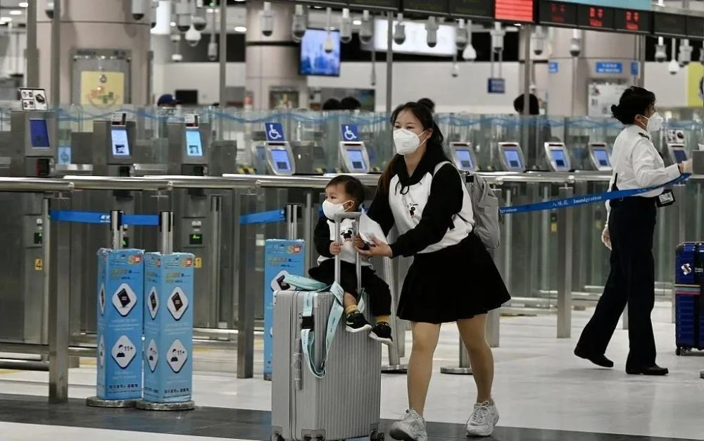

# 香港通关十日：抢人、抢项目，但首先是亲人团聚

_来源：视觉中国_

作者 | 陈弗也

编辑 | 杨布丁

出品 | 棱镜·腾讯小满工作室

“前方到站香港西九龙站。”

1月15日，广深港高铁香港段正式恢复服务，久违的播报声再次在中国香港境内那段全长26公里的铁路上响起。当天早上7点24分，G5607次高铁缓缓驶出深圳福田站，这是疫情以来内地开往香港的首趟列车。18分钟后，列车抵达香港西九龙站，首批来自内地的高铁旅客走出车厢，再次踏上这片熟悉的土地。

一周前的1月8日，中国香港与内地正式开启首阶段通关，冷清了近3年的深圳福田口岸也出现了久违的堵车现象。

“通关与家人团聚是我们收到的春节大礼包！”这段时间以来，阿庄都难掩心中的喜悦。她是一位在广州土生土长的香港居民，疫情之前，每逢周末和节假日，阿庄都经常会回到内地与家人朋友团聚，但从2020年2月8日香港“封关”开始，与家人团聚的日子一去不返。

去年12月中下旬，因为担心在内地父母的身体，阿庄向公司申请居家办公，返回广州。当时，往返香港和内地依然需要隔离，并且名额有限。根据香港本地媒体报道，回内地名额曾被黄牛炒到3700港元/人的高价，即使到了12月中旬，阿庄回内地时，因为一直抽不到过关名额，也花了一千多元找黄牛购买“资格”。

去年12月26日，阿庄刚刚结束集中隔离，香港政府便宣布了通关日期，并表示往返两地不再需要隔离。她自嘲是“最后一批被隔离的人”。

不过，在家中看着父亲在客厅唱卡拉OK、母亲伴着音乐跳舞，而自己为家人下厨做饭，再想到未来这种日子又会重新回来，她仍兴奋不已。

自香港和内地正式通关后，探亲访友成为了两地居民这个春节的一大话题，而企业、政府也没有闲着：深圳、汕头等地组织企业团赴港考察、参展，港府也开始举办一系列展会、峰会，邀请内地企业参加。

香港贸易发展局华南首席代表黄天伟向作者表示，香港始终都是内地商家通往全球的最便捷通道，香港占尽地利优势，而且有专业的服务和人才，可以帮助粤港澳大湾区和其他内地企业配对全球资源。

香港各界，正在努力找回失去的三年。

**赴港签注“一号难求”**

探亲、经商、访学、旅游，很多人曾经通过广深港跨境铁路往返于香港和内地，西九龙口岸一度成为了香港最繁忙的口岸之一。

在通关的第一阶段，深圳仅开通了福田、深圳湾、文锦渡、大桥口岸珠港通道四个陆路口岸，并且实行“配额”制度，每天陆路口岸的单向通行人数最多为5万人。

广深港跨境高铁的恢复，意味着通关力度在加大：从深圳核心地带到香港西九龙商圈，仅需十几分钟，若通过陆路口岸出行，则至少需要一个小时。目前全国几个主要城市都可以通过高铁便捷地往返香港。

1月11日，香港特区政府宣布高铁运营时间后，将两地居民的出行意愿推向了一个小高潮。12306官网显示，春节期间，香港去深圳的高铁票都非常紧张，多个班次都是“售罄”状态。

不过，与深圳方向高铁票的火爆不同，香港方向的高铁票源充足。同时，1月16日，作者在陆路口岸赴港预约系统上看到，未来几天，内地赴港的预约名额充足。以最为繁忙的福田口岸为例，该口岸每天有35000个通关名额，但在16日晚上还有31000个名额。

这种反差与目前的通关政策有关。1月8日恢复通关后，各地才开始办理赴港签注，且均需要提前预约和人工审批，这使得短期内能够赴港的内地居民并不多。

井喷的出行需求也使得不少地方的签注预约“一号难求”。作者在广州、深圳、佛山等地多个签注预约小程序上看到，春节之前，几乎已经约满。

为应对旺盛的出行需求，1月14日，香港特区政府宣布，年廿七至年三十，将陆路口岸的单向通行人数提升至65000人。

1月13日，罗先生在深圳宝安办理了香港旅游签注。他告诉作者，为了早日赴港，从1月8日开始，每天一大早他就在预约系统“抢号”，才最终预约成功。不过，在当天办理时，工作人员的效率让他感到意外，从取号到受理完毕，他仅用了15分钟。

“虽然还不能在自助机上办理签注，但人工窗口的办理效率也很高。”罗先生向作者表示。

他本以为要7个工作日才能拿到通行证，工作人员却告诉他，3个工作日就可以了，他们希望大家能早日拿到通行证，赶上春节去香港旅游、购物。更令罗先生感到意外的是，仅仅过了1个工作日，他便收到短信，通行证已经可以领取了。

**保险代理、“水客”都失业了**

封关的3年，不少人的生活被改变，不能便捷地通关，让他们的生意、工作无法顺利进行。

Cherry是一家香港保险公司的资深代理人，她的客户有95%来自内地。据她介绍，早些年，行情好的时候，这份工作每年可以为她带来近百万元的收入，即便是一般年份，依靠这份工作，她也可以在香港体面地生活。

因为内地客户办理香港保险业务不能在线签单，这意味着，一旦封关，Cherry将会失去至少95%的客户。事实上，在整个2020年，她的收入几乎为0。

“在我们这个行业，只要客户来到香港，那大概率就会签单、办理。”Cherry向作者表示，“但封关之后，每天往返内地的名额有限，还要经历漫长的隔离，客户们肯定就不会因为办保险来香港了。”

和很多香港人一样，在疫情初期，Cherry并没有太过担忧，她认为封关的时间不会太长，熬过去就好了。但眼看着短时间内通关无望，焦虑、压力便随之而来。

2021年初，她开始在一家公司做文书助理的工作，周末还会去一家超市做兼职促销员，几乎告别了曾经从事十余年的保险行业。如今，她和朋友开了一家进出口贸易公司，做保健品、小家电等方面的业务。

过去3年，香港的一个微小变化给她留下了深刻的印象。

她做促销员的超市叫做DONKI，是一家来自日本的超市品牌，主要销售日本的进口商品。2021年，整个香港还只有一家DONKI，如今已经开了五六家。

在Cherry看来，由于封关，很多人无法出去旅游，而香港人又特别喜欢旅游，尤其对日本情有独钟，他们就将出门旅游的渴望转变成消费的动力，在日本超市购物、消费，直接带火了这个品牌。

张磊（化名）的生意一度也遭到了重创。他是深圳一家网店的老板，主要销售高端化妆品，和Cherry一样，各个通关口岸是他的“衣食父母”，他的生意并不复杂，但属于灰色地带。

一直以来，深圳的各大口岸都活跃着众多“水客”，他们往来两地，将奶粉、化妆品、药物、电子产品等从香港带到深圳，“化整为零”，躲避海关的检查。张磊就是通过“水客”从香港采购化妆品，再通过电商平台卖给客户，这样生意模式在深圳并不少见。

封关之后，“水客”们失业，张磊的生意也一落千丈，从每个月几十万的销售额，到不足两万元，并且只能通过跨境快递拿货，这大大提高了他的成本。

他在这个行业从业十几年，香港很多卖场的销售员都是他的合作伙伴。过去，他会把自己的银行卡丢给销售员，并告知对方密码，只要卖场有优惠活动，销售员就帮他刷卡扫货，再通过“水客”带到深圳。

如今，深圳网店的生意不好做，香港卖场销售员的收入也锐减，张磊认识的几位化妆品销售员也早早地转行不干了。

**新一轮抢人抢项目**

对于Cherry、张磊这样的普通民众来说，通关是他们的迫切愿望，只有通关了，生意才可以逐步恢复。

在另一方面，过去两三年里，整个香港也面临着巨大的压力，尤其是来自新加坡的压力。一直以来，新加坡都对香港国际金融中心的地位虎视眈眈，时刻想要取而代之。

封关三年，人员出入境自由流动受到影响，尤其经常需要当天往返的商务旅客。去年10月，香港特首李家超发布了任期内的首份《施政报告》，他指出，过去2年，香港本地劳动人口流失约14万人。

与此同时，新加坡则有针对性地制定了一系列抢人才抢项目的策略。比如，去年8月，新加坡就早早地推出了“海外网络和专业签证”计划，降低了新加坡长期签证的门槛。

事实上，在2022年，新加坡积极地通过大型活动和优惠政策，在国际舞台上吸引企业和投资者，试图超越香港的国际金融中心地位。有一段时间，大量国际投资人、创业者齐聚新加坡，当地的酒店甚至天天满房，价格也被炒高。不少国内的投资人、创业者也被这股热浪吸引，跑到新加坡找钱、找项目。

“新加坡这是明目张胆的抢企业抢人才，竞争很激烈啊！”回想起去年11月的一件事情，阿庄颇为感叹地说——她的工作让她需要时刻关注国内外的金融市场。

当时，正是香港“金融科技周”的举办周期。新加坡也有自己的“金融科技节”活动，若在往年，新加坡就会错峰举办，不与香港正面刚。但在去年，新加坡突然宣布，他们将在同一时间主办“金融科技节”。

当时，甚至有媒体报道，新加坡的主办方号召参会者“二选一”，只能参加一个地方的活动。由于入境香港需要隔离，不少参会者便选择了新加坡。

“在2022年，香港的一些国际投资基金确实跑到了新加坡，他们觉得新加坡的生意更多。”澳洲会计师公会大中华区分会2023年度会长吕志宏向作者表示。他同时担任德勤中国资本市场服务部上市业务华南区主管合伙人。

不过，他并不担心香港的金融中心地位在短时间内会被新加坡取代，因为，在金融市场，新加坡依然与香港相比仍有不小的差距，尤其是在股票、债券市场上。

同时，香港依然是一片开放、自由的投资热土，也在积极适应市场的变化。

此前，香港在新一份施政报告里开启了“抢人才”模式，优化了“香港优才计划”，以期吸引更多的人才来香港就业、定居。

再比如对虚拟资产，在之前，港府未有具体的政策表态如何发展这个领域，但去年10月底，香港财政司发布《有关香港虚拟资产发展的政策宣言》，明确表示香港是国际金融中心，对全球从事虚拟资产业务的创新人员抱持开放和兼容的态度。

“表态之前，不少虚拟资产公司可能考虑落户新加坡，但香港发布宣言之后，至少有50家虚拟资产生态圈相关的公司、基金表示对在港发展有兴趣，主动与我们联系询问在香港运作的方式。”吕志宏告诉作者。

**邮件不如见面**

在去年12月26日晚上确认了香港准备恢复通关的消息后，吕志宏马上让秘书订了1月10日前往内地的机票，迫不及待地要去内地见一下老朋友们。

疫情前，他几乎每个月都要前往内地办公，而香港封关之后，便只能通过社交平台、网络会议与内地的合伙人、客户交流。

“这种方式可以维系与老客户的关系，毕竟大家都能理解当时跨境旅行的不便状况，但是发展新客户和拓展业务就比较困难。”吕志宏向作者坦言，“一家企业的负责人在处理金额庞大的企业项目时还是会选择可靠的伙伴，对于从没见过面的客户，如果我们只靠网络开会，缺少面对面的交流互动，就不容易直接和客户建立这种宝贵的信任基础。”

当恢复通关的时间确定后，他就感觉到一些投资公司马上会重启或开拓香港的业务，事实上，也已经有公司在预约他们的时间，想要在1月份赴港与其面对面交流，洽谈IPO、资产管理的事宜。

疫情虽然让Cherry暂时离开保险行业，但内地的朋友、客户并没有忘记她。恢复通关之后，便有内地朋友联系她，想请她帮忙在香港注册公司，办理相关保险、税收业务，这是她熟悉的业务。

张磊也有同样的境遇。通关之后，香港卖场的销售员、水客开始与他联系，问他是否需要货源。不过，他选择先放一下，大年廿二那天便和家人回到了老家，不用隔离、报备、扫码了，想和家人过一个团圆温馨的春节。

此外，疫情期间，化妆品市场也发生了翻天覆地的变化，海南免税店迅速崛起，取代香港成为代购者的天堂，华强北也一度成为全国最大的化妆品批发市场。

“客户丢失得很多，要想重新找回客户需要费一番脑筋。”张磊向作者表示，“等春节之后吧，计划尝试一下短视频、直播，看能不能将客户找回来，之前的玩法不好用了。”

恢复通关之后，政府也在积极推动两地的商贸往来。

香港是国际知名的金融中心、贸易中心、航运中心，同时也是会展中心，疫情之前，每隔一段时间就会有世界级的会展在此召开。

1月9日至12日，恢复通关后，香港就迅速举办了第49届玩具展、第14届婴儿用品展及第21届文具及学习用品展等多个展会。

香港贸发局华南首席代表黄天伟向作者介绍，1月7日，他们便与广东省商务厅组织了“千人参展团”，赴港参展，香港也迎来了近三年规模最大的外贸参展团；1月10日，香港贸发局又率港商前往广州开发区考察，这是港商大湾区系列考察的第一站。

“香港和内地恢复通关，相信是世界各地企业期待已久的好消息。”黄天伟说。

公开资料显示，1月12日，深圳前海在香港召开了深港现代服务业合作区的宣传推介会；一天后，深圳宝安区主要领导连夜率队赴港开展招商活动，两天内，就密集召开了1场推介会、3场专题座谈会。

