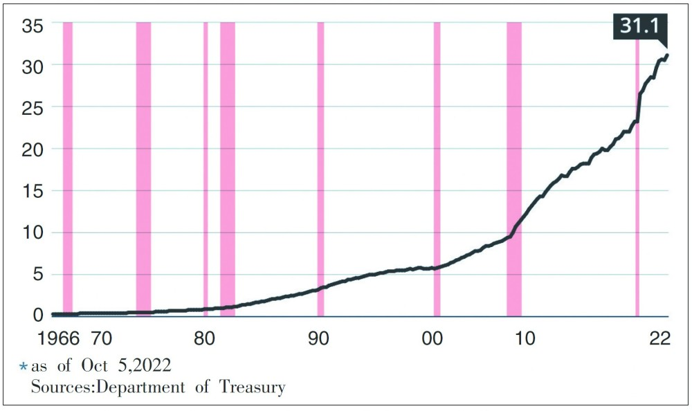

# “美债炸弹”滴答作响，美国两党进入摊牌时刻！

【环球时报驻美国特约记者 李准 环球时报记者 潘晓彤
甄翔】美国债务上限拉响红色警报，民主、共和两党面临“摊牌时刻”。当地时间19日，美国政府债务将达到约31.4万亿美元的法定限额，政府停摆、债务违约的风险近在咫尺。美国白宫17日要求国会必须无条件解决债务上限问题，但目前掌控着众议院的共和党人威胁利用债务上限作为杠杆，要求拜登所在的民主党削减开支，美国两党仍然在提高债务上限问题上僵持不下。高盛集团经济学家警告称，2023年的债务上限危机可能是自2011年以来最严重的一次。国际货币基金组织（IMF）第一副总裁戈皮纳特18日表示，美债僵局是美国和世界都不应面临的风险。

**以“非常规措施”应对**

“美国国债时钟”网站实时数据显示，截至当地时间18日上午，美国政府债务已突破31.4万亿美元的法定限额，比美国财长耶伦此前预报的提早一天。耶伦日前在致美国众议院的一封信中表示，债务达到上限后将迫使财政部采取“非常规措施”，包括切断对在职公务员和退休人员的保险福利发放等。这些措施将使政府能够“在有限的时间内”保持运作，并支付债务利息等最关键的款项，但最多只能撑到6月初。届时，美国国库的资金可能会枯竭，导致“史无前例”的债务违约。

“美债炸弹”滴答作响，美国两党仍在激烈博弈。据美国《国会山报》18日报道，共和党众议员麦卡锡为了顺利担任众议院议长，向极右翼共和党人作出几项让步，包括承诺在提高债务上限的任何立法中加入大幅削减开支的条款，但在参议院占多数的民主党人不太可能同意这样的削减，从而导致僵局。白宫17日表示，众议院共和党人的债务计划可能导致威胁全球的经济灾难，并将影响对边境安全、食品安全和其他必要政府活动的支付。白宫方面要求国会必须无条件解决债务上限问题。而麦卡锡同日接受福克斯新闻网采访时表示，他拒绝民主党人提出的在不附加任何条件的情况下大幅提高债务上限的呼吁，“如果你给你的孩子一张信用卡，他们不断刷卡到限额，而你一次又一次地提高额度。为什么我们现在不改变这种行为，以便在财政上处于更强大的地位？”

根据美国财政部的定义，债务上限是美国国会为联邦政府设定的为履行已产生的支付义务而举债的最高额度，触及这条“红线”，意味着美国财政部借款授权用尽。调高债务上限后，财政部可以通过发行新债来履行现有支付义务。自有记录的1940年以来，美国债务上限被修改了104次，平均每9个月一次。其中，大部分是上调，以满足政府所作出的支出承诺。美国国会于2021年12月通过立法将联邦政府债务上限调高至约31.4万亿美元。

**内伤外溢风险高**

“美国经济今年面临的最大威胁可能是围绕债务上限的斗争”，《国会山报》18日报道称，美国两党政策研究中心学者斯奈德曼说，“经济放缓可能会使美国政府失去急需的税收收入，从而缩短提高债务上限的窗口期。反过来，如果未来政府需要应对经济低迷，其手段将更加有限”。穆迪公司首席经济学家马克赞迪在一份报告中预测，债务上限问题若陷入长期僵局，其引发的股市暴跌将使美国家庭财富蒸发15万亿美元，失业率将从目前的约5%飙升至约9%，多达600万个就业岗位将就此消失。

彭博社18日援引戈皮纳特的话称，美国国会在提高联邦债务上限上的僵局，是美国和世界都不应面临的风险。牛津经济研究院经济学家豪登认为，虽然美国最终发生债务违约的可能性不大，但不排除美国财政部采取前所未有的措施来防止违约，这些措施可能会扰乱金融市场，并对经济产生负面影响。

中国社科院世界经济与政治研究所研究员高凌云18日对《环球时报》记者表示，美国债务触及上限会对其国内和全球带来四个方面影响。第一，可能导致美国政府停摆，相关事务出现拖延情况；第二，偿还债务及利息会挤压政府财力，影响政府在其他方面的支出；第三，如果美国大幅提高债务上限，可能会影响全球市场对美债的信心，导致购买美债的机构或国家减少；第四，美国的国债收益率并不高，只在流通性上占优势，如果提高债务上限意味着将继续增发国债，这可能增加全球金融市场上的不安定情绪。

**相当于夫妻为信用卡账单争吵**

“美国经济又一次被债务上限挟持”，美国《洛杉矶时报》17日称，众议院共和党一群装腔作势的幼稚人士再次威胁要阻止提高联邦债务上限，并要求削减开支，但这将不可避免地对最贫穷的美国人造成最严重的影响。美国《西南时报》讽刺地评论称，美国的巨额债务是由两党几十年来甚至两个世纪以来共同累积起来的。如果国会拒绝提高债务上限，“这就相当于婚姻双方为信用卡账单而争吵。这可不是经营婚姻的好办法，也不是治理一个对所有美国人和世界其他国家都影响巨大的国家的方式”。《纽约时报》认为，作为长期以来两党博弈的发力点，今年债务上限问题或将演变为一场彻底的灾难。美国银行分析师认为美国政府可能于今年夏末或秋初出现债务违约，高盛则认为目前美国政府债务违约的风险高于2011年上一次债务上限危机以来的任何时段。目前世界金融市场远比2011年更为复杂，一旦出问题影响必然更大。

外交学院国际关系研究所教授李海东18日接受《环球时报》记者采访时表示，债务上限问题是今年美国政坛的一个重大事件，从表面看，是如何使用财权问题，但实质上，是关于国家如何前进的原则性问题，更是两党相互角逐、竞争权力的议题。“如果债务上限不能提高，联邦政府的信誉受损，各州政府的权力膨胀，而这恰恰满足了共和党内极右翼政治势力的愿望。因此，是否提高债务上限，不仅关乎联邦政府是否能正常运转，还涉及民主、共和两党在新政治版图中地位的消长。从目前的情况看，双方针尖对麦芒，碰撞激烈，而这种相互对撕的场景在今年接下来的时间里会频繁出现。”

