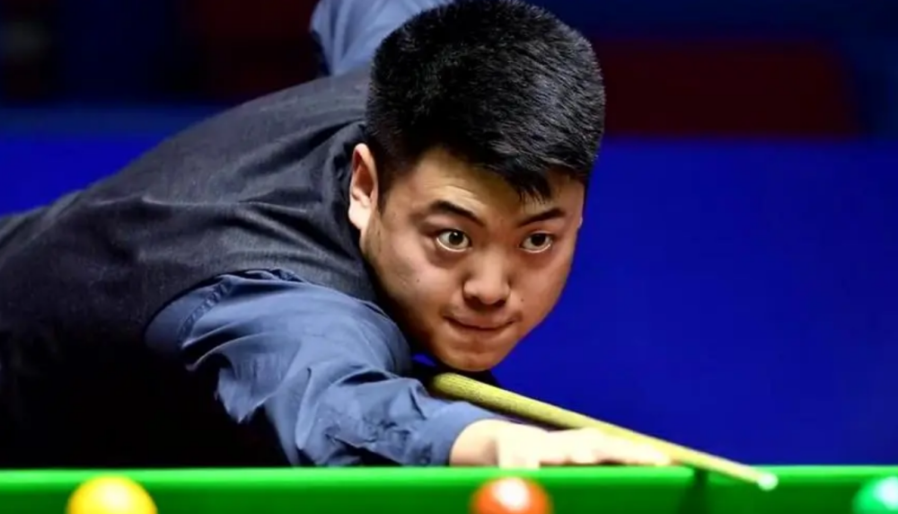
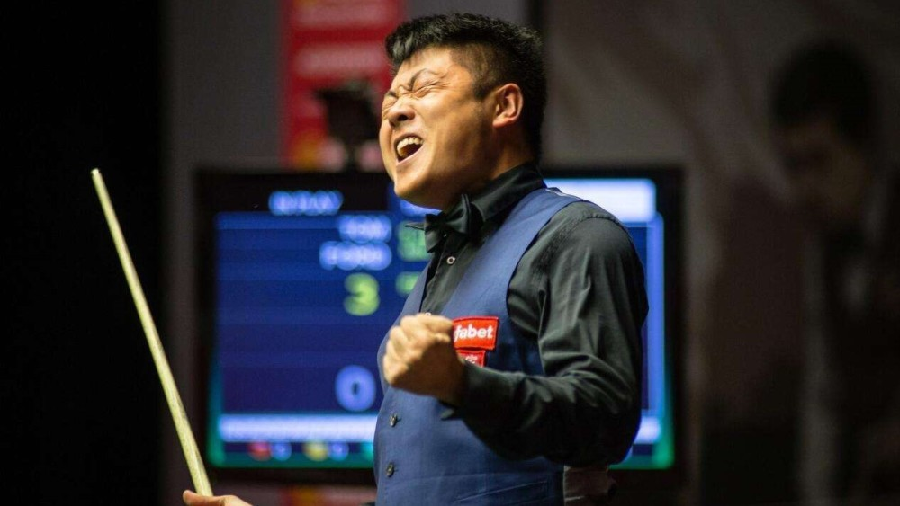
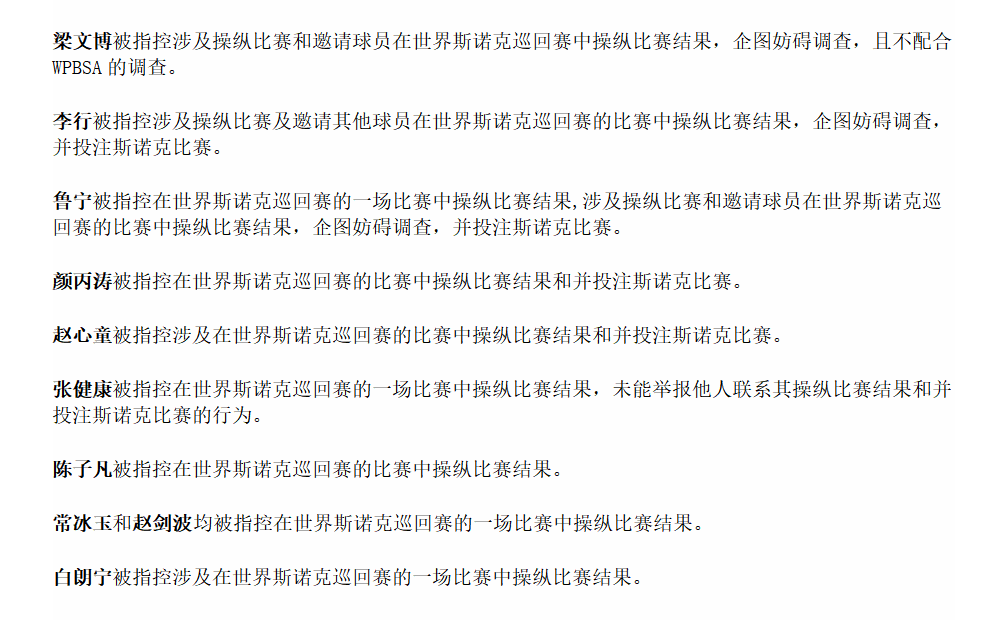
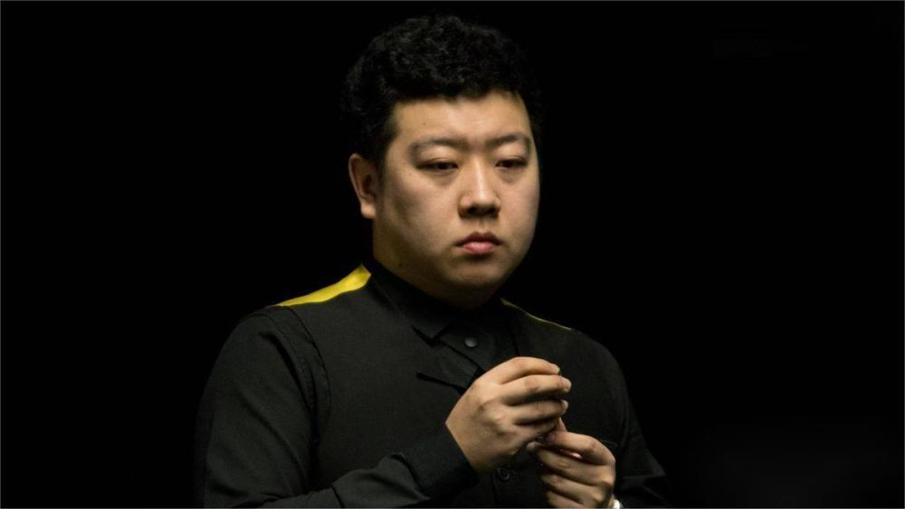
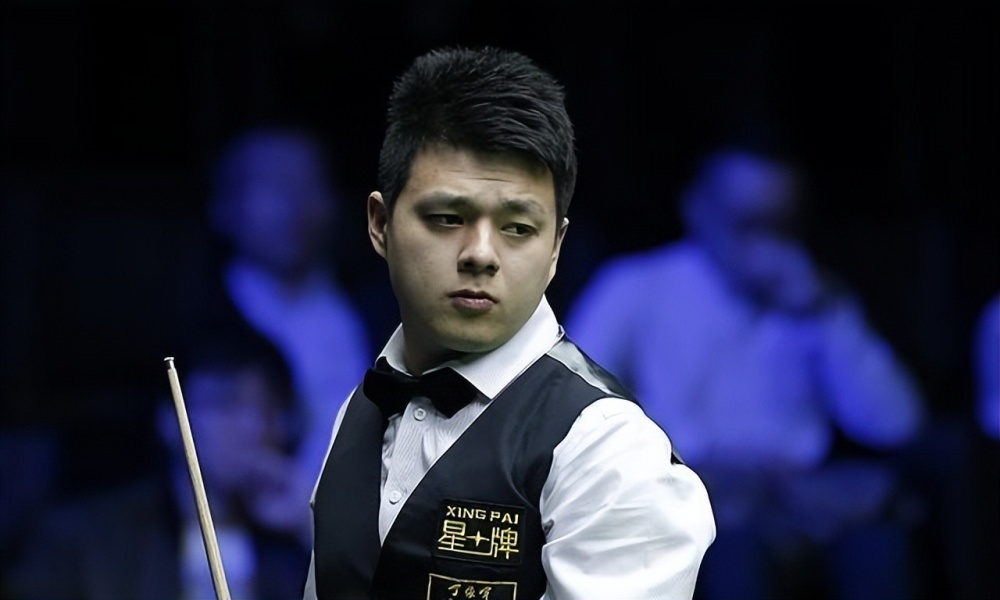
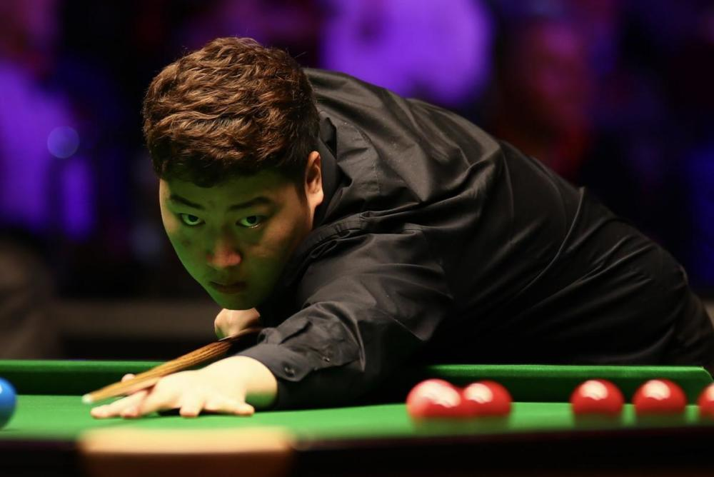
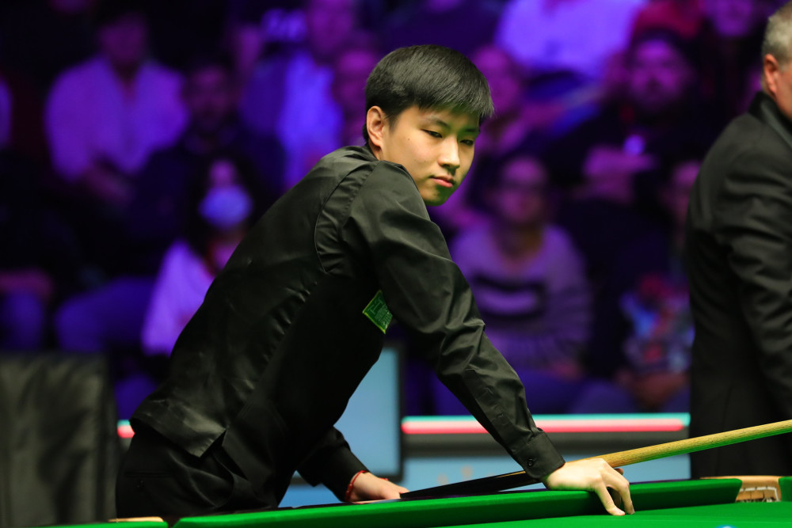
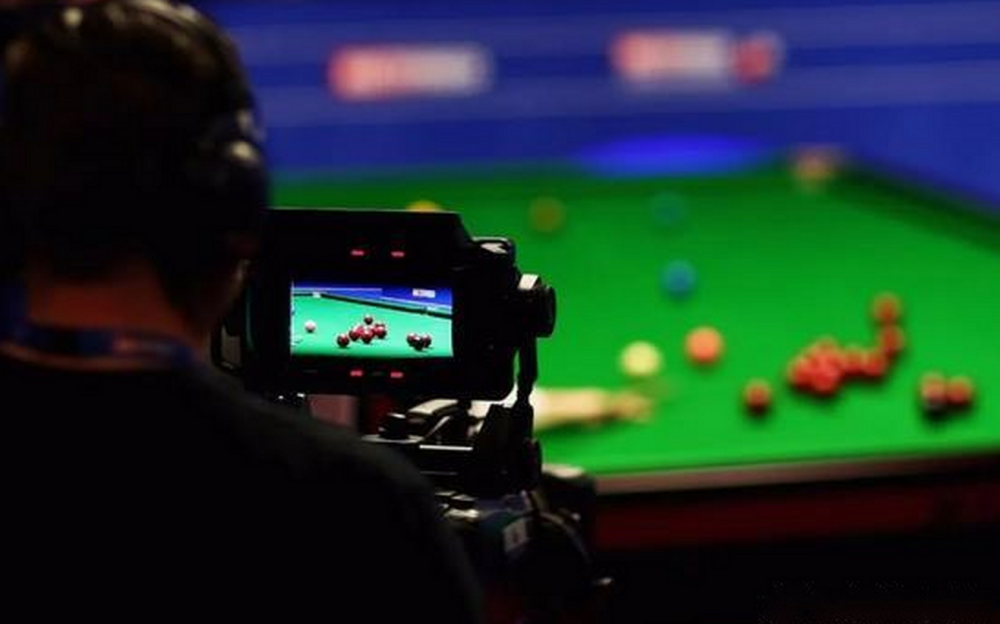

# 中国斯诺克打假球调查结果出炉：梁文博最恶劣 赵心童操纵比赛并下注

1月18日，世界台联（WPBSA）正式公布了关于中国斯诺克10名涉嫌操纵比赛结果的选手调查结果，其中以梁文博为首的中国斯诺克选手，全部涉嫌在比赛中操纵比赛结果，其中梁文博、李行、鲁宁等3人最为严重，他们还企图妨碍官方调查，特别是梁文博还不配合官方的调查。世界台联将在后续依据调查结果，对相关选手进行最终的处罚，以禁赛和罚款为主。

从去年12月份开始，世界台联先后四次公布了官方声明，包括梁文博、李行、鲁宁、颜丙涛、赵心童、张健康、陈子凡、常冰玉、赵剑波、白朗宁等10名选手先后被暂停职业资格，原因都是涉嫌操纵比赛结果，存在打假球行为。与此同时，中国台球协会同步跟进，发布了官方声明，将10名选手在国内同步禁赛处罚。

根据世界台联此次发布的调查结果声明，可以看出，梁文博是这次假球案的罪魁祸首，他被指控涉及操纵比赛、并且邀请其他球员在世界斯诺克巡回赛中操纵比赛结果，企图妨碍调查，且不配合世界台联的调查。从当时另一名被调查选手常冰玉的个人声明中可以验证了这个事实情况，梁文博不仅自己打假球，还怂恿其他人参与，事情败露后，还拒不承认，妨碍调查，行为和影响可谓相当恶劣。

李行被指控涉及操纵比赛及邀请其他球员在世界斯诺克巡回赛的比赛中操纵比赛结果，企图妨碍调查，并投注斯诺克比赛。

鲁宁被指控在世界斯诺克巡回赛的一场比赛中操纵比赛结果,涉及操纵比赛和邀请球员在世界斯诺克巡回赛的比赛中操纵比赛结果，企图妨碍调查，并投注斯诺克比赛。两人的行为同样很恶劣，后续恐怕也会被严惩。

关于颜丙涛和赵心童，两人的情况相似，都是被指控在世界斯诺克巡回赛的比赛中操纵比赛结果并投注斯诺克比赛。两人如果都认可调查结果，那么将会受到应有的惩罚。而张健康被指控在世界斯诺克巡回赛的一场比赛中操纵比赛结果，未能举报他人联系自己操纵比赛并投注斯诺克比赛的行为。

剩余的陈子凡被指控在世界斯诺克巡回赛的比赛中操纵比赛结果。常冰玉和赵剑波均被指控在世界斯诺克巡回赛的一场比赛中操纵比赛结果。白朗宁被指控涉及在世界斯诺克巡回赛的一场比赛中操纵比赛结果。

根据世界台联的声明，后续整个案件将会被移交独立的纪律审裁处，将展开涉案选手与世界台联的听证会诉讼，具体的日期和地点将在晚些时间公布。

另外世界台联也在声明中提及涉案的中国斯诺克选手，他们都违反了球员行为准则中关于赌博规则的多个条例。如果最终球员都认可了调查结果，那么官方将根据相关条例进行对应的处罚认定。

