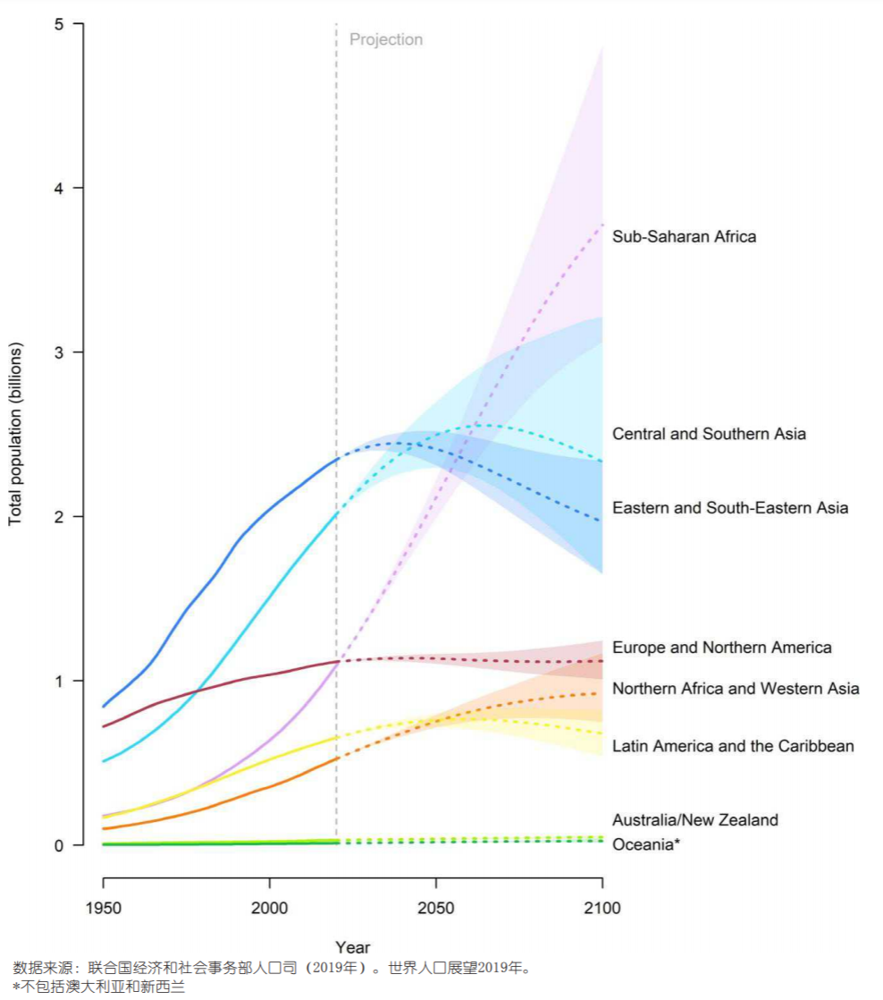
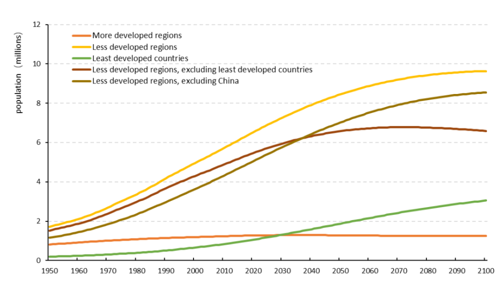
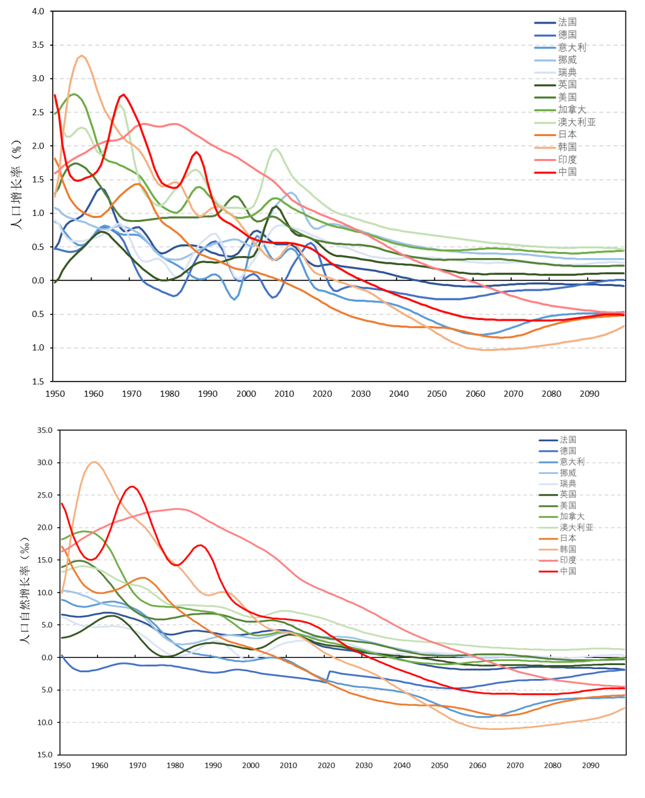

# 人口负增长的历史性时刻到来，一个国家应该如何应对？

_pixabay.com_

**撰文｜董浩月 李婷（中国人民大学社会与人口学院）**

**责编｜陈晓雪 李珊珊**

1月17日，国家统计局发布数据显示，2022年全年出生人口956万人，死亡人口1041万人，人口减少85万，自然增长率为-0.60‰。

除1959-1961年三年困难时期的人口下降之外，这是新中国成立以来的首次人口下降，中国人口负增长的靴子终于落地了。

事实上，这次的负增长并没有那么令人意外，在2021年之前，就曾有多家机构预测，就在不远的将来，中国的人口将迎来峰值，出现拐点。

在这些预测中，按照联合国的中方案预测，中国的人口负增长将出现在2030年。

在华盛顿大学预测方案中，中国人口将于2024年达到顶峰（约14.3亿），随即进入人口负增长。

翟振武等（2017）以2015年小普查数据为基础，基于全面两孩政策对中国人口进行预测，结果显示我国总人口规模将于2029年左右迎来峰值14.55亿人，之后将步入人口负增长。

而张现苓等（2020）以2017年全国户籍登记数据为基础预测，低、中、高方案下中国人口增长率由正转负的拐点分别将于2025年、2028年和2032年到来。

不同预测虽然结果稍有所差异，但基本上能够认为，中国将在2030年以前迎来人口增长的拐点，而今天，这个拐点终于来了，而且比所有人的预测都要提前地到来了。

人口负增长变成了既成事实，我们所能做的最佳选择，只能是理性地看待和积极的应对。

人口的下降既不是好事，也不是坏事，但它是一件大事，而我们所能做的，则是进一步思考如何变害为利，这在一定程度上考验着国家的制度设计能力，考验着我们能否建立一套全新的、适应人口发展新形势的治理体系。

**全球的人口负增长趋势**

“人口负增长”
很容易从字面上理解，负向增长，也就是人口减少，再严格一点，一般指一定时间、空间范围内总人口规模的绝对减少。最直观的观察方法就是看人口数量增长量和人口增长率。

从全球范围内来看，根据联合国《世界人口展望2019》的数据（包含201个国家和地区）， **直到2100年全球人口仍将保持正向增长的趋势**
，但是，人口增长动力主要源于撒哈拉以南的非洲地区，而世界其他地区的人口则将在本世纪结束之前达到峰值并出现下降。

不过，在美国华盛顿大学健康指标与评估研究所（后文简称：华盛顿大学）的预测方案中，
**世界人口将在2065年达到峰值97.3亿人，之后则开始下降，即进入负增长时代，到2100年，全球总人口将下降到87.9亿人。**
区域层面，整体趋势与联合国预测基本一致，除了撒哈拉以南非洲和中亚地区以外地区，在21世纪结束之前均已进入人口负增长时期。

_来源：Stein
Emil Vollset, Emily Goren, etc. Fertility, Mortality, Migration, and
Population Scenarios for 195 Countries and Territories from 2017 to 2100: A
Forcasting Analysis for the Global Burden of Disease Study. Lancet, online
24th July 2020._

发达国家和地区最早步入人口负增长。联合国预测发达国家和地区的人口峰值出现在2036年，高收入国家团队在2049年达到人口峰值，而华盛顿大学预测的高收入国家团队将从2042年开始人口负增长，略早于联合国的预测方案。欠发达地区（不含最不发达地区）的人口负增长到来稍晚一些，按联合国预测方案峰值将出现在2072年。分国家来看，联合国预测到2100年之前会有124个国家和地区进入人口负增长时代，而华盛顿大学给出的预测是167个。

_数据来源：联合国经济和社会事务部人口司（2019）。世界人口展望2019年。_

如果选取典型国家，观察其人口变动情况，就会发现部分欧洲国家已经或者即将步入人口负增长：德国人口自然增长率自1950年以来长期保持在零以下（仅靠移民勉强维持人口规模不剧烈下滑）；意大利自2016年之后人口增长率持续为负；法国人口峰值大概在2045年前后到来。

美国、加拿大、澳大利亚等国家人口增长率在2100年之前仍然保持为正。但结合自然增长率情况不难发现，其人口增长的动力主要来源于 **人口迁移的机械增长**
。在本世纪中叶，这些国家的人口自然增长率（不考虑人口迁入）也将由正转负。

再来看我们的邻居日本和韩国，以及长期的 “竞争对手”
印度。日本在2010年人口规模已经开始减少，而韩国的人口负增长预计会出现在两年后（但根据最新报道，由于疫情的影响，韩国在2020年已经出现死亡人口超过出生人口的负增长趋势），印度则在2060年前后。虽然
**人口迁移** 能在一定程度上推迟人口负增长的发生，比如美国、加拿大等国即是如此，但东亚国家普遍不具备移民文化。

_数据来源：联合国经济和社会事务部人口司（2019）。世界人口展望2019年。_

**人口负增长是 “灰犀牛”？**

用 “灰犀牛”
来比喻人口负增长再恰当不过，这是因为人口转变是一个长期的过程，现在或者将来观察到的人口变动趋势，其实在久远的过去就已经埋下了种子，人口负增长也是如此。

**这里需要提到的一个概念就是人口惯性**
，在一个封闭人口中，如果该人口之前持续增长，即使生育率降到更替水平或更低，在最终达到静止人口之前，该人口规模仍然会保持一段时期的增长趋势，反之亦然。

通俗一点来说，就是在不考虑迁移流动的情况下，一个地区的人口如果之前长期增长，即使生育率下降到了很低的水平，但由于在快速增长时期出生的大量人口到生育年龄仍然会带来大量的出生人口，即使相比于上一代规模有所减小，但绝对规模仍然很大，所以总人口仍然将保持一段时期的增长。就像汽车加速过程中，踩下刹车后仍然需要一段时间的减速才能停下，而在减速期间，汽车仍然会发生向前的位移。

**对人口变动来说，这种增长的惯性会使得未来长期的变动趋势被隐藏在表象之下。**
在人口统计中，可以用人口惯性因子和人口内在自然增长率对这种被掩盖的趋势进行测量。人口惯性因子大于1或者人口内在自然增长率为正，则意味着未来长期来看人口有持续增长的趋势，反之亦然。欧洲人口在21世纪初已经表现出人口负增长惯性，日本的人口惯性在1990-1995年间出现逆转，新加坡和韩国的转折点出现在2000-2005年。

中国的人口惯性自从1970年代生育政策收缩以来逐渐减小，但由于新中国成立初期高生育率和低死亡率带来的人口正增长惯性积累，到90年代人口惯性因子仍然处于1.44的较高水平。随后持续的低生育水平使得人口正增长惯性不断削弱，到2010年保持微弱的正增长惯性。2020年起，中国人口惯性因子将低于1，出现显著且不可逆转的负增长惯性
(茅倬彦 等，2018）。所以说， **虽然中国的人口负增长将在未来几年内才会出现，但这一趋势在较早之前已经显现。**

**人口负增长从何而来？**

那么造成人口负增长的根本原因是什么呢？ **最直接的原因是长期的低生育水平，即一对夫妇生育的子女数长期少于2个。**

低生育率对人口负增长的影响是不断累积、逐渐显现的长期过程，具有时滞性和隐蔽性。随着低生育水平的持续，人口惯性将由正转负，人口负增长惯性也将持续积累，人口增长速度逐渐减缓，并最终表现为人口减少。

已有的经验表明，长期较低的生育水平下，生育水平很难回升，即使回升也很难回升到更替水平以上。一旦人口开始负增长，即便是生育水平回升也难以扭转人口负增长惯性，很难实现人口增长方向由负转正。

间接导致人口负增长最突出的就是社会经济因素。现代化的过程也是生育率不断下降的过程，随着现代化的发展，产业结构由农业向工业和服务业转变，物质生产功能和养老功能不断从家庭中剥离，社会保障体制的完善使得孩子的养老保障效用下降，从而导致生育率的降低。

**经济快速发展的同时也带来人们对个体价值认识及生育观念的转变** ，个人主义价值观开始流行，生育观念由 “多生” 转变为 “少生” 甚至
“不生”，不婚和丁克家庭比例上升（陆杰华，2019、2020）。

**社会性别平等的发展**
使得女性的受教育程度、工资水平以及就业率获得提高，社会地位和家庭地位都得到提升，同时养育孩子的直接成本和机会成本也增加，女性面临着工作和家庭冲突的矛盾，导致未婚比例提高、初婚初育年龄推迟、生育子女数量减少、生育间隔增大，进一步导致生育率的下降。

对中国而言， **生育政策也是促进生育率下降及人口负增长的重要因素**
，计划生育政策不仅使生育率快速下降，随着在政策期内出生人口开始进入育龄期，育龄妇女规模也逐渐缩小，这种累积效应使得人口负增长的风险也逐渐积累。

**人口负增长的社会经济影响**

**伴随着人口负增长，老龄化将成为常态。**
随着预期寿命的延长和生育率的降低，人口老龄化是一个必然的结果，同时老龄化与人口负增长也是相互强化的过程。《世界人口展望2019》数据显示，2018年全世界65岁及以上老人数量已经超过5岁及以下儿童数量，到2050年，前者将达到后者的两倍，同时也超过了15至24岁青年的数量。

区域人口变动主要推动力变为迁移流动。随着人口自然增长率越来越低甚至转为负值，人口规模正向增长的唯一动力变为迁移流动，不论是国家或地区层面还是国内区域层面均是如此。由于流动人口年龄结构的年轻化，区域间人口规模、人口年龄结构的差异将随迁移流动进一步拉大（王谦，2020）。

**人口负增长对经济增长的影响如何，仍然是一个争议性的话题。**
一方面，有学者认为劳动年人口的负增长将使未来劳动参与率下降、劳动生产率增速减缓、国内需求下降、市场萎缩、储蓄率下降，人口老龄化也会使得经济的创新活力减弱、财政负担加重，这些都不利于经济发展，经济潜在增长率显著下降。另一方面，也有学者认为较大的人口规模在经济发展中的回旋空间可以促进和保障经济增长且高质量发展，而人口老龄化可能带来新的养老市场，推动养老产业发展，并且老年人积累的社会资本也是潜在的资本供应。因此，人口负增长也可能成为推动科技进步、产业结构升级、经济增长的诱因。

**人口负增长对资源环境可能是把双刃剑。**
从总量视角来看，基于最适人口规模、资源环境承载力的角度，人口总量的减少有利于释放资源环境的压力，缓和区域竞争关系。但从个体视角出发，在个体消费不断升级的情况下，人口负增长却并不必然能够带来人口、资源与环境的可持续发展。

**人口负增长也将给国家安全和社会稳定带来挑战。**
人口是国家的根本，是国家稳定的重要因素。人口负增长及其未来的不确定性使得中长期的人口发展趋势变得更难把握，而人口的长期不稳定和不确定可能给国家和国防安全带来威胁。另外，人口减少带来的经济和社会压力可能造成社会不稳定，例如区域间人口迁移流动可能进一步加剧地区间发展不平衡，以及迁移流动人口的社会文化差异、融合困难等都可能衍生出不利于稳定的社会问题。

**人口负增长，社会保障体系也会受到冲击。**
人口负增长与人口老龄化彼此相互强化，快速增加的老年人口规模意味着医疗卫生、社会保障等财政支出增加，老龄化程度的假设也不断加重人口抚养负担。欧洲、日本和韩国等对人口负增长的恐惧就主要表现在担心劳动年龄人口不足以支持老年人。在中国也同样如此，潜在的人口抚养比下降，造成中青年群体和老年群体的代际间社会福利的不均衡，也不利于社会保障均等化。

**人口负增长如何应对？**

**制定中长期人口发展战略**

应对人口负增长的当务之急是制定中长期综合人口发展战略，在尊重人口发展的基础上，以更长远的视角来完善人口政策，并对各相关政策进行统筹协调，对未来人口负增长时代到来可能引发的社会经济后果进行超前预案。

**积极应对人口老龄化，完善社会保障机制**

人口负增长与老龄化共生并互相强化，面对人口负增长时代更需要积极应对人口老龄化。一方面，要从全生命周期的视角看待老年问题，将老龄化视为终身过程，开展全民健康教育，加强疾病预防，在生命早期就对老年阶段可能遇到的健康问题进行预防。另一方面，在制度上，完善养老保险、医疗保险和长期护理保险三大社会保障制度支柱，加快推进老年健康服务体系建设。除此以外，还需要构建老年友好宜居环境，不仅要从建筑、社区等居住环境方面改造，更要拓展到老年宜居社会环境的改造。

**完善家庭支持政策，促进生育动能释放**

低生育水平是人口负增长的最直接原因，低生育水平的国家应当提供全方位的、系统完善的家庭支持政策体系，全面激发和释放人们的生育意愿。

**加快经济结构转型升级**

人口负增长必然带来劳动力规模的减小，在经济增长方式完全转型升级之前，可以通过延迟退休或弹性退休制度增加老年人就业渠道，同时提高女性就业保障政策减少女性就业歧视促进女性工作与家庭的平衡，促进女性劳动参与率提升。同时，强调创新驱动技术研发进步，逐步实现人工智能代替劳动密集型、低技术含量劳动力，提高人口素质，提高人口素质水平与经济发展劳动力需求的匹配程度，充分挖掘
“教育红利”、“性别红利” 和 “老龄红利”。

最后借用全球最大的调研公司之一益普索公共事务CEO达雷尔布里克的一句话：“人口下降既不是好事，也不是坏事，但它是一件大事。”
相比于其他国家，在应对人口负增长上，我国有更大的人口规模回旋空间。如何变害为利，也在一定程度上考验国家的制度设计能力。当然，更重要的是国家需要建立一套全新的、适应人口发展新形势的治理体系。

**参考资料**

[1] 茅倬彦.60年来中国人口惯性变化及趋势[J].人口与经济,2010(06):1-6.

[2] 翟振武,陈佳鞠,李龙.2015～2100年中国人口与老龄化变动趋势[J].人口研究,2017,41(04):60-71.

[3] 茅倬彦,申小菊,张闻雷.人口惯性和生育政策选择:国际比较及启示[J].南方人口,2018,33(02):15-28.

[4] 陆杰华.人口负增长时代:特征、风险及其应对策略[J].社会发展研究,2019,6(01):21-32+242.

[5] 陆杰华,刘瑞平.新时代我国人口负增长中长期变化特征、原因与影响探究[J].中共福建省委党校(福建行政学院)学报,2020(01):19-28.

[6] 原新,金牛.“危”“机”与应对：中国人口负增长时代的老龄社会[J].中共福建省委党校(福建行政学院)学报,2020(01):29-37.

[7]
王金营,刘艳华.经济发展中的人口回旋空间:存在性和理论架构——基于人口负增长背景下对经济增长理论的反思和借鉴[J].人口研究,2020,44(01):3-18.

[8] 张现苓,翟振武,陶涛.中国人口负增长:现状、未来与特征[J].人口研究,2020,44(03):3-20.

[9] 陶涛,金光照,张现苓.世界人口负增长:特征、趋势和应对[J].人口研究,2020,44(04):46-61.

[10] 刘厚莲,原新.人口负增长时代还能实现经济持续增长吗?[J].社会科学文摘,2020(12):5-7.

[11] 原新,金牛.世界人口负增长的趋势展望与影响应对[J].河北大学学报(哲学社会科学版),2021,46(01):82-91.

制版编辑 | 于松仪

